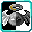

# Stripes

<small>[TR: Nightmares](../../index.md) &rsaquo; [Abilities](../index.md) &rsaquo; [Unique Skills](index.md)</small>

| | |
|---|---|
| **Type** | Unique Skill |
| **ID** | `trnightmare:stripes` |
| **Modes** | 2 |
| **Activation** | Press |

> Your body can move or stop moving. Never both.

## Modes

| # | Mode |
|---|---|
| 1 | Force |
| 2 | Object |

## Costs

| When | Magicule (MP) | Aura (AP) |
|---|---|---|
| Always | 0 |  |

## How it works

- Activated by pressing the skill key
- Triggers when you damage a target
- Triggers when you are attacked
- Triggers when you take damage
- Triggers when an effect is applied to you
- Triggers when you die

## Related

- **Related skills:** [Physical Attack Resistance](../../../tensura-reincarnated/abilities/resistance-skills/physical-attack-resistance.md)
- **Effects:** [Anti-Skill](../../../tensura-reincarnated/effects/anti-skill.md)

## Stats (config defaults)

Set in [`config/nightmare/ability/skill/nightmare_unique.toml`](../../configs/config-nightmare-ability-skill-nightmare-unique.md).

| Option | Default | Description |
|---|---|---|
| `Stripes.mpAcquirement` | 40,000 | Magicule Acquirement Cost. |
| `Stripes.magiculeCostForce` | 2,000 | Magicule Cost to activate or deactivate Force. |
| `Stripes.magiculeCostObject` | 2,000 | Magicule Cost to activate or deactivate Object. |
| `Stripes.effectImmunities` | "tensura:disintegration", "tensura:chill", "tensura:frost", "tensura:burden", "tensura:webbed", "minecraft:slowness", "miencraft:mining_fatigue", "minecraft:slow_falling" | List of effects stopped by Force. |
| `Stripes.forceCooldown` | 10 | Cooldown for activating and deactivating Force in seconds. |
| `Stripes.objectCooldown` | 10 | Cooldown for activating and deactivating Object in seconds. |
| `Stripes.objectBlockPercentage` | 50 | Percentage of damage stopped by Object. |
| `Stripes.forceDamage` | 30 | Damage multiplier for a physical attack to force. |

Set in [`config/tensura/ability/skill/resistance_config.toml`](../../../tensura-reincarnated/configs/config-tensura-ability-skill-resistance-config.md).

| Option | Default | Description |
|---|---|---|
| `nullificationDamageMultiplier` | 0 | The multiplier that will be applied on incoming damage when the damage went through Nullifications |
| `hpDamageBypassResistance` | 0.5 | How many times of current HP that incoming damage value needs to be higher to deal damage to the user with Resistances -1 = always applied regardless of HP |

## Tags

`tensura:skills/unique_skills`
