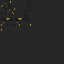

# Zegion Boots

<small>[TR: Nightmares](../../index.md) &rsaquo; [Items](../index.md) &rsaquo; [Armor](index.md)</small>

| | |
|---|---|
| **ID** | `trnightmare:zegion_boots` |
| **Category** | Armor |
| **Stack size** | 1 |

