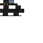

# Zegion Leggings

<small>[TR: Nightmares](../../index.md) &rsaquo; [Items](../index.md) &rsaquo; [Armor](index.md)</small>

| | |
|---|---|
| **ID** | `trnightmare:zegion_leggings` |
| **Category** | Armor |
| **Stack size** | 1 |
| **Armor** | 15 |
| **Armor toughness** | 10 |
| **Knockback resistance** | 100% |

## What it does

Hihiirokane armor for the leggings slot: **15** armor, **10** toughness and **100%** knockback resistance.
