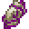

# Ender Essence

<small>[TR: Nightmares](../../index.md) &rsaquo; [Items](../index.md) &rsaquo; [Materials](index.md)</small>

| | |
|---|---|
| **ID** | `trnightmare:ender_essence` |
| **Category** | Materials |

## Description

Warped power from the void beyond.

## What it does

Food that restores **4** hunger (2 shanks) and **2.4** saturation, and can be eaten even when you're full. It is dropped by [Enderman](https://minecraft.wiki/w/Enderman) and [Endermite](https://minecraft.wiki/w/Endermite).

## Obtaining

### Loot

| Source | Count | Chance | Notes |
|---|---|---|---|
| Dropped by [Endermite](https://minecraft.wiki/w/Endermite) | 3 | 20% |  |
| Dropped by [Enderman](https://minecraft.wiki/w/Enderman) | 1 | 10% |  |
