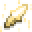

# Holy Essence

<small>[TR: Nightmares](../../index.md) &rsaquo; [Items](../index.md) &rsaquo; [Materials](index.md)</small>

| | |
|---|---|
| **ID** | `trnightmare:holy_essence` |
| **Category** | Materials |

## Description

A symbol of peace brought by death.

## What it does

Food that restores **4** hunger (2 shanks) and **2.4** saturation, and can be eaten even when you're full. Used to make [Ark](../weapons/ark.md) and [Divine Axe Rhitta](../weapons/divine-axe-rhitta.md). It is dropped by [Shulker](https://minecraft.wiki/w/Shulker) and [Zombie Villager](https://minecraft.wiki/w/Zombie_Villager).

## Obtaining

### Loot

| Source | Count | Chance | Notes |
|---|---|---|---|
| Dropped by [Shulker](https://minecraft.wiki/w/Shulker) | 1 | 50% |  |
| Dropped by [Zombie Villager](https://minecraft.wiki/w/Zombie_Villager) | 1 | 50% |  |

## Used in

[Ark](../weapons/ark.md), [Divine Axe Rhitta](../weapons/divine-axe-rhitta.md)
