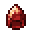

# Miscellaneous

<small>[TR: Nightmares](../../index.md) &rsaquo; [Items](../index.md)</small>

| | Name | Description |
|---|---|---|
|  | [EVIL ATTRIBUTE STICK](evil-attribute-stick.md) |  |
|  | [Fragment of Akasha](fragment-akasha.md) |  |
|  | [Frost Dragon Seed](frost-dragon-seed.md) | Edible. Imprints a True Dragon into your Inner World. |
|  | [Heroic Memory](heroic-memory.md) | EP: ? |
|  | [Scorch Dragon Seed](scorch-dragon-seed.md) | Edible. Imprints a True Dragon into your Inner World. |
|  | [Signed Contract](deal-contract.md) | Signed Contract |
|  | [Soul](soul.md) | Soul type: ? |
|  | [Storm Dragon Seed](storm-dragon-seed.md) | Edible. Imprints a True Dragon into your Inner World. |
|  | [Writable Contract](writable-contract.md) |  |
