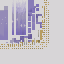
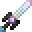

# Ark

<small>[TR: Nightmares](../../index.md) &rsaquo; [Items](../index.md) &rsaquo; [Weapons](index.md)</small>

| | |
|---|---|
| **ID** | `trnightmare:ark` |
| **Category** | Weapons |
| **Gear EP** | 10,000,000 - 100,000,000 |

## What it does

It is made at the Tensura Smithing.

## Obtaining

### Recipes

**Tensura Smithing** &rarr;  [Ark](ark.md)

Ingredients:  [Holy Essence](../materials/holy-essence.md) x4,  [Nether Star](https://minecraft.wiki/w/Nether_Star) x4,  [Hihi'Irokane Sword](../../../tensura-reincarnated/items/weapons/hihiirokane-sword.md),  Block Of Hihiirokane x4,  [Hihi'Irokane Ingot](../../../tensura-reincarnated/items/materials/hihiirokane-ingot.md) x2

Requires schematic:  [Hihi'Irokane Gear Schematic](../../../tensura-reincarnated/items/schematics/hihiirokane-gear-schematic.md)
