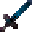

# Death's Door

<small>[TR: Nightmares](../../index.md) &rsaquo; [Items](../index.md) &rsaquo; [Weapons](index.md)</small>

| | |
|---|---|
| **ID** | `trnightmare:atropos_sword` |
| **Category** | Weapons |

