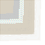

# Courechouse

<small>[TR: Nightmares](../../index.md) &rsaquo; [Items](../index.md) &rsaquo; [Weapons](index.md)</small>

| | |
|---|---|
| **ID** | `trnightmare:courechouse` |
| **Category** | Weapons |
| **Stack size** | 1 |
| **Attack damage** | 237 |
| **Attack speed** | 7 |
| **Tier** | Hihiirokane |
| **Durability** | 3,600 |

## What it does

A Hihiirokane weapon that deals **237** attack damage at **7** attack speed. Durability: **3,600**.
