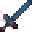

# Blade of The End

<small>[TR: Nightmares](../../index.md) &rsaquo; [Items](../index.md) &rsaquo; [Weapons](index.md)</small>

| | |
|---|---|
| **ID** | `trnightmare:ending_unsealed_sword` |
| **Category** | Weapons |
| **Rarity** | Epic |
| **Fire resistant** | Yes |
| **Attack damage** | 82 (81 one-handed) |
| **Attack speed** | 1.4 (1.2 one-handed) |
| **Reach** | +1 blocks |
| **Sweep damage** | +25% |
| **Tier** | Hihiirokane |
| **Durability** | 3,600 |

## What it does

The unsealed form of the [Ending](../../abilities/unique-skills/ending.md) skill's sword. If you have Ending, every hit gives the target [Ending](../../effects/ending.md) for 5 seconds, and holding it in your main hand fully masters Ending (mastery 1,500). If you don't have Ending, trying to use it destroys it. Repair it with Daemon Essence.

A Hihiirokane sword you can hold in one or both hands. Two-handed it deals **82** attack damage at **1.4** attack speed; one-handed **81** damage at **1.2** speed. It also has +1 block of reach and 25% sweeping damage. Durability: **3,600**.
