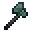

# Galand's Halberd

<small>[TR: Nightmares](../../index.md) &rsaquo; [Items](../index.md) &rsaquo; [Weapons](index.md)</small>

| | |
|---|---|
| **ID** | `trnightmare:galand_halberd` |
| **Category** | Weapons |
| **Stack size** | 1 |
| **Attack damage** | 105 |
| **Attack speed** | 5 |
| **Tier** | Demon Treasures |
| **Durability** | 10,000 |

## What it does

A treasure weapon with no ability of its own (see the stats box). It never breaks, can't be repaired, doesn't burn and can't be put in shulker boxes or bundles.

A Demon Treasures weapon that deals **105** attack damage at **5** attack speed. Durability: **10,000**. It is made at the Tensura Smithing.

## Obtaining

### Recipes

**Tensura Smithing** &rarr;  [Galand's Halberd](galand-halberd.md)

Ingredients:  Chaos Core,  [Adamantite Axe](../../../tensura-reincarnated/items/tools/adamantite-axe.md),  [Adamantite Spear](../../../tensura-reincarnated/items/weapons/adamantite-spear.md),  Demon Essence x6

Requires schematic:  [Adamantite Gear Schematic](../../../tensura-reincarnated/items/schematics/adamantite-gear-schematic.md),  [Spear Schematic](../../../tensura-reincarnated/items/schematics/spear-schematic.md)
