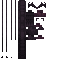

# Memory

<small>[TR: Nightmares](../../index.md) &rsaquo; [Items](../index.md) &rsaquo; [Weapons](index.md)</small>

| | |
|---|---|
| **ID** | `trnightmare:memory` |
| **Category** | Weapons |
| **Gear EP** | 10,000,000 - 100,000,000 |
| **Attack damage** | 110 (110 one-handed) |
| **Attack speed** | 1.5 (1.5 one-handed) |
| **Reach** | +2 blocks |
| **Sweep damage** | +75% |
| **Critical chance** | +20% |
| **Tier** | Divine Tools |
| **Durability** | 10,000 |

## What it does

**Memory**, a Genesis sword with the same stats as the others. [｢ Astral Light, Lord of Creation ｣](../../abilities/ultimate-skills/astral-light.md) forges it (its fifth mode) if you have a named Amnesiac ego. Only one Memory exists per world: copies that don't match the world's forged Memory are deleted from inventories.

A Divine Tools sword you can hold in one or both hands. Two-handed it deals **110** attack damage at **1.5** attack speed; one-handed **110** damage at **1.5** speed. It also has +2 blocks of reach, +20% critical hit chance and 75% sweeping damage. Durability: **10,000**.
