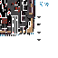

# Nodens: The World

<small>[TR: Nightmares](../../index.md) &rsaquo; [Items](../index.md) &rsaquo; [Weapons](index.md)</small>

| | |
|---|---|
| **ID** | `trnightmare:nodens_the_world` |
| **Category** | Weapons |
| **Stack size** | 1 |
| **Durability** | 100,000 |
| **Attack damage** | 257 (256 one-handed) |
| **Attack speed** | 7 (6.8 one-handed) |
| **Reach** | +1 blocks |
| **Sweep damage** | +25% |
| **Tier** | Hihiirokane |

## What it does

A Hihiirokane weapon you can hold in one or both hands. Two-handed it deals **257** attack damage at **7** attack speed; one-handed **256** damage at **6.8** speed. It also has +1 block of reach and 25% sweeping damage. Durability: **3,600**.
