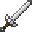

# Dragon Sword: Reid (Locked)

<small>[TR: Nightmares](../../index.md) &rsaquo; [Items](../index.md) &rsaquo; [Weapons](index.md)</small>

| | |
|---|---|
| **ID** | `trnightmare:reinhard_locked` |
| **Category** | Weapons |
| **Stack size** | 1 |
| **Durability** | 10,000 |
| **Attack damage** | 117 (116 one-handed) |
| **Attack speed** | 7 (6.8 one-handed) |
| **Tier** | Hihiirokane |

## What it does

A Hihiirokane long sword you can hold in one or both hands. Two-handed it deals **117** attack damage at **7** attack speed; one-handed **116** damage at **6.8** speed. It also has +1 block of reach and 25% sweeping damage. Durability: **3,600**. It is made at the Tensura Smithing.

## Obtaining

### Recipes

**Tensura Smithing** &rarr;  [Dragon Sword: Reid (Locked)](reinhard-locked.md)

Ingredients:  Block Of Hihiirokane,  [Dragon Peacock Feather](https://minecraft.wiki/w/Dragon_Peacock_Feather),  Demon Essence,  [Element Core (Space)](../../../tensura-reincarnated/items/miscellaneous/element-core-space.md),  [Iron Long Sword](../../../tensura-reincarnated/items/weapons/iron-long-sword.md)

Requires schematic:  [Long Sword Schematic](../../../tensura-reincarnated/items/schematics/long-sword-schematic.md),  [Hihi'Irokane Gear Schematic](../../../tensura-reincarnated/items/schematics/hihiirokane-gear-schematic.md)
