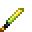

# Genesis Grade - The Asura

<small>[TR: Nightmares](../../index.md) &rsaquo; [Items](../index.md) &rsaquo; [Weapons](index.md)</small>

| | |
|---|---|
| **ID** | `trnightmare:the_asura` |
| **Category** | Weapons |
| **Stack size** | 1 |
| **Durability** | 10,000 |
| **Gear EP** | 10,000,000 - 100,000,000 |

## What it does

It is made at the Tensura Smithing.

## Obtaining

### Recipes

**Tensura Smithing** &rarr;  [Genesis Grade - The Asura](the-asura.md)

Ingredients:  Block Of Hihiirokane x4,  Block Of Orichalcum x2,  [Redstone Block](https://minecraft.wiki/w/Redstone_Block),  [Orichalcum Short Sword](../../../tensura-reincarnated/items/weapons/orichalcum-short-sword.md),  [Amethyst Shard](https://minecraft.wiki/w/Amethyst_Shard)

Requires schematic:  [Long Sword Schematic](../../../tensura-reincarnated/items/schematics/long-sword-schematic.md),  [Hihi'Irokane Gear Schematic](../../../tensura-reincarnated/items/schematics/hihiirokane-gear-schematic.md)
