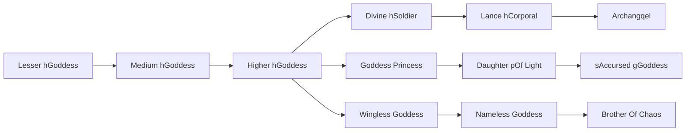

# Archangqel

<small>[TR: Nightmares](../index.md) &rsaquo; [Races](index.md)</small>

| | |
|---|---|
| **ID** | `trnightmare:archangel` |
| **Stage** | Final |
| **Difficulty** | Easy |
| **Alignment** | Holy |
| **Aura** | 500,000 - 1,000,000 |
| **Magicule** | 300,000 - 600,000 |
| **Health bonus** | 979 |
| **Spiritual health bonus** | 5,717 |
| **Attack damage bonus** | 8 |
| **Movement speed bonus** | 0.05 |
| **EP to evolve into** | 1,000,000 |

## Evolution

- **Evolves from:** [Lance hCorporal](lance-corporal.md)

### Requirements to evolve into Archangqel

Each requirement adds its weight to the evolution progress bar; you can evolve at 100%.

| Requirement | Weight |
|---|---|
| Reach Existence Points of 1,000,000 | 50% |
| Consume 10 of [Holy Essence](../items/materials/holy-essence.md) | 50% |

### Evolution tree

## Intrinsic skills

Granted automatically when you become this race.

-  [Holy Magic Release](../abilities/intrinsic-skills/holy-magic-release.md)

## Traits

- Divine

## Attribute modifiers

| Attribute | Amount | Operation |
|---|---|---|
| Scale | 1 | add |
| Max Health | 979 | add |
| Max Spiritual Health | 5,717 | add |
| Attack Damage | 8 | add |
| Attack Speed | 0 | add |
| Knockback Resistance | 1.5 | add |
| Movement Speed | 0.05 | add |
| Swim Speed Multiplier | 0.05 | add |

## Stats (config defaults)

Set in [`config/nightmare/race/goddess_clan_config.toml`](../configs/config-nightmare-race-goddess-clan-config.md).

| Option | Default | Description |
|---|---|---|
| `Archangel.epRequirement` | 1,000,000 | Existence points required to evolve into Archangel. |
| `Archangel.essenceRequirementHoly` | 10 | Holy essence required to evolve into Archangel. |
| `Archangel.minAura` | 500,000 | Minimal aura. |
| `Archangel.maxAura` | 1,000,000 | Maximum aura. |
| `Archangel.minMagicule` | 300,000 | Minimal magicule. |
| `Archangel.maxMagicule` | 600,000 | Maximum magicule. |
| `Archangel.size` | 1 | Bonus Size. |
| `Archangel.maxHealth` | 979 | Bonus Max Health. |
| `Archangel.maxSpiritualHealth` | 5,717 | Bonus Max Spiritual Health. |
| `Archangel.attack` | 8 | Bonus Attack Damage. |
| `Archangel.attackSpeed` | 0 | Bonus Attack Speed. |
| `Archangel.knockbackResistance` | 1.5 | Bonus Knockback Resistance. |
| `Archangel.movementSpeed` | 0.05 | Bonus Movement Speed. |
| `Archangel.swimSpeed` | 0.05 | Bonus Swimming Speed Multiplier. |
| `LanceCorporal.epRequirement` | 750,000 | Existence points required to evolve into Lance Corporal. |
| `LanceCorporal.minAura` | 375,000 | Minimal aura. |
| `LanceCorporal.maxAura` | 750,000 | Maximum aura. |
| `LanceCorporal.minMagicule` | 225,000 | Minimal magicule. |
| `LanceCorporal.maxMagicule` | 450,000 | Maximum magicule. |
| `LanceCorporal.size` | 1 | Bonus Size. |
| `LanceCorporal.maxHealth` | 757 | Bonus Max Health. |
| `LanceCorporal.maxSpiritualHealth` | 3,240 | Bonus Max Spiritual Health. |
| `LanceCorporal.attack` | 4 | Bonus Attack Damage. |
| `LanceCorporal.attackSpeed` | 0 | Bonus Attack Speed. |
| `LanceCorporal.knockbackResistance` | 1.1 | Bonus Knockback Resistance. |
| `LanceCorporal.movementSpeed` | 0.03 | Bonus Movement Speed. |
| `LanceCorporal.swimSpeed` | 0.03 | Bonus Swimming Speed Multiplier. |
| `DivineSoldier.epRequirement` | 350,000 | Existence points required to evolve into Divine Soldier. |
| `DivineSoldier.essenceRequirementHoly` | 15 | Holy essence required to evolve into Divine Soldier. |
| `DivineSoldier.minAura` | 175,000 | Minimal aura. |
| `DivineSoldier.maxAura` | 350,000 | Maximum aura. |
| `DivineSoldier.minMagicule` | 105,000 | Minimal magicule. |
| `DivineSoldier.maxMagicule` | 210,000 | Maximum magicule. |
| `DivineSoldier.size` | 0.5 | Bonus Size. |
| `DivineSoldier.maxHealth` | 330 | Bonus Max Health. |
| `DivineSoldier.maxSpiritualHealth` | 1,140 | Bonus Max Spiritual Health. |
| `DivineSoldier.attack` | 3 | Bonus Attack Damage. |
| `DivineSoldier.attackSpeed` | 0 | Bonus Attack Speed. |
| `DivineSoldier.knockbackResistance` | 0.9 | Bonus Knockback Resistance. |
| `DivineSoldier.movementSpeed` | 0.02 | Bonus Movement Speed. |
| `DivineSoldier.swimSpeed` | 0.02 | Bonus Swimming Speed Multiplier. |
| `HigherClassGoddess.epRequirement` | 150,000 | Existence points required to evolve into Higher Class Goddess. |
| `HigherClassGoddess.essenceRequirementHoly` | 10 | Holy essence required to evolve into Higher Class Goddess. |
| `HigherClassGoddess.minAura` | 75,000 | Minimal aura. |
| `HigherClassGoddess.maxAura` | 150,000 | Maximum aura. |
| `HigherClassGoddess.minMagicule` | 45,000 | Minimal magicule. |
| `HigherClassGoddess.maxMagicule` | 90,000 | Maximum magicule. |
| `HigherClassGoddess.size` | 0 | Bonus Size. |
| `HigherClassGoddess.maxHealth` | 230 | Bonus Max Health. |
| `HigherClassGoddess.maxSpiritualHealth` | 690 | Bonus Max Spiritual Health. |
| `HigherClassGoddess.attack` | 2.4 | Bonus Attack Damage. |
| `HigherClassGoddess.attackSpeed` | 0.3 | Bonus Attack Speed. |
| `HigherClassGoddess.knockbackResistance` | 0.5 | Bonus Knockback Resistance. |
| `HigherClassGoddess.movementSpeed` | 0.06 | Bonus Movement Speed. |
| `HigherClassGoddess.swimSpeed` | 0.06 | Bonus Swimming Speed Multiplier. |
| `MediumClassGoddess.essenceRequirementHoly` | 10 | Holy essence required to evolve into Medium Class Goddess. |
| `MediumClassGoddess.epRequirement` | 80,000 | Existence points required to evolve into Medium Class Goddess. |
| `MediumClassGoddess.essenceRequirementHoly` | 10 | Holy essence required to evolve into Medium Class Goddess. |
| `MediumClassGoddess.minAura` | 40,000 | Minimal aura. |
| `MediumClassGoddess.maxAura` | 80,000 | Maximum aura. |
| `MediumClassGoddess.minMagicule` | 24,000 | Minimal magicule. |
| `MediumClassGoddess.maxMagicule` | 48,000 | Maximum magicule. |
| `MediumClassGoddess.size` | 0 | Bonus Size. |
| `MediumClassGoddess.maxHealth` | 100 | Bonus Max Health. |
| `MediumClassGoddess.maxSpiritualHealth` | 200 | Bonus Max Spiritual Health. |
| `MediumClassGoddess.attack` | 1.4 | Bonus Attack Damage. |
| `MediumClassGoddess.attackSpeed` | 0 | Bonus Attack Speed. |
| `MediumClassGoddess.knockbackResistance` | 0.5 | Bonus Knockback Resistance. |
| `MediumClassGoddess.movementSpeed` | 0.04 | Bonus Movement Speed. |
| `MediumClassGoddess.swimSpeed` | 0.04 | Bonus Swimming Speed Multiplier. |
| `LowerClassGoddess.minAura` | 2,000 | Minimal aura. |
| `LowerClassGoddess.maxAura` | 4,000 | Maximum aura. |
| `LowerClassGoddess.minMagicule` | 500 | Minimal magicule. |
| `LowerClassGoddess.maxMagicule` | 1,000 | Maximum magicule. |
| `LowerClassGoddess.size` | 0 | Bonus Size. |
| `LowerClassGoddess.maxHealth` | 25 | Bonus Max Health. |
| `LowerClassGoddess.maxSpiritualHealth` | 90 | Bonus Max Spiritual Health. |
| `LowerClassGoddess.attack` | 0.7 | Bonus Attack Damage. |
| `LowerClassGoddess.attackSpeed` | -0.2 | Bonus Attack Speed. |
| `LowerClassGoddess.knockbackResistance` | 0.5 | Bonus Knockback Resistance. |
| `LowerClassGoddess.movementSpeed` | 0.02 | Bonus Movement Speed. |
| `LowerClassGoddess.swimSpeed` | 0.02 | Bonus Swimming Speed Multiplier. |

## Tags

`tensura:races/divine`
