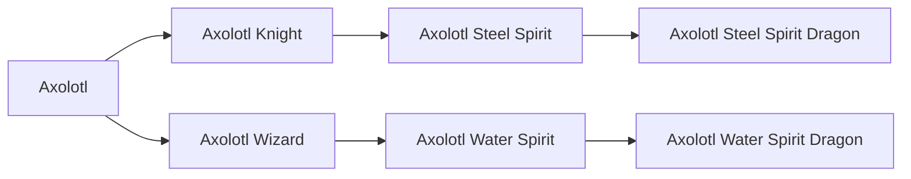

# Axolotl Knight

<small>[TR: Nightmares](../index.md) &rsaquo; [Races](index.md)</small>

| | |
|---|---|
| **ID** | `trnightmare:axolotl_knight` |
| **Stage** | In-between |
| **Difficulty** | Hard |
| **Alignment** | Default |
| **Aura** | 500 - 500 |
| **Magicule** | 1,500 - 5,500 |
| **Health bonus** | 5 |
| **Spiritual health bonus** | 15 |
| **Attack damage bonus** | 2 |
| **Movement speed bonus** | 0.02 |
| **EP to evolve into** | 50,000 |

## Evolution

- **Evolves from:** [Axolotl](axolotl.md)
- **Evolves into:** [Axolotl Steel Spirit](axolotl-steel-spirit.md)
- **Default evolution:** [Axolotl Steel Spirit](axolotl-steel-spirit.md)
- **On awakening (True Demon Lord / True Hero):** [Axolotl Steel Spirit](axolotl-steel-spirit.md)
- **During the Harvest Festival:** [Axolotl Steel Spirit](axolotl-steel-spirit.md)

### Requirements to evolve into Axolotl Knight

Each requirement adds its weight to the evolution progress bar; you can evolve at 100%.

| Requirement | Weight |
|---|---|
| Reach Existence Points of 50,000 | 100% |

### Evolution tree

## Attribute modifiers

| Attribute | Amount | Operation |
|---|---|---|
| Scale | -1.1 | add |
| Max Health | 5 | add |
| Max Spiritual Health | 15 | add |
| Attack Damage | 2 | add |
| Attack Speed | 0 | add |
| Knockback Resistance | 5 | add |
| Movement Speed | 0.02 | add |
| Swim Speed Multiplier | 0.5 | add |

## Stats (config defaults)

Set in [`config/nightmare/race/axolotl/axolotl_config.toml`](../configs/config-nightmare-race-axolotl-axolotl-config.md).

| Option | Default | Description |
|---|---|---|
| `AxolotlKnight.epRequirement` | 50,000 | EP requirement to evolve. |
| `AxolotlKnight.minAura` | 500 | Minimal aura. |
| `AxolotlKnight.maxAura` | 500 | Maximum aura. |
| `AxolotlKnight.minMagicule` | 1,500 | Minimal magicule. |
| `AxolotlKnight.maxMagicule` | 5,500 | Maximum magicule. |
| `AxolotlKnight.size` | -1.1 | Bonus Size. |
| `AxolotlKnight.maxHealth` | 5 | Bonus Max Health. |
| `AxolotlKnight.maxSpiritualHealth` | 15 | Bonus Max Spiritual Health. |
| `AxolotlKnight.attack` | 2 | Bonus Attack Damage. |
| `AxolotlKnight.attackSpeed` | 0 | Bonus Attack Speed. |
| `AxolotlKnight.knockbackResistance` | 5 | Bonus Knockback Resistance. |
| `AxolotlKnight.movementSpeed` | 0.02 | Bonus Movement Speed. |
| `AxolotlKnight.swimSpeed` | 0.5 | Bonus Swimming Speed Multiplier. |
| `AxolotlKnight.intrinsicSkills` | "tensura:dragon_skin", "tensura:body_armor", "tensura:physical_attack_resistance" | List of skills obtained by this race. |
| `Axolotl.epRequirement` | 50,000 | EP requirement to evolve. |
| `Axolotl.minAura` | 500 | Minimal aura. |
| `Axolotl.maxAura` | 1,500 | Maximum aura. |
| `Axolotl.minMagicule` | 1,500 | Minimal magicule. |
| `Axolotl.maxMagicule` | 5,500 | Maximum magicule. |
| `Axolotl.size` | -1.1 | Bonus Size. |
| `Axolotl.maxHealth` | -15 | Bonus Max Health. |
| `Axolotl.maxSpiritualHealth` | -10 | Bonus Max Spiritual Health. |
| `Axolotl.attack` | 0 | Bonus Attack Damage. |
| `Axolotl.attackSpeed` | 0 | Bonus Attack Speed. |
| `Axolotl.knockbackResistance` | 0.5 | Bonus Knockback Resistance. |
| `Axolotl.movementSpeed` | 0.02 | Bonus Movement Speed. |
| `Axolotl.swimSpeed` | 0.5 | Bonus Swimming Speed Multiplier. |
| `Axolotl.intrinsicSkills` | "tensura:self_regeneration", "tensura:absorb_and_dissolve", "tensura:water_breathing", "tensura:wind_attack_resistance" | List of skills obtained by this race. |
