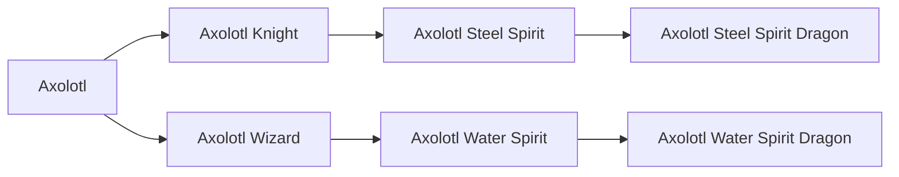

# Axolotl Water Spirit Dragon

<small>[TR: Nightmares](../index.md) &rsaquo; [Races](index.md)</small>

| | |
|---|---|
| **ID** | `trnightmare:axolotl_water_dragon` |
| **Stage** | Final |
| **Difficulty** | Hard |
| **Alignment** | Holy |
| **Aura** | 500 - 500 |
| **Magicule** | 1,500 - 5,500 |
| **Health bonus** | 1,000 |
| **Spiritual health bonus** | 6,600 |
| **Attack damage bonus** | 3 |
| **Movement speed bonus** | 0.02 |
| **EP to evolve into** | 1,600,000 |

## Evolution

- **Evolves from:** [Axolotl Water Spirit](axolotl-water-spirit.md)

### Requirements to evolve into Axolotl Water Spirit Dragon

Each requirement adds its weight to the evolution progress bar; you can evolve at 100%.

| Requirement | Weight |
|---|---|
| Reach Existence Points of 1,600,000 | 50% |
| Kill 4 bosses | 50% |

### Evolution tree

## Traits

- Divine

## Attribute modifiers

| Attribute | Amount | Operation |
|---|---|---|
| Scale | -1.1 | add |
| Max Health | 1,000 | add |
| Max Spiritual Health | 6,600 | add |
| Attack Damage | 3 | add |
| Attack Speed | 0 | add |
| Knockback Resistance | 5 | add |
| Movement Speed | 0.02 | add |
| Swim Speed Multiplier | 1.5 | add |

## Stats (config defaults)

Set in [`config/nightmare/race/axolotl/axolotl_config.toml`](../configs/config-nightmare-race-axolotl-axolotl-config.md).

| Option | Default | Description |
|---|---|---|
| `WaterDragon.epRequirement` | 1,600,000 | EP requirement to evolve. |
| `WaterDragon.bossRequirement` | 4 | Bosses required to evolve. |
| `WaterDragon.minAura` | 500 | Minimal aura. |
| `WaterDragon.maxAura` | 500 | Maximum aura. |
| `WaterDragon.minMagicule` | 1,500 | Minimal magicule. |
| `WaterDragon.maxMagicule` | 5,500 | Maximum magicule. |
| `WaterDragon.size` | -1.1 | Bonus Size. |
| `WaterDragon.maxHealth` | 1,000 | Bonus Max Health. |
| `WaterDragon.maxSpiritualHealth` | 6,600 | Bonus Max Spiritual Health. |
| `WaterDragon.attack` | 3 | Bonus Attack Damage. |
| `WaterDragon.attackSpeed` | 0 | Bonus Attack Speed. |
| `WaterDragon.knockbackResistance` | 5 | Bonus Knockback Resistance. |
| `WaterDragon.movementSpeed` | 0.02 | Bonus Movement Speed. |
| `WaterDragon.swimSpeed` | 1.5 | Bonus Swimming Speed Multiplier. |
| `WaterDragon.intrinsicSkills` | "trnightmare:water_ki_release", "trnightmare:water_dragon_armor", "tensura:water_attack_nullification", "trnightmare:axolotl_haki" | List of skills obtained by this race. |
| `WaterSpirit.epRequirement` | 200,000 | EP requirement to evolve. |
| `WaterSpirit.codRequirement` | 60 | Raw cod requirement to evolve |
| `WaterSpirit.minAura` | 500 | Minimal aura. |
| `WaterSpirit.maxAura` | 500 | Maximum aura. |
| `WaterSpirit.minMagicule` | 1,500 | Minimal magicule. |
| `WaterSpirit.maxMagicule` | 5,500 | Maximum magicule. |
| `WaterSpirit.size` | -1.1 | Bonus Size. |
| `WaterSpirit.maxHealth` | 180 | Bonus Max Health. |
| `WaterSpirit.maxSpiritualHealth` | 3,600 | Bonus Max Spiritual Health. |
| `WaterSpirit.attack` | 1 | Bonus Attack Damage. |
| `WaterSpirit.attackSpeed` | 0 | Bonus Attack Speed. |
| `WaterSpirit.knockbackResistance` | 5 | Bonus Knockback Resistance. |
| `WaterSpirit.movementSpeed` | 0.02 | Bonus Movement Speed. |
| `WaterSpirit.swimSpeed` | 0.5 | Bonus Swimming Speed Multiplier. |
| `WaterSpirit.intrinsicSkills` | "trnightmare:water_ki_release" | List of skills obtained by this race. |
| `AxolotlWizard.epRequirement` | 50,000 | EP requirement to evolve. |
| `AxolotlWizard.minAura` | 500 | Minimal aura. |
| `AxolotlWizard.maxAura` | 1,500 | Maximum aura. |
| `AxolotlWizard.minMagicule` | 1,500 | Minimal magicule. |
| `AxolotlWizard.maxMagicule` | 5,500 | Maximum magicule. |
| `AxolotlWizard.size` | -1.1 | Bonus Size. |
| `AxolotlWizard.maxHealth` | 0 | Bonus Max Health. |
| `AxolotlWizard.maxSpiritualHealth` | 40 | Bonus Max Spiritual Health. |
| `AxolotlWizard.attack` | 0 | Bonus Attack Damage. |
| `AxolotlWizard.attackSpeed` | 0 | Bonus Attack Speed. |
| `AxolotlWizard.knockbackResistance` | 0.5 | Bonus Knockback Resistance. |
| `AxolotlWizard.movementSpeed` | 0.02 | Bonus Movement Speed. |
| `AxolotlWizard.swimSpeed` | 0.5 | Bonus Swimming Speed Multiplier. |
| `AxolotlWizard.intrinsicSkills` | "tensura:self_regeneration", "tensura:absorb_and_dissolve", "tensura:water_breathing", "tensura:wind_attack_resistance" | List of skills obtained by this race. |
| `Axolotl.epRequirement` | 50,000 | EP requirement to evolve. |
| `Axolotl.minAura` | 500 | Minimal aura. |
| `Axolotl.maxAura` | 1,500 | Maximum aura. |
| `Axolotl.minMagicule` | 1,500 | Minimal magicule. |
| `Axolotl.maxMagicule` | 5,500 | Maximum magicule. |
| `Axolotl.size` | -1.1 | Bonus Size. |
| `Axolotl.maxHealth` | -15 | Bonus Max Health. |
| `Axolotl.maxSpiritualHealth` | -10 | Bonus Max Spiritual Health. |
| `Axolotl.attack` | 0 | Bonus Attack Damage. |
| `Axolotl.attackSpeed` | 0 | Bonus Attack Speed. |
| `Axolotl.knockbackResistance` | 0.5 | Bonus Knockback Resistance. |
| `Axolotl.movementSpeed` | 0.02 | Bonus Movement Speed. |
| `Axolotl.swimSpeed` | 0.5 | Bonus Swimming Speed Multiplier. |
| `Axolotl.intrinsicSkills` | "tensura:self_regeneration", "tensura:absorb_and_dissolve", "tensura:water_breathing", "tensura:wind_attack_resistance" | List of skills obtained by this race. |

## Tags

`tensura:races/divine`
