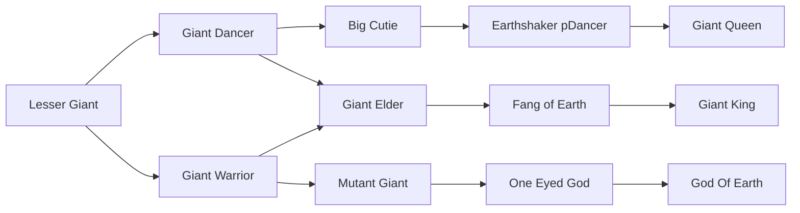

# Big Cutie

<small>[TR: Nightmares](../index.md) &rsaquo; [Races](index.md)</small>

| | |
|---|---|
| **ID** | `trnightmare:big_cutie` |
| **Stage** | In-between |
| **Difficulty** | Hard |
| **Alignment** | Default |
| **Aura** | 60,000 - 120,000 |
| **Magicule** | 40,000 - 80,000 |
| **Health bonus** | 360 |
| **Spiritual health bonus** | 840 |
| **Attack damage bonus** | 2 |
| **Movement speed bonus** | 0.09 |
| **EP to evolve into** | 120,000 |

## Evolution

- **Evolves from:** [Giant Dancer](giant-dancer.md)
- **Evolves into:** [Earthshaker pDancer](earthshaker-dancer.md)
- **Default evolution:** [Earthshaker pDancer](earthshaker-dancer.md)
- **On awakening (True Demon Lord / True Hero):** [Earthshaker pDancer](earthshaker-dancer.md)
- **During the Harvest Festival:** [Earthshaker pDancer](earthshaker-dancer.md)

### Requirements to evolve into Big Cutie

Each requirement adds its weight to the evolution progress bar; you can evolve at 100%.

| Requirement | Weight |
|---|---|
| Reach Existence Points of 120,000 | 100% |

### Evolution tree

## Intrinsic skills

Granted automatically when you become this race.

-  [Pain Resistance](../../tensura-reincarnated/abilities/resistance-skills/pain-resistance.md)
-  [Pierce Resistance](../../tensura-reincarnated/abilities/resistance-skills/pierce-resistance.md)
-  [Earth Domination](../../tensura-reincarnated/abilities/extra-skills/earth-domination.md)
-  [Size Condense](../abilities/intrinsic-skills/size-condense.md)

## Attribute modifiers

| Attribute | Amount | Operation |
|---|---|---|
| Scale | 0.5 | add |
| Max Health | 360 | add |
| Max Spiritual Health | 840 | add |
| Attack Damage | 2 | add |
| Attack Speed | 1.2 | add |
| Knockback Resistance | 0.1 | add |
| Movement Speed | 0.09 | add |
| Swim Speed Multiplier | 0.09 | add |

## Stats (config defaults)

Set in [`config/nightmare/race/giant_clan_config.toml`](../configs/config-nightmare-race-giant-clan-config.md).

| Option | Default | Description |
|---|---|---|
| `BigCutie.epRequirement` | 120,000 | Existence points required to evolve into Big Cutie. |
| `BigCutie.minAura` | 60,000 | Minimal aura. |
| `BigCutie.maxAura` | 120,000 | Maximum aura. |
| `BigCutie.minMagicule` | 40,000 | Minimal magicule. |
| `BigCutie.maxMagicule` | 80,000 | Maximum magicule. |
| `BigCutie.size` | 0.5 | Bonus Size. |
| `BigCutie.maxHealth` | 360 | Bonus Max Health. |
| `BigCutie.maxSpiritualHealth` | 840 | Bonus Max Spiritual Health. |
| `BigCutie.attack` | 2 | Bonus Attack Damage. |
| `BigCutie.attackSpeed` | 1.2 | Bonus Attack Speed. |
| `BigCutie.knockbackResistance` | 0.1 | Bonus Knockback Resistance. |
| `BigCutie.movementSpeed` | 0.09 | Bonus Movement Speed. |
| `BigCutie.swimSpeed` | 0.09 | Bonus Swimming Speed Multiplier. |
| `GiantDancer.epRequirement` | 40,000 | Existence points required to evolve into Giant Dancer. |
| `GiantDancer.minAura` | 25,000 | Minimal aura. |
| `GiantDancer.maxAura` | 50,000 | Maximum aura. |
| `GiantDancer.minMagicule` | 15,000 | Minimal magicule. |
| `GiantDancer.maxMagicule` | 30,000 | Maximum magicule. |
| `GiantDancer.size` | 0.5 | Bonus Size. |
| `GiantDancer.maxHealth` | 300 | Bonus Max Health. |
| `GiantDancer.maxSpiritualHealth` | 840 | Bonus Max Spiritual Health. |
| `GiantDancer.attack` | 2 | Bonus Attack Damage. |
| `GiantDancer.attackSpeed` | 1 | Bonus Attack Speed. |
| `GiantDancer.knockbackResistance` | 0.5 | Bonus Knockback Resistance. |
| `GiantDancer.movementSpeed` | 0.07 | Bonus Movement Speed. |
| `GiantDancer.swimSpeed` | 0.07 | Bonus Swimming Speed Multiplier. |
| `LesserGiant.minAura` | 500 | Minimal aura. |
| `LesserGiant.maxAura` | 500 | Maximum aura. |
| `LesserGiant.minMagicule` | 1,500 | Minimal magicule. |
| `LesserGiant.maxMagicule` | 5,500 | Maximum magicule. |
| `LesserGiant.size` | 0.5 | Bonus Size. |
| `LesserGiant.maxHealth` | 80 | Bonus Max Health. |
| `LesserGiant.maxSpiritualHealth` | 240 | Bonus Max Spiritual Health. |
| `LesserGiant.attack` | 2 | Bonus Attack Damage. |
| `LesserGiant.attackSpeed` | 0 | Bonus Attack Speed. |
| `LesserGiant.knockbackResistance` | 0.5 | Bonus Knockback Resistance. |
| `LesserGiant.movementSpeed` | 0.04 | Bonus Movement Speed. |
| `LesserGiant.swimSpeed` | 0.04 | Bonus Swimming Speed Multiplier. |
