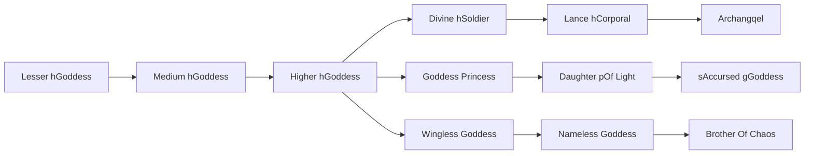

# Brother Of Chaos

<small>[TR: Nightmares](../index.md) &rsaquo; [Races](index.md)</small>

| | |
|---|---|
| **ID** | `trnightmare:brother_of_chaos` |
| **Stage** | Final |
| **Difficulty** | Easy |
| **Alignment** | Majin |
| **Aura** | 600,000 - 1,200,000 |
| **Magicule** | 1,000,000 - 2,000,000 |
| **Health bonus** | 980 |
| **Spiritual health bonus** | 6,000 |
| **Attack damage bonus** | 14 |
| **Movement speed bonus** | 0.11 |
| **EP to evolve into** | 2,000,000 |

## Evolution

- **Evolves from:** [Nameless Goddess](nameless-goddess.md)

### Requirements to evolve into Brother Of Chaos

Each requirement adds its weight to the evolution progress bar; you can evolve at 100%.

| Requirement | Weight |
|---|---|
| Reach Existence Points of 2,000,000 | 34% |
| Consume 90 of [Holy Essence](../items/materials/holy-essence.md) | 33% |
| Consume 90 of [Daemon Essence](../../tensura-reincarnated/items/materials/daemon-essence.md) | 33% |

### Evolution tree

## Intrinsic skills

Granted automatically when you become this race.

-  [Physical Attack Resistance](../../tensura-reincarnated/abilities/resistance-skills/physical-attack-resistance.md)
-  [Ultraspeed Regeneration](../../tensura-reincarnated/abilities/extra-skills/ultraspeed-regeneration.md)

## Traits

- Divine

## Attribute modifiers

| Attribute | Amount | Operation |
|---|---|---|
| Scale | 0 | add |
| Max Health | 980 | add |
| Max Spiritual Health | 6,000 | add |
| Attack Damage | 14 | add |
| Attack Speed | 0 | add |
| Knockback Resistance | 1 | add |
| Movement Speed | 0.11 | add |
| Swim Speed Multiplier | 0.11 | add |

## Stats (config defaults)

Set in [`config/nightmare/race/goddess_clan_config.toml`](../configs/config-nightmare-race-goddess-clan-config.md).

| Option | Default | Description |
|---|---|---|
| `BrotherOfChaosGoddess.epRequirement` | 2,000,000 | Existence points required to evolve into Brother Of Chaos Goddess. |
| `BrotherOfChaosGoddess.essenceRequirementHoly` | 35 | Holy essence required to evolve into Brother Of Chaos Goddess. |
| `BrotherOfChaosGoddess.essenceRequirementDaemon` | 35 | Daemon essence required to evolve into Brother Of Chaos Goddess. |
| `BrotherOfChaosGoddess.minAura` | 600,000 | Minimal aura. |
| `BrotherOfChaosGoddess.maxAura` | 1,200,000 | Maximum aura. |
| `BrotherOfChaosGoddess.minMagicule` | 1,000,000 | Minimal magicule. |
| `BrotherOfChaosGoddess.maxMagicule` | 2,000,000 | Maximum magicule. |
| `BrotherOfChaosGoddess.size` | 0 | Bonus Size. |
| `BrotherOfChaosGoddess.maxHealth` | 980 | Bonus Max Health. |
| `BrotherOfChaosGoddess.maxSpiritualHealth` | 6,000 | Bonus Max Spiritual Health. |
| `BrotherOfChaosGoddess.attack` | 14 | Bonus Attack Damage. |
| `BrotherOfChaosGoddess.attackSpeed` | 0 | Bonus Attack Speed. |
| `BrotherOfChaosGoddess.knockbackResistance` | 1 | Bonus Knockback Resistance. |
| `BrotherOfChaosGoddess.movementSpeed` | 0.11 | Bonus Movement Speed. |
| `BrotherOfChaosGoddess.swimSpeed` | 0.11 | Bonus Swimming Speed Multiplier. |
| `MediumClassGoddess.essenceRequirementHoly` | 10 | Holy essence required to evolve into Medium Class Goddess. |
| `MediumClassGoddess.epRequirement` | 80,000 | Existence points required to evolve into Medium Class Goddess. |
| `MediumClassGoddess.essenceRequirementHoly` | 10 | Holy essence required to evolve into Medium Class Goddess. |
| `MediumClassGoddess.minAura` | 40,000 | Minimal aura. |
| `MediumClassGoddess.maxAura` | 80,000 | Maximum aura. |
| `MediumClassGoddess.minMagicule` | 24,000 | Minimal magicule. |
| `MediumClassGoddess.maxMagicule` | 48,000 | Maximum magicule. |
| `MediumClassGoddess.size` | 0 | Bonus Size. |
| `MediumClassGoddess.maxHealth` | 100 | Bonus Max Health. |
| `MediumClassGoddess.maxSpiritualHealth` | 200 | Bonus Max Spiritual Health. |
| `MediumClassGoddess.attack` | 1.4 | Bonus Attack Damage. |
| `MediumClassGoddess.attackSpeed` | 0 | Bonus Attack Speed. |
| `MediumClassGoddess.knockbackResistance` | 0.5 | Bonus Knockback Resistance. |
| `MediumClassGoddess.movementSpeed` | 0.04 | Bonus Movement Speed. |
| `MediumClassGoddess.swimSpeed` | 0.04 | Bonus Swimming Speed Multiplier. |
| `HigherClassGoddess.essenceRequirementHoly` | 10 | Holy essence required to evolve into Higher Class Goddess. |
| `HigherClassGoddess.epRequirement` | 150,000 | Existence points required to evolve into Higher Class Goddess. |
| `HigherClassGoddess.essenceRequirementHoly` | 10 | Holy essence required to evolve into Higher Class Goddess. |
| `HigherClassGoddess.minAura` | 75,000 | Minimal aura. |
| `HigherClassGoddess.maxAura` | 150,000 | Maximum aura. |
| `HigherClassGoddess.minMagicule` | 45,000 | Minimal magicule. |
| `HigherClassGoddess.maxMagicule` | 90,000 | Maximum magicule. |
| `HigherClassGoddess.size` | 0 | Bonus Size. |
| `HigherClassGoddess.maxHealth` | 230 | Bonus Max Health. |
| `HigherClassGoddess.maxSpiritualHealth` | 690 | Bonus Max Spiritual Health. |
| `HigherClassGoddess.attack` | 2.4 | Bonus Attack Damage. |
| `HigherClassGoddess.attackSpeed` | 0.3 | Bonus Attack Speed. |
| `HigherClassGoddess.knockbackResistance` | 0.5 | Bonus Knockback Resistance. |
| `HigherClassGoddess.movementSpeed` | 0.06 | Bonus Movement Speed. |
| `HigherClassGoddess.swimSpeed` | 0.06 | Bonus Swimming Speed Multiplier. |
| `WinglessGoddess.essenceRequirementHoly` | 35 | Holy essence required to evolve into Wingless Goddess. |
| `WinglessGoddess.epRequirement` | 350,000 | Existence points required to evolve into Wingless Goddess. |
| `WinglessGoddess.essenceRequirementHoly` | 35 | Holy essence required to evolve into Wingless Goddess. |
| `WinglessGoddess.essenceRequirementDaemon` | 55 | Daemon essence required to evolve into Wingless Goddess. |
| `WinglessGoddess.minAura` | 105,000 | Minimal aura. |
| `WinglessGoddess.maxAura` | 210,000 | Maximum aura. |
| `WinglessGoddess.minMagicule` | 175,000 | Minimal magicule. |
| `WinglessGoddess.maxMagicule` | 350,000 | Maximum magicule. |
| `WinglessGoddess.size` | 0 | Bonus Size. |
| `WinglessGoddess.maxHealth` | 280 | Bonus Max Health. |
| `WinglessGoddess.maxSpiritualHealth` | 940 | Bonus Max Spiritual Health. |
| `WinglessGoddess.attack` | 7 | Bonus Attack Damage. |
| `WinglessGoddess.attackSpeed` | 0.3 | Bonus Attack Speed. |
| `WinglessGoddess.knockbackResistance` | 0.6 | Bonus Knockback Resistance. |
| `WinglessGoddess.movementSpeed` | 0.07 | Bonus Movement Speed. |
| `WinglessGoddess.swimSpeed` | 0.07 | Bonus Swimming Speed Multiplier. |
| `NamelessGoddess.epRequirement` | 700,000 | Existence points required to evolve into Nameless Goddess. |
| `NamelessGoddess.minAura` | 210,000 | Minimal aura. |
| `NamelessGoddess.maxAura` | 420,000 | Maximum aura. |
| `NamelessGoddess.minMagicule` | 350,000 | Minimal magicule. |
| `NamelessGoddess.maxMagicule` | 700,000 | Maximum magicule. |
| `NamelessGoddess.size` | 0 | Bonus Size. |
| `NamelessGoddess.maxHealth` | 580 | Bonus Max Health. |
| `NamelessGoddess.maxSpiritualHealth` | 1,940 | Bonus Max Spiritual Health. |
| `NamelessGoddess.attack` | 12 | Bonus Attack Damage. |
| `NamelessGoddess.attackSpeed` | 0 | Bonus Attack Speed. |
| `NamelessGoddess.knockbackResistance` | 0.7 | Bonus Knockback Resistance. |
| `NamelessGoddess.movementSpeed` | 0.09 | Bonus Movement Speed. |
| `NamelessGoddess.swimSpeed` | 0.09 | Bonus Swimming Speed Multiplier. |
| `LowerClassGoddess.minAura` | 2,000 | Minimal aura. |
| `LowerClassGoddess.maxAura` | 4,000 | Maximum aura. |
| `LowerClassGoddess.minMagicule` | 500 | Minimal magicule. |
| `LowerClassGoddess.maxMagicule` | 1,000 | Maximum magicule. |
| `LowerClassGoddess.size` | 0 | Bonus Size. |
| `LowerClassGoddess.maxHealth` | 25 | Bonus Max Health. |
| `LowerClassGoddess.maxSpiritualHealth` | 90 | Bonus Max Spiritual Health. |
| `LowerClassGoddess.attack` | 0.7 | Bonus Attack Damage. |
| `LowerClassGoddess.attackSpeed` | -0.2 | Bonus Attack Speed. |
| `LowerClassGoddess.knockbackResistance` | 0.5 | Bonus Knockback Resistance. |
| `LowerClassGoddess.movementSpeed` | 0.02 | Bonus Movement Speed. |
| `LowerClassGoddess.swimSpeed` | 0.02 | Bonus Swimming Speed Multiplier. |

## Tags

`tensura:races/divine`
