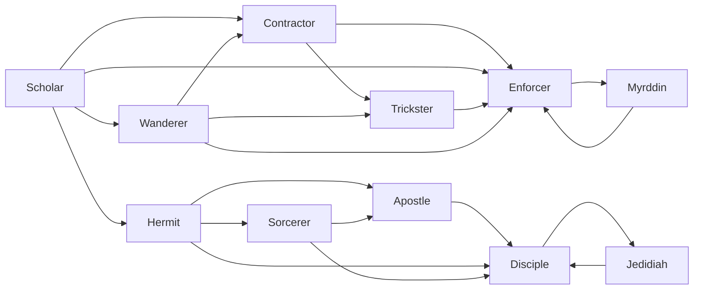

# Disciple

<small>[TR: Nightmares](../index.md) &rsaquo; [Races](index.md)</small>

| | |
|---|---|
| **ID** | `trnightmare:disciple` |
| **Stage** | In-between |
| **Difficulty** | Intermediate |
| **Alignment** | Chaos |
| **Aura** | 100,000 - 2,000,000 |
| **Magicule** | 100,000 - 1,000,000 |
| **Health bonus** | 880 |
| **Spiritual health bonus** | 4,440 |
| **Attack damage bonus** | 5 |
| **Movement speed bonus** | 0.08 |
| **EP to evolve into** | 1,000,000 |

## Evolution

- **Evolves from:** [Apostle](apostle.md), [Hermit](hermit.md), [Sorcerer](sorcerer.md), [Jedidiah](jedidiah.md)
- **Evolves into:** [Jedidiah](jedidiah.md)
- **Default evolution:** [Jedidiah](jedidiah.md)

### Requirements to evolve into Disciple

Each requirement adds its weight to the evolution progress bar; you can evolve at 100%.

| Requirement | Weight |
|---|---|
| Reach Existence Points of 1,000,000 | 50% |
| Awaken [True Demon Lord./True Hero.] | 50% |

### Evolution tree

## Attribute modifiers

| Attribute | Amount | Operation |
|---|---|---|
| Scale | 0 | add |
| Max Health | 880 | add |
| Max Spiritual Health | 4,440 | add |
| Attack Damage | 5 | add |
| Attack Speed | -2.6 | add |
| Knockback Resistance | 0.7 | add |
| Movement Speed | 0.08 | add |
| Swim Speed Multiplier | 0.08 | add |

## Stats (config defaults)

Set in [`config/nightmare/race/scholar_config.toml`](../configs/config-nightmare-race-scholar-config.md).

| Option | Default | Description |
|---|---|---|
| `Disciple.epRequirement` | 1,000,000 | EP requirement to evolve into Disciple. |
| `Disciple.minAura` | 100,000 | Minimal aura. |
| `Disciple.maxAura` | 2,000,000 | Maximum aura. |
| `Disciple.minMagicule` | 100,000 | Minimal magicule. |
| `Disciple.maxMagicule` | 1,000,000 | Maximum magicule. |
| `Disciple.size` | 0 | Bonus Size. |
| `Disciple.maxHealth` | 880 | Bonus Max Health. |
| `Disciple.maxSpiritualHealth` | 4,440 | Bonus Max Spiritual Health. |
| `Disciple.attack` | 5 | Bonus Attack Damage. |
| `Disciple.attackSpeed` | -2.6 | Bonus Attack Speed. |
| `Disciple.knockbackResistance` | 0.7 | Bonus Knockback Resistance. |
| `Disciple.movementSpeed` | 0.08 | Bonus Movement Speed. |
| `Disciple.swimSpeed` | 0.08 | Bonus Swimming Speed Multiplier. |
| `Disciple.intrinsicSkills` | "trnightmare:ideal" | List of skills obtained by this race. |
| `Apostle.epRequirement` | 500,000 | EP requirement to evolve into Apostle. |
| `Apostle.minAura` | 100,000 | Minimal aura. |
| `Apostle.maxAura` | 2,000,000 | Maximum aura. |
| `Apostle.minMagicule` | 100,000 | Minimal magicule. |
| `Apostle.maxMagicule` | 1,000,000 | Maximum magicule. |
| `Apostle.size` | 0 | Bonus Size. |
| `Apostle.maxHealth` | 580 | Bonus Max Health. |
| `Apostle.maxSpiritualHealth` | 2,340 | Bonus Max Spiritual Health. |
| `Apostle.attack` | 4 | Bonus Attack Damage. |
| `Apostle.attackSpeed` | -2 | Bonus Attack Speed. |
| `Apostle.knockbackResistance` | 0.5 | Bonus Knockback Resistance. |
| `Apostle.movementSpeed` | 0.07 | Bonus Movement Speed. |
| `Apostle.swimSpeed` | 0.07 | Bonus Swimming Speed Multiplier. |
| `Apostle.intrinsicSkills` | "tensura:ranged_barrier" | List of skills obtained by this race. |
| `Sorcerer.epRequirement` | 100,000 | EP requirement to evolve into Sorcerer. |
| `Sorcerer.minAura` | 20,000 | Minimal aura. |
| `Sorcerer.maxAura` | 100,000 | Maximum aura. |
| `Sorcerer.minMagicule` | 20,000 | Minimal magicule. |
| `Sorcerer.maxMagicule` | 200,000 | Maximum magicule. |
| `Sorcerer.size` | 0 | Bonus Size. |
| `Sorcerer.maxHealth` | 180 | Bonus Max Health. |
| `Sorcerer.maxSpiritualHealth` | 1,540 | Bonus Max Spiritual Health. |
| `Sorcerer.attack` | 3 | Bonus Attack Damage. |
| `Sorcerer.attackSpeed` | -1.5 | Bonus Attack Speed. |
| `Sorcerer.knockbackResistance` | 0.3 | Bonus Knockback Resistance. |
| `Sorcerer.movementSpeed` | 0.06 | Bonus Movement Speed. |
| `Sorcerer.swimSpeed` | 0.06 | Bonus Swimming Speed Multiplier. |
| `Sorcerer.intrinsicSkills` | "trnightmare:ideal" | List of skills obtained by this race. |
| `Hermit.epRequirement` | 50,000 | EP requirement to evolve into Hermit. |
| `Hermit.minAura` | 20,000 | Minimal aura. |
| `Hermit.maxAura` | 100,000 | Maximum aura. |
| `Hermit.minMagicule` | 20,000 | Minimal magicule. |
| `Hermit.maxMagicule` | 50,000 | Maximum magicule. |
| `Hermit.size` | 0 | Bonus Size. |
| `Hermit.maxHealth` | 80 | Bonus Max Health. |
| `Hermit.maxSpiritualHealth` | 740 | Bonus Max Spiritual Health. |
| `Hermit.attack` | 2 | Bonus Attack Damage. |
| `Hermit.attackSpeed` | -1 | Bonus Attack Speed. |
| `Hermit.knockbackResistance` | 0.2 | Bonus Knockback Resistance. |
| `Hermit.movementSpeed` | 0.05 | Bonus Movement Speed. |
| `Hermit.swimSpeed` | 0.05 | Bonus Swimming Speed Multiplier. |
| `Hermit.intrinsicSkills` | "tensura:shadow_motion" | List of skills obtained by this race. |
| `Scholar.minAura` | 500 | Minimal aura. |
| `Scholar.maxAura` | 2,000 | Maximum aura. |
| `Scholar.minMagicule` | 5,500 | Minimal magicule. |
| `Scholar.maxMagicule` | 8,000 | Maximum magicule. |
| `Scholar.size` | 0 | Bonus Size. |
| `Scholar.maxHealth` | 20 | Bonus Max Health. |
| `Scholar.maxSpiritualHealth` | 340 | Bonus Max Spiritual Health. |
| `Scholar.attack` | 0 | Bonus Attack Damage. |
| `Scholar.attackSpeed` | -0.5 | Bonus Attack Speed. |
| `Scholar.knockbackResistance` | 0.1 | Bonus Knockback Resistance. |
| `Scholar.movementSpeed` | 0 | Bonus Movement Speed. |
| `Scholar.swimSpeed` | 0 | Bonus Swimming Speed Multiplier. |
| `Scholar.intrinsicSkills` | "tensura:chant_annulment", "tensura:sage" | List of skills obtained by this race. |
