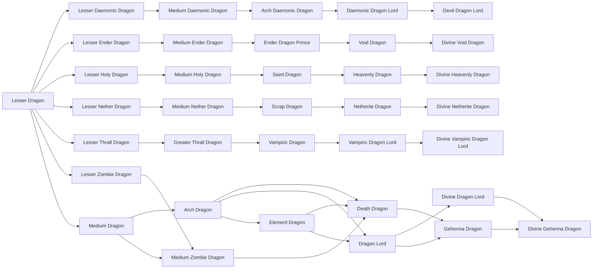

# Divine Netherite Dragon

<small>[TR: Nightmares](../index.md) &rsaquo; [Races](index.md)</small>

| | |
|---|---|
| **ID** | `trnightmare:divine_netherite_dragon` |
| **Stage** | Final |
| **Difficulty** | Hard |
| **Alignment** | Default |
| **Aura** | 900,000 - 1,700,000 |
| **Magicule** | 1,500,000 - 3,000,000 |
| **Health bonus** | 1,000 |
| **Spiritual health bonus** | 8,500 |
| **Attack damage bonus** | 4.1 |
| **Movement speed bonus** | 0.03 |
| **EP to evolve into** | 3,000,000 |

## Evolution

- **Evolves from:** [Netherite Dragon](netherite-dragon.md)

### Requirements to evolve into Divine Netherite Dragon

Each requirement adds its weight to the evolution progress bar; you can evolve at 100%.

| Requirement | Weight |
|---|---|
| Reach Existence Points of 3,000,000 | 50% |
| Carrying 16 of ANCIENT_DEBRIS | 50% |

### Evolution tree

## Intrinsic skills

Granted automatically when you become this race.

-  [Dragon Ear](../../tensura-reincarnated/abilities/intrinsic-skills/dragon-ear.md)
-  [Dragon Eye](../../tensura-reincarnated/abilities/intrinsic-skills/dragon-eye.md)
-  [Dragon Skin](../../tensura-reincarnated/abilities/intrinsic-skills/dragon-skin.md)
-  [Flame Attack Resistance](../../tensura-reincarnated/abilities/resistance-skills/flame-attack-resistance.md)
-  [Heat Resistance](../../tensura-reincarnated/abilities/resistance-skills/heat-resistance.md)
-  [Ultraspeed Regeneration](../../tensura-reincarnated/abilities/extra-skills/ultraspeed-regeneration.md)
-  [Size Condense](../abilities/intrinsic-skills/size-condense.md)

## Traits

- Divine
- Has creative-style flight

## Attribute modifiers

| Attribute | Amount | Operation |
|---|---|---|
| Scale | 1.08 | add |
| Max Health | 1,000 | add |
| Max Spiritual Health | 8,500 | add |
| Attack Damage | 4.1 | add |
| Attack Speed | 0.22 | add |
| Knockback Resistance | 0.88 | add |
| Movement Speed | 0.03 | add |
| Swim Speed Multiplier | 0.2 | add |

## Stats (config defaults)

Set in [`config/nightmare/race/dragon_config.toml`](../configs/config-nightmare-race-dragon-config.md).

| Option | Default | Description |
|---|---|---|
| `DivineNetheriteDragon.epRequirement` | 3,000,000 |  |
| `DivineNetheriteDragon.minAura` | 900,000 |  |
| `DivineNetheriteDragon.maxAura` | 1,700,000 |  |
| `DivineNetheriteDragon.minMagicule` | 1,500,000 |  |
| `DivineNetheriteDragon.maxMagicule` | 3,000,000 |  |
| `DivineNetheriteDragon.size` | 1.08 |  |
| `DivineNetheriteDragon.maxHealth` | 1,000 |  |
| `DivineNetheriteDragon.maxSpiritualHealth` | 8,500 |  |
| `DivineNetheriteDragon.attack` | 4.1 |  |
| `DivineNetheriteDragon.attackSpeed` | 0.22 |  |
| `DivineNetheriteDragon.knockbackResistance` | 0.88 |  |
| `DivineNetheriteDragon.movementSpeed` | 0.03 |  |
| `DivineNetheriteDragon.swimSpeed` | 0.2 |  |
| `DivineNetheriteDragon.ancientDebrisRequirement` | 16 | Ancient Debris required to evolve into this tier. |
| `LesserDragon.epRequirement` | 0 | EP requirement to evolve into this tier. |
| `LesserDragon.minAura` | 5,000 |  |
| `LesserDragon.maxAura` | 14,000 |  |
| `LesserDragon.minMagicule` | 12,000 |  |
| `LesserDragon.maxMagicule` | 32,000 |  |
| `LesserDragon.size` | 0.2 |  |
| `LesserDragon.maxHealth` | 45 |  |
| `LesserDragon.maxSpiritualHealth` | 130 |  |
| `LesserDragon.attack` | 1.8 |  |
| `LesserDragon.attackSpeed` | 0.1 |  |
| `LesserDragon.knockbackResistance` | 0.15 |  |
| `LesserDragon.movementSpeed` | 0.01 |  |
| `LesserDragon.swimSpeed` | 0.05 |  |
| `LesserZombieDragon.epRequirement` | 0 | EP requirement to evolve into this tier. |
| `LesserZombieDragon.minAura` | 6,000 |  |
| `LesserZombieDragon.maxAura` | 12,000 |  |
| `LesserZombieDragon.minMagicule` | 8,000 |  |
| `LesserZombieDragon.maxMagicule` | 16,000 |  |
| `LesserZombieDragon.size` | 0.2 |  |
| `LesserZombieDragon.maxHealth` | 45 |  |
| `LesserZombieDragon.maxSpiritualHealth` | 80 |  |
| `LesserZombieDragon.attack` | 1 |  |
| `LesserZombieDragon.attackSpeed` | -0.25 |  |
| `LesserZombieDragon.knockbackResistance` | 0.2 |  |
| `LesserZombieDragon.movementSpeed` | -0.005 |  |
| `LesserZombieDragon.swimSpeed` | -0.05 |  |
| `MediumDragon.epRequirement` | 160,000 |  |
| `MediumDragon.minAura` | 40,000 |  |
| `MediumDragon.maxAura` | 80,000 |  |
| `MediumDragon.minMagicule` | 120,000 |  |
| `MediumDragon.maxMagicule` | 160,000 |  |
| `MediumDragon.size` | 0.35 |  |
| `MediumDragon.maxHealth` | 170 |  |
| `MediumDragon.maxSpiritualHealth` | 360 |  |
| `MediumDragon.attack` | 1.2 |  |
| `MediumDragon.attackSpeed` | 0 |  |
| `MediumDragon.knockbackResistance` | 0.25 |  |
| `MediumDragon.movementSpeed` | 0.015 |  |
| `MediumDragon.swimSpeed` | 0.08 |  |
| `MediumZombieDragon.epRequirement` | 100,000 |  |
| `MediumZombieDragon.minAura` | 24,000 |  |
| `MediumZombieDragon.maxAura` | 45,000 |  |
| `MediumZombieDragon.minMagicule` | 35,000 |  |
| `MediumZombieDragon.maxMagicule` | 70,000 |  |
| `MediumZombieDragon.size` | 0.35 |  |
| `MediumZombieDragon.maxHealth` | 90 |  |
| `MediumZombieDragon.maxSpiritualHealth` | 340 |  |
| `MediumZombieDragon.attack` | 1.6 |  |
| `MediumZombieDragon.attackSpeed` | -0.1 |  |
| `MediumZombieDragon.knockbackResistance` | 0.35 |  |
| `MediumZombieDragon.movementSpeed` | 0 |  |
| `MediumZombieDragon.swimSpeed` | -0.02 |  |
| `ArchDragon.epRequirement` | 400,000 |  |
| `ArchDragon.minAura` | 80,000 |  |
| `ArchDragon.maxAura` | 150,000 |  |
| `ArchDragon.minMagicule` | 250,000 |  |
| `ArchDragon.maxMagicule` | 300,000 |  |
| `ArchDragon.size` | 0.5 |  |
| `ArchDragon.maxHealth` | 444 |  |
| `ArchDragon.maxSpiritualHealth` | 888 |  |
| `ArchDragon.attack` | 1.8 |  |
| `ArchDragon.attackSpeed` | 0.1 |  |
| `ArchDragon.knockbackResistance` | 0.35 |  |
| `ArchDragon.movementSpeed` | 0.02 |  |
| `ArchDragon.swimSpeed` | 0.12 |  |
| `ElementDragon.epRequirement` | 800,000 |  |
| `ElementDragon.minAura` | 180,000 |  |
| `ElementDragon.maxAura` | 300,000 |  |
| `ElementDragon.minMagicule` | 350,000 |  |
| `ElementDragon.maxMagicule` | 600,000 |  |
| `ElementDragon.size` | 0.65 |  |
| `ElementDragon.maxHealth` | 777 |  |
| `ElementDragon.maxSpiritualHealth` | 1,000 |  |
| `ElementDragon.attack` | 2.3 |  |
| `ElementDragon.attackSpeed` | 0.2 |  |
| `ElementDragon.knockbackResistance` | 0.45 |  |
| `ElementDragon.movementSpeed` | 0.025 |  |
| `ElementDragon.swimSpeed` | 0.15 |  |
| `ElementDragon.essenceRequirement` | 25 | Elemental Essence required to evolve into Element Dragon. |
| `DeathDragon.epRequirement` | 400,000 |  |
| `DeathDragon.minAura` | 90,000 |  |
| `DeathDragon.maxAura` | 180,000 |  |
| `DeathDragon.minMagicule` | 160,000 |  |
| `DeathDragon.maxMagicule` | 320,000 |  |
| `DeathDragon.size` | 0.55 |  |
| `DeathDragon.maxHealth` | 370 |  |
| `DeathDragon.maxSpiritualHealth` | 560 |  |
| `DeathDragon.attack` | 2.2 |  |
| `DeathDragon.attackSpeed` | 0 |  |
| `DeathDragon.knockbackResistance` | 0.5 |  |
| `DeathDragon.movementSpeed` | 0.01 |  |
| `DeathDragon.swimSpeed` | 0 |  |
| `DragonLord.epRequirement` | 800,000 |  |
| `DragonLord.minAura` | 350,000 |  |
| `DragonLord.maxAura` | 600,000 |  |
| `DragonLord.minMagicule` | 700,000 |  |
| `DragonLord.maxMagicule` | 1,200,000 |  |
| `DragonLord.size` | 0.8 |  |
| `DragonLord.maxHealth` | 800 |  |
| `DragonLord.maxSpiritualHealth` | 1,150 |  |
| `DragonLord.attack` | 2.8 |  |
| `DragonLord.attackSpeed` | 0.25 |  |
| `DragonLord.knockbackResistance` | 0.6 |  |
| `DragonLord.movementSpeed` | 0.03 |  |
| `DragonLord.swimSpeed` | 0.2 |  |
| `GehennaDragon.epRequirement` | 800,000 |  |
| `GehennaDragon.minAura` | 380,000 |  |
| `GehennaDragon.maxAura` | 680,000 |  |
| `GehennaDragon.minMagicule` | 700,000 |  |
| `GehennaDragon.maxMagicule` | 1,300,000 |  |
| `GehennaDragon.size` | 0.85 |  |
| `GehennaDragon.maxHealth` | 740 |  |
| `GehennaDragon.maxSpiritualHealth` | 2,520 |  |
| `GehennaDragon.attack` | 3 |  |
| `GehennaDragon.attackSpeed` | 0.1 |  |
| `GehennaDragon.knockbackResistance` | 0.7 |  |
| `GehennaDragon.movementSpeed` | 0.02 |  |
| `GehennaDragon.swimSpeed` | 0.05 |  |
| `DivineDragonLord.epRequirement` | 2,000,000 |  |
| `DivineDragonLord.minAura` | 800,000 |  |
| `DivineDragonLord.maxAura` | 1,500,000 |  |
| `DivineDragonLord.minMagicule` | 1,500,000 |  |
| `DivineDragonLord.maxMagicule` | 3,000,000 |  |
| `DivineDragonLord.size` | 1 |  |
| `DivineDragonLord.maxHealth` | 990 |  |
| `DivineDragonLord.maxSpiritualHealth` | 8,100 |  |
| `DivineDragonLord.attack` | 3.5 |  |
| `DivineDragonLord.attackSpeed` | 0.35 |  |
| `DivineDragonLord.knockbackResistance` | 0.8 |  |
| `DivineDragonLord.movementSpeed` | 0.035 |  |
| `DivineDragonLord.swimSpeed` | 0.25 |  |
| `DivineGehennaDragon.epRequirement` | 2,100,000 |  |
| `DivineGehennaDragon.minAura` | 900,000 |  |
| `DivineGehennaDragon.maxAura` | 1,700,000 |  |
| `DivineGehennaDragon.minMagicule` | 1,700,000 |  |
| `DivineGehennaDragon.maxMagicule` | 3,200,000 |  |
| `DivineGehennaDragon.size` | 1.05 |  |
| `DivineGehennaDragon.maxHealth` | 900 |  |
| `DivineGehennaDragon.maxSpiritualHealth` | 7,850 |  |
| `DivineGehennaDragon.attack` | 3.8 |  |
| `DivineGehennaDragon.attackSpeed` | 0.2 |  |
| `DivineGehennaDragon.knockbackResistance` | 0.9 |  |
| `DivineGehennaDragon.movementSpeed` | 0.03 |  |
| `DivineGehennaDragon.swimSpeed` | 0.1 |  |

## Tags

`tensura:races/divine`, `tensura:races/has_creative_flight`
