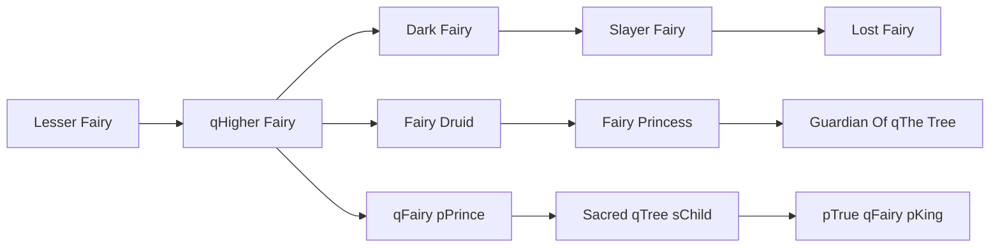

# Fairy Druid

<small>[TR: Nightmares](../index.md) &rsaquo; [Races](index.md)</small>

| | |
|---|---|
| **ID** | `trnightmare:fairy_druid` |
| **Stage** | In-between |
| **Difficulty** | Hard |
| **Alignment** | Default |
| **Aura** | 50,000 - 100,000 |
| **Magicule** | 30,000 - 60,000 |
| **Health bonus** | 280 |
| **Spiritual health bonus** | 840 |
| **Attack damage bonus** | 1 |
| **Movement speed bonus** | 0.07 |
| **EP to evolve into** | 100,000 |

## Evolution

- **Evolves from:** [qHigher Fairy](higher-fairy.md)
- **Evolves into:** [Fairy Princess](fairy-princess.md)
- **Default evolution:** [Fairy Princess](fairy-princess.md)
- **On awakening (True Demon Lord / True Hero):** [Fairy Princess](fairy-princess.md)
- **During the Harvest Festival:** [Fairy Princess](fairy-princess.md)

### Requirements to evolve into Fairy Druid

Each requirement adds its weight to the evolution progress bar; you can evolve at 100%.

| Requirement | Weight |
|---|---|
| Reach Existence Points of 100,000 | 100% |

### Evolution tree

## Intrinsic skills

Granted automatically when you become this race.

-  [Charm](../../tensura-reincarnated/abilities/intrinsic-skills/charm.md)
-  [Light Transform](../../tensura-reincarnated/abilities/intrinsic-skills/light-transform.md)

## Attribute modifiers

| Attribute | Amount | Operation |
|---|---|---|
| Scale | -0.5 | add |
| Max Health | 280 | add |
| Max Spiritual Health | 840 | add |
| Attack Damage | 1 | add |
| Attack Speed | 2 | add |
| Knockback Resistance | 0.3 | add |
| Movement Speed | 0.07 | add |
| Swim Speed Multiplier | 0.07 | add |

## Stats (config defaults)

Set in [`config/nightmare/race/fairy_clan_config.toml`](../configs/config-nightmare-race-fairy-clan-config.md).

| Option | Default | Description |
|---|---|---|
| `FairyDruid.epRequirement` | 100,000 | Existence points required to evolve into Fairy Druid. |
| `FairyDruid.minAura` | 50,000 | Minimal aura. |
| `FairyDruid.maxAura` | 100,000 | Maximum aura. |
| `FairyDruid.minMagicule` | 30,000 | Minimal magicule. |
| `FairyDruid.maxMagicule` | 60,000 | Maximum magicule. |
| `FairyDruid.size` | -0.5 | Bonus Size. |
| `FairyDruid.maxHealth` | 280 | Bonus Max Health. |
| `FairyDruid.maxSpiritualHealth` | 840 | Bonus Max Spiritual Health. |
| `FairyDruid.attack` | 1 | Bonus Attack Damage. |
| `FairyDruid.attackSpeed` | 2 | Bonus Attack Speed. |
| `FairyDruid.knockbackResistance` | 0.3 | Bonus Knockback Resistance. |
| `FairyDruid.movementSpeed` | 0.07 | Bonus Movement Speed. |
| `FairyDruid.swimSpeed` | 0.07 | Bonus Swimming Speed Multiplier. |
| `HigherFairy.epRequirement` | 40,000 | Existence points required to evolve into Higher Fairy. |
| `HigherFairy.essenceRequirementLife` | 10 | Number of life essence required to evolve into Higher Fairy. |
| `HigherFairy.minAura` | 25,000 | Minimal aura. |
| `HigherFairy.maxAura` | 50,000 | Maximum aura. |
| `HigherFairy.minMagicule` | 15,000 | Minimal magicule. |
| `HigherFairy.maxMagicule` | 30,000 | Maximum magicule. |
| `HigherFairy.size` | -0.5 | Bonus Size. |
| `HigherFairy.maxHealth` | 10 | Bonus Max Health. |
| `HigherFairy.maxSpiritualHealth` | 150 | Bonus Max Spiritual Health. |
| `HigherFairy.attack` | 0 | Bonus Attack Damage. |
| `HigherFairy.attackSpeed` | 1 | Bonus Attack Speed. |
| `HigherFairy.knockbackResistance` | 0 | Bonus Knockback Resistance. |
| `HigherFairy.movementSpeed` | 0.04 | Bonus Movement Speed. |
| `HigherFairy.swimSpeed` | 0.04 | Bonus Swimming Speed Multiplier. |
| `LesserFairy.minAura` | 500 | Minimal aura. |
| `LesserFairy.maxAura` | 500 | Maximum aura. |
| `LesserFairy.minMagicule` | 1,500 | Minimal magicule. |
| `LesserFairy.maxMagicule` | 5,500 | Maximum magicule. |
| `LesserFairy.size` | -1 | Bonus Size. |
| `LesserFairy.maxHealth` | -10 | Bonus Max Health. |
| `LesserFairy.maxSpiritualHealth` | 90 | Bonus Max Spiritual Health. |
| `LesserFairy.attack` | 0 | Bonus Attack Damage. |
| `LesserFairy.attackSpeed` | -0.2 | Bonus Attack Speed. |
| `LesserFairy.knockbackResistance` | 0 | Bonus Knockback Resistance. |
| `LesserFairy.movementSpeed` | 0.02 | Bonus Movement Speed. |
| `LesserFairy.swimSpeed` | 0.02 | Bonus Swimming Speed Multiplier. |
