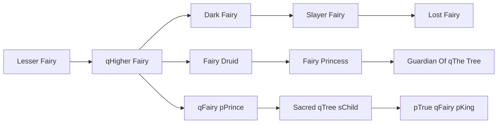

# qFairy pPrince

<small>[TR: Nightmares](../index.md) &rsaquo; [Races](index.md)</small>

| | |
|---|---|
| **ID** | `trnightmare:fairy_prince` |
| **Difficulty** | Hard |
| **Alignment** | Default |
| **Aura** | 60,000 - 120,000 |
| **Magicule** | 40,000 - 80,000 |
| **Health bonus** | 330 |
| **Spiritual health bonus** | 940 |
| **Attack damage bonus** | 0 |
| **Movement speed bonus** | 0.07 |
| **EP to evolve into** | 120,000 |

## Evolution

- **Evolves from:** [qHigher Fairy](higher-fairy.md)
- **Evolves into:** [Sacred qTree sChild](sacred-tree-child.md)
- **Default evolution:** [Sacred qTree sChild](sacred-tree-child.md)
- **On awakening (True Demon Lord / True Hero):** [Sacred qTree sChild](sacred-tree-child.md)
- **During the Harvest Festival:** [Sacred qTree sChild](sacred-tree-child.md)

### Requirements to evolve into qFairy pPrince

Each requirement adds its weight to the evolution progress bar; you can evolve at 100%.

| Requirement | Weight |
|---|---|
| Reach Existence Points of 120,000 | 50% |
| Consume 20 of [Life Essence](../items/materials/life-essence.md) | 50% |

### Evolution tree

## Intrinsic skills

Granted automatically when you become this race.

-  [Abnormal Condition Nullification](../../tensura-reincarnated/abilities/resistance-skills/abnormal-condition-nullification.md)
-  [Gravity Attack Resistance](../../tensura-reincarnated/abilities/resistance-skills/gravity-attack-resistance.md)
-  [Gravity Manipulation](../../tensura-reincarnated/abilities/extra-skills/gravity-manipulation.md)
-  [Ultraspeed Regeneration](../../tensura-reincarnated/abilities/extra-skills/ultraspeed-regeneration.md)

## Attribute modifiers

| Attribute | Amount | Operation |
|---|---|---|
| Scale | -1 | add |
| Max Health | 330 | add |
| Max Spiritual Health | 940 | add |
| Attack Damage | 0 | add |
| Attack Speed | 0 | add |
| Knockback Resistance | 0.5 | add |
| Movement Speed | 0.07 | add |
| Swim Speed Multiplier | 0.07 | add |

## Stats (config defaults)

Set in [`config/nightmare/race/fairy_clan_config.toml`](../configs/config-nightmare-race-fairy-clan-config.md).

| Option | Default | Description |
|---|---|---|
| `FairyPrince.epRequirement` | 120,000 | Existence points required to evolve into Fairy Prince. |
| `FairyPrince.essenceRequirementLife` | 20 | Life Essence required to evolve into Fairy Prince. |
| `FairyPrince.minAura` | 60,000 | Minimal aura. |
| `FairyPrince.maxAura` | 120,000 | Maximum aura. |
| `FairyPrince.minMagicule` | 40,000 | Minimal magicule. |
| `FairyPrince.maxMagicule` | 80,000 | Maximum magicule. |
| `FairyPrince.size` | -1 | Bonus Size. |
| `FairyPrince.maxHealth` | 330 | Bonus Max Health. |
| `FairyPrince.maxSpiritualHealth` | 940 | Bonus Max Spiritual Health. |
| `FairyPrince.attack` | 0 | Bonus Attack Damage. |
| `FairyPrince.attackSpeed` | 0 | Bonus Attack Speed. |
| `FairyPrince.knockbackResistance` | 0.5 | Bonus Knockback Resistance. |
| `FairyPrince.movementSpeed` | 0.07 | Bonus Movement Speed. |
| `FairyPrince.swimSpeed` | 0.07 | Bonus Swimming Speed Multiplier. |
| `HigherFairy.epRequirement` | 40,000 | Existence points required to evolve into Higher Fairy. |
| `HigherFairy.essenceRequirementLife` | 10 | Number of life essence required to evolve into Higher Fairy. |
| `HigherFairy.minAura` | 25,000 | Minimal aura. |
| `HigherFairy.maxAura` | 50,000 | Maximum aura. |
| `HigherFairy.minMagicule` | 15,000 | Minimal magicule. |
| `HigherFairy.maxMagicule` | 30,000 | Maximum magicule. |
| `HigherFairy.size` | -0.5 | Bonus Size. |
| `HigherFairy.maxHealth` | 10 | Bonus Max Health. |
| `HigherFairy.maxSpiritualHealth` | 150 | Bonus Max Spiritual Health. |
| `HigherFairy.attack` | 0 | Bonus Attack Damage. |
| `HigherFairy.attackSpeed` | 1 | Bonus Attack Speed. |
| `HigherFairy.knockbackResistance` | 0 | Bonus Knockback Resistance. |
| `HigherFairy.movementSpeed` | 0.04 | Bonus Movement Speed. |
| `HigherFairy.swimSpeed` | 0.04 | Bonus Swimming Speed Multiplier. |
| `LesserFairy.minAura` | 500 | Minimal aura. |
| `LesserFairy.maxAura` | 500 | Maximum aura. |
| `LesserFairy.minMagicule` | 1,500 | Minimal magicule. |
| `LesserFairy.maxMagicule` | 5,500 | Maximum magicule. |
| `LesserFairy.size` | -1 | Bonus Size. |
| `LesserFairy.maxHealth` | -10 | Bonus Max Health. |
| `LesserFairy.maxSpiritualHealth` | 90 | Bonus Max Spiritual Health. |
| `LesserFairy.attack` | 0 | Bonus Attack Damage. |
| `LesserFairy.attackSpeed` | -0.2 | Bonus Attack Speed. |
| `LesserFairy.knockbackResistance` | 0 | Bonus Knockback Resistance. |
| `LesserFairy.movementSpeed` | 0.02 | Bonus Movement Speed. |
| `LesserFairy.swimSpeed` | 0.02 | Bonus Swimming Speed Multiplier. |
