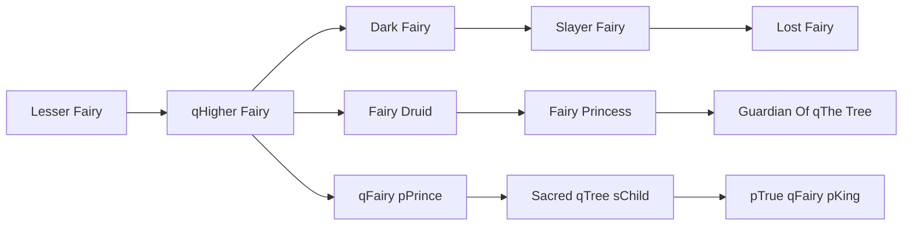

# Fairy Princess

<small>[TR: Nightmares](../index.md) &rsaquo; [Races](index.md)</small>

| | |
|---|---|
| **ID** | `trnightmare:fairy_princess` |
| **Difficulty** | Hard |
| **Alignment** | Default |
| **Aura** | 225,000 - 450,000 |
| **Magicule** | 135,000 - 270,000 |
| **Health bonus** | 580 |
| **Spiritual health bonus** | 1,940 |
| **Attack damage bonus** | 2 |
| **Movement speed bonus** | 0.09 |
| **EP to evolve into** | 450,000 |

## Evolution

- **Evolves from:** [Fairy Druid](fairy-druid.md)
- **Evolves into:** [Guardian Of qThe Tree](guardian-of-the-tree.md)
- **Default evolution:** [Guardian Of qThe Tree](guardian-of-the-tree.md)
- **On awakening (True Demon Lord / True Hero):** [Guardian Of qThe Tree](guardian-of-the-tree.md)
- **During the Harvest Festival:** [Guardian Of qThe Tree](guardian-of-the-tree.md)

### Requirements to evolve into Fairy Princess

Each requirement adds its weight to the evolution progress bar; you can evolve at 100%.

| Requirement | Weight |
|---|---|
| Reach Existence Points of ep requirement | 100% |

### Evolution tree

## Intrinsic skills

Granted automatically when you become this race.

-  [Light Attack Resistance](../../tensura-reincarnated/abilities/resistance-skills/light-attack-resistance.md)
-  [Holy Attack Resistance](../../tensura-reincarnated/abilities/resistance-skills/holy-attack-resistance.md)

## Attribute modifiers

| Attribute | Amount | Operation |
|---|---|---|
| Scale | size | add |
| Max Health | max HP | add |
| Max Spiritual Health | max spiritual HP | add |
| Attack Damage | attack | add |
| Attack Speed | attack speed | add |
| Knockback Resistance | knockback resistance | add |
| Movement Speed | movement speed | add |
| Swim Speed Multiplier | swim speed | add |

## Stats (config defaults)

Set in [`config/nightmare/race/fairy_clan_config.toml`](../configs/config-nightmare-race-fairy-clan-config.md).

| Option | Default | Description |
|---|---|---|
| `FairyPrincess.epRequirement` | 450,000 | Existence points required to evolve into Fairy Princess. |
| `FairyPrincess.minAura` | 225,000 | Minimal aura. |
| `FairyPrincess.maxAura` | 450,000 | Maximum aura. |
| `FairyPrincess.minMagicule` | 135,000 | Minimal magicule. |
| `FairyPrincess.maxMagicule` | 270,000 | Maximum magicule. |
| `FairyPrincess.size` | -0.5 | Bonus Size. |
| `FairyPrincess.maxHealth` | 580 | Bonus Max Health. |
| `FairyPrincess.maxSpiritualHealth` | 1,940 | Bonus Max Spiritual Health. |
| `FairyPrincess.attack` | 2 | Bonus Attack Damage. |
| `FairyPrincess.attackSpeed` | 3 | Bonus Attack Speed. |
| `FairyPrincess.knockbackResistance` | 0.6 | Bonus Knockback Resistance. |
| `FairyPrincess.movementSpeed` | 0.09 | Bonus Movement Speed. |
| `FairyPrincess.swimSpeed` | 0.09 | Bonus Swimming Speed Multiplier. |
| `FairyDruid.epRequirement` | 100,000 | Existence points required to evolve into Fairy Druid. |
| `FairyDruid.minAura` | 50,000 | Minimal aura. |
| `FairyDruid.maxAura` | 100,000 | Maximum aura. |
| `FairyDruid.minMagicule` | 30,000 | Minimal magicule. |
| `FairyDruid.maxMagicule` | 60,000 | Maximum magicule. |
| `FairyDruid.size` | -0.5 | Bonus Size. |
| `FairyDruid.maxHealth` | 280 | Bonus Max Health. |
| `FairyDruid.maxSpiritualHealth` | 840 | Bonus Max Spiritual Health. |
| `FairyDruid.attack` | 1 | Bonus Attack Damage. |
| `FairyDruid.attackSpeed` | 2 | Bonus Attack Speed. |
| `FairyDruid.knockbackResistance` | 0.3 | Bonus Knockback Resistance. |
| `FairyDruid.movementSpeed` | 0.07 | Bonus Movement Speed. |
| `FairyDruid.swimSpeed` | 0.07 | Bonus Swimming Speed Multiplier. |
| `HigherFairy.epRequirement` | 40,000 | Existence points required to evolve into Higher Fairy. |
| `HigherFairy.essenceRequirementLife` | 10 | Number of life essence required to evolve into Higher Fairy. |
| `HigherFairy.minAura` | 25,000 | Minimal aura. |
| `HigherFairy.maxAura` | 50,000 | Maximum aura. |
| `HigherFairy.minMagicule` | 15,000 | Minimal magicule. |
| `HigherFairy.maxMagicule` | 30,000 | Maximum magicule. |
| `HigherFairy.size` | -0.5 | Bonus Size. |
| `HigherFairy.maxHealth` | 10 | Bonus Max Health. |
| `HigherFairy.maxSpiritualHealth` | 150 | Bonus Max Spiritual Health. |
| `HigherFairy.attack` | 0 | Bonus Attack Damage. |
| `HigherFairy.attackSpeed` | 1 | Bonus Attack Speed. |
| `HigherFairy.knockbackResistance` | 0 | Bonus Knockback Resistance. |
| `HigherFairy.movementSpeed` | 0.04 | Bonus Movement Speed. |
| `HigherFairy.swimSpeed` | 0.04 | Bonus Swimming Speed Multiplier. |
| `LesserFairy.minAura` | 500 | Minimal aura. |
| `LesserFairy.maxAura` | 500 | Maximum aura. |
| `LesserFairy.minMagicule` | 1,500 | Minimal magicule. |
| `LesserFairy.maxMagicule` | 5,500 | Maximum magicule. |
| `LesserFairy.size` | -1 | Bonus Size. |
| `LesserFairy.maxHealth` | -10 | Bonus Max Health. |
| `LesserFairy.maxSpiritualHealth` | 90 | Bonus Max Spiritual Health. |
| `LesserFairy.attack` | 0 | Bonus Attack Damage. |
| `LesserFairy.attackSpeed` | -0.2 | Bonus Attack Speed. |
| `LesserFairy.knockbackResistance` | 0 | Bonus Knockback Resistance. |
| `LesserFairy.movementSpeed` | 0.02 | Bonus Movement Speed. |
| `LesserFairy.swimSpeed` | 0.02 | Bonus Swimming Speed Multiplier. |
