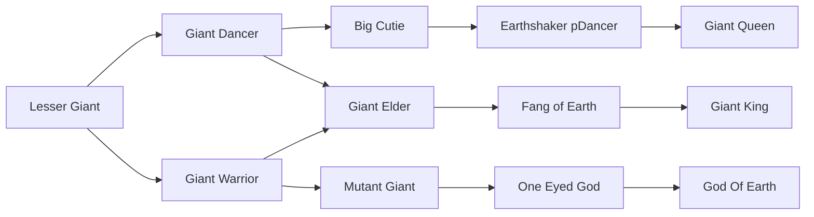

# Fang of Earth

<small>[TR: Nightmares](../index.md) &rsaquo; [Races](index.md)</small>

| | |
|---|---|
| **ID** | `trnightmare:fang_of_earth` |
| **Difficulty** | Hard |
| **Alignment** | Default |
| **Aura** | 250,000 - 500,000 |
| **Magicule** | 150,000 - 390,000 |
| **Health bonus** | 400 |
| **Spiritual health bonus** | 1,620 |
| **Attack damage bonus** | 5 |
| **Movement speed bonus** | 0.07 |
| **EP to evolve into** | 500,000 |

## Evolution

- **Evolves from:** [Giant Elder](giant-elder.md)
- **Evolves into:** [Giant King](giant-king.md)
- **Default evolution:** [Giant King](giant-king.md)
- **On awakening (True Demon Lord / True Hero):** [Giant King](giant-king.md)
- **During the Harvest Festival:** [Giant King](giant-king.md)

### Requirements to evolve into Fang of Earth

Each requirement adds its weight to the evolution progress bar; you can evolve at 100%.

| Requirement | Weight |
|---|---|
| Reach Existence Points of 500,000 | 100% |

### Evolution tree

## Intrinsic skills

Granted automatically when you become this race.

-  [Earth Attack Resistance](../../tensura-reincarnated/abilities/resistance-skills/earth-attack-resistance.md)
-  [Pain Resistance](../../tensura-reincarnated/abilities/resistance-skills/pain-resistance.md)
-  [Size Condense](../abilities/intrinsic-skills/size-condense.md)

## Traits

- Divine

## Attribute modifiers

| Attribute | Amount | Operation |
|---|---|---|
| Scale | 2 | add |
| Max Health | 400 | add |
| Max Spiritual Health | 1,620 | add |
| Attack Damage | 5 | add |
| Attack Speed | 1.5 | add |
| Knockback Resistance | 0.8 | add |
| Movement Speed | 0.07 | add |
| Swim Speed Multiplier | 0.07 | add |

## Stats (config defaults)

Set in [`config/nightmare/race/giant_clan_config.toml`](../configs/config-nightmare-race-giant-clan-config.md).

| Option | Default | Description |
|---|---|---|
| `FangOfEarth.epRequirement` | 500,000 | Existence points required to evolve into Fang of Earth. |
| `FangOfEarth.minAura` | 250,000 | Minimal aura. |
| `FangOfEarth.maxAura` | 500,000 | Maximum aura. |
| `FangOfEarth.minMagicule` | 150,000 | Minimal magicule. |
| `FangOfEarth.maxMagicule` | 390,000 | Maximum magicule. |
| `FangOfEarth.size` | 2 | Bonus Size. |
| `FangOfEarth.maxHealth` | 400 | Bonus Max Health. |
| `FangOfEarth.maxSpiritualHealth` | 1,620 | Bonus Max Spiritual Health. |
| `FangOfEarth.attack` | 5 | Bonus Attack Damage. |
| `FangOfEarth.attackSpeed` | 1.5 | Bonus Attack Speed. |
| `FangOfEarth.knockbackResistance` | 0.8 | Bonus Knockback Resistance. |
| `FangOfEarth.movementSpeed` | 0.07 | Bonus Movement Speed. |
| `FangOfEarth.swimSpeed` | 0.07 | Bonus Swimming Speed Multiplier. |
| `GiantElder.epRequirement` | 80,000 | Existence points required to evolve into Giant Elder. |
| `GiantElder.minAura` | 24,000 | Minimal aura. |
| `GiantElder.maxAura` | 48,000 | Maximum aura. |
| `GiantElder.minMagicule` | 40,000 | Minimal magicule. |
| `GiantElder.maxMagicule` | 80,000 | Maximum magicule. |
| `GiantElder.size` | 1 | Bonus Size. |
| `GiantElder.maxHealth` | 330 | Bonus Max Health. |
| `GiantElder.maxSpiritualHealth` | 1,140 | Bonus Max Spiritual Health. |
| `GiantElder.attack` | 3 | Bonus Attack Damage. |
| `GiantElder.attackSpeed` | 1 | Bonus Attack Speed. |
| `GiantElder.knockbackResistance` | 0.7 | Bonus Knockback Resistance. |
| `GiantElder.movementSpeed` | 0.05 | Bonus Movement Speed. |
| `GiantElder.swimSpeed` | 0.05 | Bonus Swimming Speed Multiplier. |
| `GiantWarrior.epRequirement` | 40,000 | Existence points required to evolve into Giant Warrior. |
| `GiantWarrior.minAura` | 25,000 | Minimal aura. |
| `GiantWarrior.maxAura` | 50,000 | Maximum aura. |
| `GiantWarrior.minMagicule` | 15,000 | Minimal magicule. |
| `GiantWarrior.maxMagicule` | 30,000 | Maximum magicule. |
| `GiantWarrior.size` | 0.5 | Bonus Size. |
| `GiantWarrior.maxHealth` | 330 | Bonus Max Health. |
| `GiantWarrior.maxSpiritualHealth` | 940 | Bonus Max Spiritual Health. |
| `GiantWarrior.attack` | 3.5 | Bonus Attack Damage. |
| `GiantWarrior.attackSpeed` | 0 | Bonus Attack Speed. |
| `GiantWarrior.knockbackResistance` | 0.8 | Bonus Knockback Resistance. |
| `GiantWarrior.movementSpeed` | 0.04 | Bonus Movement Speed. |
| `GiantWarrior.swimSpeed` | 0.04 | Bonus Swimming Speed Multiplier. |
| `LesserGiant.minAura` | 500 | Minimal aura. |
| `LesserGiant.maxAura` | 500 | Maximum aura. |
| `LesserGiant.minMagicule` | 1,500 | Minimal magicule. |
| `LesserGiant.maxMagicule` | 5,500 | Maximum magicule. |
| `LesserGiant.size` | 0.5 | Bonus Size. |
| `LesserGiant.maxHealth` | 80 | Bonus Max Health. |
| `LesserGiant.maxSpiritualHealth` | 240 | Bonus Max Spiritual Health. |
| `LesserGiant.attack` | 2 | Bonus Attack Damage. |
| `LesserGiant.attackSpeed` | 0 | Bonus Attack Speed. |
| `LesserGiant.knockbackResistance` | 0.5 | Bonus Knockback Resistance. |
| `LesserGiant.movementSpeed` | 0.04 | Bonus Movement Speed. |
| `LesserGiant.swimSpeed` | 0.04 | Bonus Swimming Speed Multiplier. |

## Tags

`tensura:races/divine`
