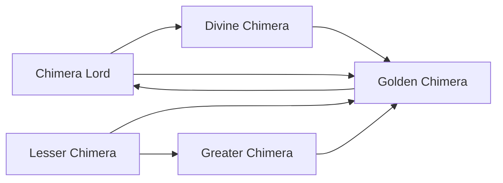

# Greater Chimera

<small>[TR: Nightmares](../index.md) &rsaquo; [Races](index.md)</small>

| | |
|---|---|
| **ID** | `trnightmare:greater_chimera` |
| **Difficulty** | Easy |
| **Alignment** | Default |
| **Aura** | 8,000 - 15,000 |
| **Magicule** | 12,000 - 25,000 |
| **Health bonus** | 50 |
| **Spiritual health bonus** | 180 |
| **Attack damage bonus** | 0.8 |
| **Movement speed bonus** | 0.01 |
| **EP to evolve into** | 20,000 |

## Evolution

- **Evolves from:** [Lesser Chimera](lesser-chimera.md)
- **Evolves into:** [Golden Chimera](golden-chimera.md)
- **Default evolution:** [Golden Chimera](golden-chimera.md)
- **On awakening (True Demon Lord / True Hero):** [Golden Chimera](golden-chimera.md)
- **During the Harvest Festival:** [Golden Chimera](golden-chimera.md)

### Requirements to evolve into Greater Chimera

Each requirement adds its weight to the evolution progress bar; you can evolve at 100%.

| Requirement | Weight |
|---|---|
| Reach Existence Points of ep requirement | 50% |
| Consume 5 of ENCHANTED_GOLDEN_APPLE | 50% |

### Evolution tree

## Attribute modifiers

| Attribute | Amount | Operation |
|---|---|---|
| Scale | size | add |
| Max Health | max HP | add |
| Max Spiritual Health | max spiritual HP | add |
| Attack Damage | attack | add |
| Attack Speed | attack speed | add |
| Knockback Resistance | knockback resistance | add |
| Movement Speed | movement speed | add |
| Swim Speed Multiplier | swim speed | add |

## Stats (config defaults)

Set in [`config/nightmare/race/chimera_config.toml`](../configs/config-nightmare-race-chimera-config.md).

| Option | Default | Description |
|---|---|---|
| `GreaterChimera.epRequirement` | 20,000 | EP requirement to evolve into Greater Chimera. |
| `GreaterChimera.minAura` | 8,000 | Minimal aura. |
| `GreaterChimera.maxAura` | 15,000 | Maximum aura. |
| `GreaterChimera.minMagicule` | 12,000 | Minimal magicule. |
| `GreaterChimera.maxMagicule` | 25,000 | Maximum magicule. |
| `GreaterChimera.size` | 0.2 | Bonus Size. |
| `GreaterChimera.maxHealth` | 50 | Bonus Max Health. |
| `GreaterChimera.maxSpiritualHealth` | 180 | Bonus Max Spiritual Health. |
| `GreaterChimera.attack` | 0.8 | Bonus Attack Damage. |
| `GreaterChimera.attackSpeed` | 0 | Bonus Attack Speed. |
| `GreaterChimera.knockbackResistance` | 0.15 | Bonus Knockback Resistance. |
| `GreaterChimera.movementSpeed` | 0.01 | Bonus Movement Speed. |
| `GreaterChimera.swimSpeed` | 0.05 | Bonus Swimming Speed Multiplier. |
| `GreaterChimera.intrinsicPool` | "tensura:absorb_and_dissolve", "tensura:beast_transformation", "tensura:dragon_ear", "tensura:dragon_eye", "tensura:dragon_mode", "tensura:dragon_skin", "tensura:giantification", "tensura:water_breathing", "tensura:corrosion", "tensura:self_regeneration", "tensura:voice_cannon", "tensura:snake_eye", "tensura:ultra_instinct" | List of intrinsic skills Greater Chimera can randomly receive. |
| `GreaterChimera.intrinsicCount` | 3 | How many intrinsic skills a Greater Chimera receives. |
| `LesserChimera.minAura` | 1,500 | Minimal aura. |
| `LesserChimera.maxAura` | 2,500 | Maximum aura. |
| `LesserChimera.minMagicule` | 3,000 | Minimal magicule. |
| `LesserChimera.maxMagicule` | 4,500 | Maximum magicule. |
| `LesserChimera.size` | 0.4 | Bonus Size. |
| `LesserChimera.maxHealth` | 18 | Bonus Max Health. |
| `LesserChimera.maxSpiritualHealth` | 80 | Bonus Max Spiritual Health. |
| `LesserChimera.attack` | 0.3 | Bonus Attack Damage. |
| `LesserChimera.attackSpeed` | -0.3 | Bonus Attack Speed. |
| `LesserChimera.knockbackResistance` | 0.05 | Bonus Knockback Resistance. |
| `LesserChimera.movementSpeed` | 0 | Bonus Movement Speed. |
| `LesserChimera.swimSpeed` | 0 | Bonus Swimming Speed Multiplier. |
| `LesserChimera.intrinsicPool` | "tensura:absorb_and_dissolve", "tensura:beast_transformation", "tensura:dragon_ear", "tensura:dragon_eye", "tensura:dragon_mode", "tensura:dragon_skin", "tensura:giantification", "tensura:water_breathing" | List of intrinsic skills Lesser Chimera can randomly receive. |
| `LesserChimera.intrinsicCount` | 2 | How many intrinsic skills a Lesser Chimera receives from the pool. |
