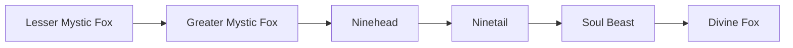

# Greater Mystic Fox

<small>[TR: Nightmares](../index.md) &rsaquo; [Races](index.md)</small>

| | |
|---|---|
| **ID** | `trnightmare:greater_mystic_fox` |
| **Difficulty** | Easy |
| **Alignment** | Default |
| **Aura** | 1,000 - 2,000 |
| **Magicule** | 2,000 - 4,000 |
| **Health bonus** | 15 |
| **Spiritual health bonus** | 60 |
| **Attack damage bonus** | 0 |
| **Movement speed bonus** | 0 |
| **EP to evolve into** | 0 |

> A developed mystic fox with sharpened perception and spiritual power.

## Evolution

- **Evolves from:** [Lesser Mystic Fox](lesser-mystic-fox.md)
- **Evolves into:** [Ninehead](ninehead.md)
- **Default evolution:** [Ninehead](ninehead.md)

### Requirements to evolve into Greater Mystic Fox

Each requirement adds its weight to the evolution progress bar; you can evolve at 100%.

| Requirement | Weight |
|---|---|
| Reach Existence Points of ep requirement | 100% |

### Evolution tree

## Intrinsic skills

Granted automatically when you become this race.

-  [Abnormal Condition Nullification](../../tensura-reincarnated/abilities/resistance-skills/abnormal-condition-nullification.md)

## Attribute modifiers

| Attribute | Amount | Operation |
|---|---|---|
| Scale | size | add |
| Max Health | max HP | add |
| Max Spiritual Health | max spiritual HP | add |
| Attack Damage | attack | add |
| Attack Speed | attack speed | add |
| Knockback Resistance | knockback resistance | add |
| Movement Speed | movement speed | add |
| Swim Speed Multiplier | swim speed | add |

## Stats (config defaults)

Set in [`config/nightmare/race/mystic_fox_config.toml`](../configs/config-nightmare-race-mystic-fox-config.md).

| Option | Default | Description |
|---|---|---|
| `GreaterMysticFox.epRequirement` | 0 | EP requirement to evolve into this tier. |
| `GreaterMysticFox.minAura` | 1,000 | Minimal aura. |
| `GreaterMysticFox.maxAura` | 2,000 | Maximum aura. |
| `GreaterMysticFox.minMagicule` | 2,000 | Minimal magicule. |
| `GreaterMysticFox.maxMagicule` | 4,000 | Maximum magicule. |
| `GreaterMysticFox.size` | 0 | Bonus Size. |
| `GreaterMysticFox.maxHealth` | 15 | Bonus Max Health. |
| `GreaterMysticFox.maxSpiritualHealth` | 60 | Bonus Max Spiritual Health. |
| `GreaterMysticFox.attack` | 0 | Bonus Attack Damage. |
| `GreaterMysticFox.attackSpeed` | 0 | Bonus Attack Speed. |
| `GreaterMysticFox.knockbackResistance` | 0 | Bonus Knockback Resistance. |
| `GreaterMysticFox.movementSpeed` | 0 | Bonus Movement Speed. |
| `GreaterMysticFox.swimSpeed` | 0 | Bonus Swimming Speed Multiplier. |
| `GreaterMysticFox.epRequirement` | 45,000 |  |
| `GreaterMysticFox.minAura` | 18,000 |  |
| `GreaterMysticFox.maxAura` | 34,000 |  |
| `GreaterMysticFox.minMagicule` | 36,000 |  |
| `GreaterMysticFox.maxMagicule` | 72,000 |  |
| `GreaterMysticFox.size` | -0.5 |  |
| `GreaterMysticFox.maxHealth` | 155 |  |
| `GreaterMysticFox.maxSpiritualHealth` | 230 |  |
| `GreaterMysticFox.attack` | 1.1 |  |
| `GreaterMysticFox.attackSpeed` | 0.2 |  |
| `GreaterMysticFox.knockbackResistance` | 0.2 |  |
| `GreaterMysticFox.movementSpeed` | 0.04 |  |
| `GreaterMysticFox.swimSpeed` | 0.05 |  |
