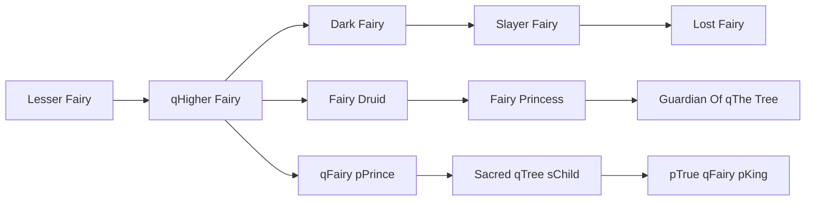

# qHigher Fairy

<small>[TR: Nightmares](../index.md) &rsaquo; [Races](index.md)</small>

| | |
|---|---|
| **ID** | `trnightmare:higher_fairy` |
| **Difficulty** | Hard |
| **Alignment** | Default |
| **Aura** | 25,000 - 50,000 |
| **Magicule** | 15,000 - 30,000 |
| **Health bonus** | 10 |
| **Spiritual health bonus** | 150 |
| **Attack damage bonus** | 0 |
| **Movement speed bonus** | 0.04 |
| **EP to evolve into** | 40,000 |

## Evolution

- **Evolves from:** [Lesser Fairy](lesser-fairy.md)
- **Evolves into:** [Dark Fairy](dark-fairy.md), [qFairy pPrince](fairy-prince.md), [Fairy Druid](fairy-druid.md)
- **Default evolution:** [Fairy Druid](fairy-druid.md)
- **On awakening (True Demon Lord / True Hero):** [qFairy pPrince](fairy-prince.md)
- **During the Harvest Festival:** [Fairy Druid](fairy-druid.md)

### Requirements to evolve into qHigher Fairy

Each requirement adds its weight to the evolution progress bar; you can evolve at 100%.

| Requirement | Weight |
|---|---|
| Reach Existence Points of 40,000 | 50% |
| Consume 10 of [Life Essence](../items/materials/life-essence.md) | 50% |

### Evolution tree

## Intrinsic skills

Granted automatically when you become this race.

-  [Poison Resistance](../../tensura-reincarnated/abilities/resistance-skills/poison-resistance.md)
-  [Paralysis Resistance](../../tensura-reincarnated/abilities/resistance-skills/paralysis-resistance.md)
-  [Wind Transform](../../tensura-reincarnated/abilities/intrinsic-skills/wind-transform.md)

## Attribute modifiers

| Attribute | Amount | Operation |
|---|---|---|
| Scale | -0.5 | add |
| Max Health | 10 | add |
| Max Spiritual Health | 150 | add |
| Attack Damage | 0 | add |
| Attack Speed | 1 | add |
| Knockback Resistance | 0 | add |
| Movement Speed | 0.04 | add |
| Swim Speed Multiplier | 0.04 | add |

## Stats (config defaults)

Set in [`config/nightmare/race/fairy_clan_config.toml`](../configs/config-nightmare-race-fairy-clan-config.md).

| Option | Default | Description |
|---|---|---|
| `HigherFairy.epRequirement` | 40,000 | Existence points required to evolve into Higher Fairy. |
| `HigherFairy.essenceRequirementLife` | 10 | Number of life essence required to evolve into Higher Fairy. |
| `HigherFairy.minAura` | 25,000 | Minimal aura. |
| `HigherFairy.maxAura` | 50,000 | Maximum aura. |
| `HigherFairy.minMagicule` | 15,000 | Minimal magicule. |
| `HigherFairy.maxMagicule` | 30,000 | Maximum magicule. |
| `HigherFairy.size` | -0.5 | Bonus Size. |
| `HigherFairy.maxHealth` | 10 | Bonus Max Health. |
| `HigherFairy.maxSpiritualHealth` | 150 | Bonus Max Spiritual Health. |
| `HigherFairy.attack` | 0 | Bonus Attack Damage. |
| `HigherFairy.attackSpeed` | 1 | Bonus Attack Speed. |
| `HigherFairy.knockbackResistance` | 0 | Bonus Knockback Resistance. |
| `HigherFairy.movementSpeed` | 0.04 | Bonus Movement Speed. |
| `HigherFairy.swimSpeed` | 0.04 | Bonus Swimming Speed Multiplier. |
| `LesserFairy.minAura` | 500 | Minimal aura. |
| `LesserFairy.maxAura` | 500 | Maximum aura. |
| `LesserFairy.minMagicule` | 1,500 | Minimal magicule. |
| `LesserFairy.maxMagicule` | 5,500 | Maximum magicule. |
| `LesserFairy.size` | -1 | Bonus Size. |
| `LesserFairy.maxHealth` | -10 | Bonus Max Health. |
| `LesserFairy.maxSpiritualHealth` | 90 | Bonus Max Spiritual Health. |
| `LesserFairy.attack` | 0 | Bonus Attack Damage. |
| `LesserFairy.attackSpeed` | -0.2 | Bonus Attack Speed. |
| `LesserFairy.knockbackResistance` | 0 | Bonus Knockback Resistance. |
| `LesserFairy.movementSpeed` | 0.02 | Bonus Movement Speed. |
| `LesserFairy.swimSpeed` | 0.02 | Bonus Swimming Speed Multiplier. |
