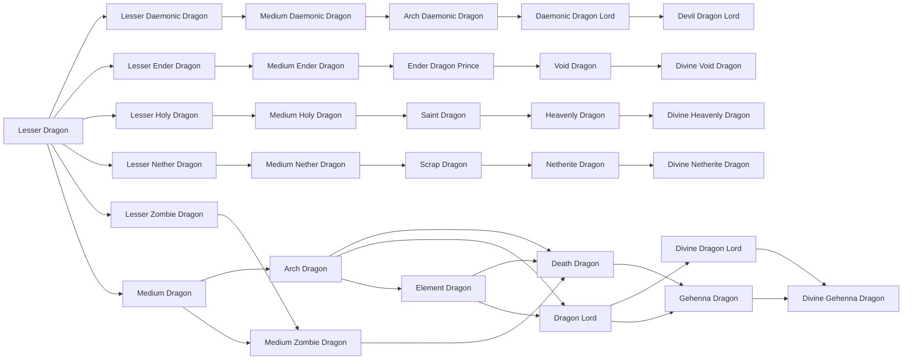
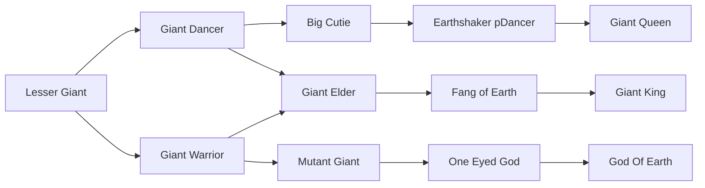
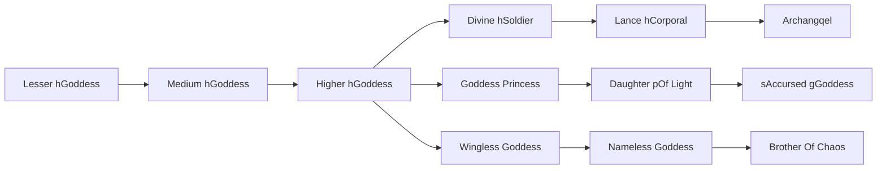
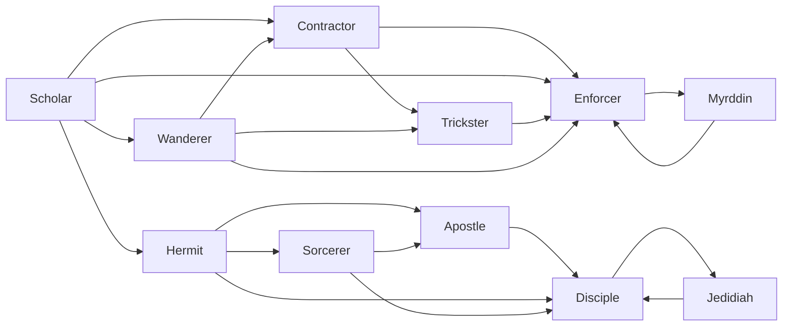
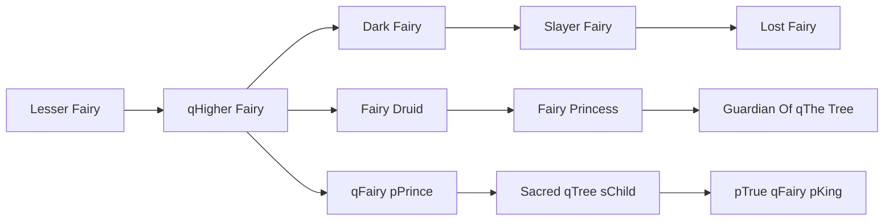
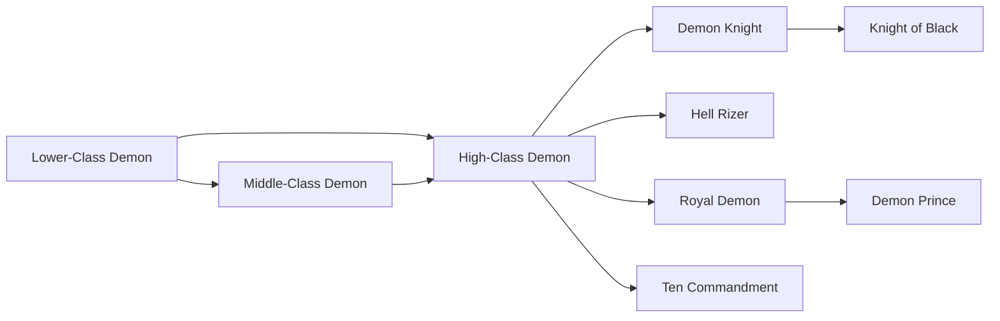
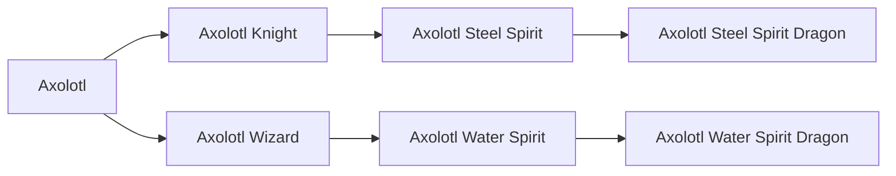
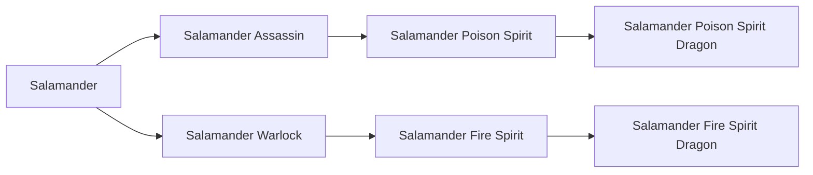
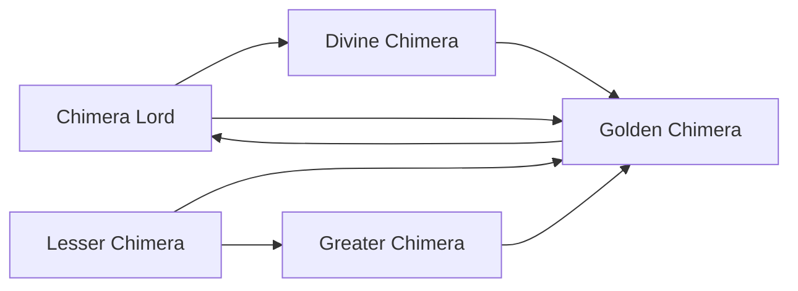

# Races

<small>[TR: Nightmares](../index.md)</small>

TR: Nightmares adds **121** races. Starting races can be chosen or rolled when you reincarnate; the rest are reached by evolving.

| Race | Difficulty | Alignment | Evolves into |
|---|---|---|---|
| [Apostle](apostle.md) | Intermediate | Holy | [Disciple](disciple.md) |
| [Arch Daemonic Dragon](arch-daemonic-dragon.md) | Hard | Default | [Daemonic Dragon Lord](daemonic-dragon-lord.md) |
| [Arch Dragon](arch-dragon.md) | Intermediate | Default | [Death Dragon](death-dragon.md), [Element Dragon](element-dragon.md), [Dragon Lord](dragon-lord.md) |
| [Archangqel](archangel.md) | Easy | Holy |  |
| [Axolotl](axolotl.md) | Hard | Default |  |
| [Axolotl Knight](axolotl-knight.md) | Hard | Default | [Axolotl Steel Spirit](axolotl-steel-spirit.md) |
| [Axolotl Steel Spirit](axolotl-steel-spirit.md) | Hard | Default | [Axolotl Steel Spirit Dragon](axolotl-steel-dragon.md) |
| [Axolotl Steel Spirit Dragon](axolotl-steel-dragon.md) | Hard | Default |  |
| [Axolotl Water Spirit](axolotl-water-spirit.md) | Hard | Holy | [Axolotl Water Spirit Dragon](axolotl-water-dragon.md) |
| [Axolotl Water Spirit Dragon](axolotl-water-dragon.md) | Hard | Holy |  |
| [Axolotl Wizard](axolotl-wizard.md) | Hard | Holy | [Axolotl Water Spirit](axolotl-water-spirit.md) |
| [Big Cutie](big-cutie.md) | Hard | Default | [Earthshaker pDancer](earthshaker-dancer.md) |
| [Brother Of Chaos](brother-of-chaos.md) | Easy | Majin |  |
| [Chimera Lord](chimera-lord.md) | Hard | Default | [Divine Chimera](divine-chimera.md) |
| [Contractor](contractor.md) | Intermediate | Majin | [Trickster](trickster.md) |
| [Daemonic Dragon Lord](daemonic-dragon-lord.md) | Hard | Default | [Devil Dragon Lord](devil-dragon-lord.md) |
| [Dark Fairy](dark-fairy.md) | Hard | Majin | [Slayer Fairy](slayer-fairy.md) |
| [Daughter pOf Light](daughter-of-light.md) | Easy | Majin | [sAccursed gGoddess](accursed-goddess.md) |
| [Death Dragon](death-dragon.md) | Intermediate | Default | [Gehenna Dragon](gehenna-dragon.md) |
| [Demon Knight](demon-knight.md) | Intermediate | Majin | [Knight of Black](knight-black.md) |
| [Demon Prince](demon-prince.md) | Intermediate | Majin |  |
| [Devil Dragon Lord](devil-dragon-lord.md) | Hard | Default |  |
| [Disciple](disciple.md) | Intermediate | Chaos | [Jedidiah](jedidiah.md) |
| [Divine Chimera](divine-chimera.md) | Hard | Default |  |
| [Divine Dragon Lord](divine-dragon-lord.md) | Hard | Default | [Divine Gehenna Dragon](divine-gehenna-dragon.md) |
| [Divine Fox](divine-fox.md) | Hard | Default |  |
| [Divine Gehenna Dragon](divine-gehenna-dragon.md) | Hard | Default |  |
| [Divine Heavenly Dragon](divine-heavenly-dragon.md) | Hard | Default |  |
| [Divine hSoldier](divine-soldier.md) | Easy | Holy | [Lance hCorporal](lance-corporal.md) |
| [Divine Netherite Dragon](divine-netherite-dragon.md) | Hard | Default |  |
| [Divine Vampiric Dragon Lord](divine-vampiric-dragon-lord.md) | Easy | Default |  |
| [Divine Void Dragon](divine-void-dragon.md) | Hard | Default |  |
| [Dragon Lord](dragon-lord.md) | Hard | Default | [Gehenna Dragon](gehenna-dragon.md), [Divine Dragon Lord](divine-dragon-lord.md) |
| [Earthshaker pDancer](earthshaker-dancer.md) | Hard | Default | [Giant Queen](giant-queen.md) |
| [Eidolon](eidolon.md) |  | Default | [Perfect Doppelganger](perfect-doppelganger.md) |
| [Element Dragon](element-dragon.md) | Hard | Default | [Death Dragon](death-dragon.md), [Dragon Lord](dragon-lord.md) |
| [Ender Dragon Prince](ender-dragon-prince.md) | Hard | Default | [Void Dragon](void-dragon.md) |
| [Enforcer](enforcer.md) | Intermediate | Chaos | [Myrddin](myrddin.md) |
| [Fairy Druid](fairy-druid.md) | Hard | Default | [Fairy Princess](fairy-princess.md) |
| [Fairy Princess](fairy-princess.md) | Hard | Default | [Guardian Of qThe Tree](guardian-of-the-tree.md) |
| [Fang of Earth](fang-of-earth.md) | Hard | Default | [Giant King](giant-king.md) |
| [Gehenna Dragon](gehenna-dragon.md) | Hard | Default | [Divine Gehenna Dragon](divine-gehenna-dragon.md) |
| [Giant Dancer](giant-dancer.md) | Hard | Default | [Big Cutie](big-cutie.md), [Giant Elder](giant-elder.md) |
| [Giant Elder](giant-elder.md) | Hard | Default | [Fang of Earth](fang-of-earth.md) |
| [Giant King](giant-king.md) | Hard | Default |  |
| [Giant Queen](giant-queen.md) | Hard | Default |  |
| [Giant Warrior](giant-warrior.md) | Hard | Default | [Giant Elder](giant-elder.md), [Mutant Giant](mutant-giant.md) |
| [God Of Earth](god-of-earth.md) | Hard | Majin |  |
| [Goddess Princess](princess-of-goddess.md) | Easy | Holy | [Daughter pOf Light](daughter-of-light.md) |
| [Golden Chimera](golden-chimera.md) | Intermediate | Default | [Chimera Lord](chimera-lord.md) |
| [Greater Chimera](greater-chimera.md) | Easy | Default | [Golden Chimera](golden-chimera.md) |
| [Greater Mystic Fox](greater-mystic-fox.md) | Easy | Default | [Ninehead](ninehead.md) |
| [Greater Thrall Dragon](greater-thrall-dragon.md) | Easy | Default |  |
| [Guardian Of qThe Tree](guardian-of-the-tree.md) | Hard | Default |  |
| [Heavenly Dragon](heavenly-dragon.md) | Hard | Default | [Divine Heavenly Dragon](divine-heavenly-dragon.md) |
| [Hell Rizer](hell-rizer.md) | Intermediate | Majin |  |
| [Hermit](hermit.md) | Easy | Holy | [Sorcerer](sorcerer.md) |
| [High-Class Demon](high-class-demon.md) | Intermediate | Majin | [Demon Knight](demon-knight.md), [Royal Demon](royal-demon.md), [Ten Commandment](ten-commandments.md), [Hell Rizer](hell-rizer.md) |
| [Higher hGoddess](higher-class-goddess.md) | Easy | Holy | [Divine hSoldier](divine-soldier.md), [Goddess Princess](princess-of-goddess.md), [Wingless Goddess](wingless-goddess.md) |
| [Jedidiah](jedidiah.md) | Intermediate | Chaos |  |
| [Knight of Black](knight-black.md) | Intermediate | Majin |  |
| [Lance hCorporal](lance-corporal.md) | Easy | Holy | [Archangqel](archangel.md) |
| [Lesser Chimera](lesser-chimera.md) | Intermediate | Default | [Greater Chimera](greater-chimera.md) |
| [Lesser Daemonic Dragon](lesser-daemonic-dragon.md) | Intermediate | Default | [Medium Daemonic Dragon](medium-daemonic-dragon.md) |
| [Lesser Dragon](lesser-dragon.md) | Intermediate | Default | [Lesser Holy Dragon](lesser-holy-dragon.md), [Lesser Daemonic Dragon](lesser-daemonic-dragon.md), [Lesser Ender Dragon](lesser-ender-dragon.md), [Lesser Nether Dragon](lesser-nether-dragon.md) |
| [Lesser Ender Dragon](lesser-ender-dragon.md) | Intermediate | Default | [Medium Ender Dragon](medium-ender-dragon.md) |
| [Lesser Fairy](lesser-fairy.md) | Hard | Default | [qHigher Fairy](higher-fairy.md) |
| [Lesser Giant](lesser-giant.md) | Hard | Default | [Giant Dancer](giant-dancer.md), [Giant Warrior](giant-warrior.md) |
| [Lesser hGoddess](lesser-goddess.md) | Easy | Holy | [Medium hGoddess](medium-class-goddess.md) |
| [Lesser Holy Dragon](lesser-holy-dragon.md) | Intermediate | Default | [Medium Holy Dragon](medium-holy-dragon.md) |
| [Lesser Mimic](lesser-mimic.md) |  | Default | [Shadow Mimic](shadow-mimic.md) |
| [Lesser Mystic Fox](lesser-mystic-fox.md) | Intermediate | Default | [Greater Mystic Fox](greater-mystic-fox.md) |
| [Lesser Nether Dragon](lesser-nether-dragon.md) | Intermediate | Default | [Medium Nether Dragon](medium-nether-dragon.md) |
| [Lesser Thrall Dragon](lesser-thrall-dragon.md) | Intermediate | Default |  |
| [Lesser Zombie Dragon](lesser-zombie-dragon.md) | Intermediate | Default | [Medium Zombie Dragon](medium-zombie-dragon.md) |
| [Lost Fairy](lost-fairy.md) | Hard | Majin |  |
| [Lower-Class Demon](lower-class-demon.md) | Intermediate | Majin | [Middle-Class Demon](mid-class-demon.md) |
| [Medium Daemonic Dragon](medium-daemonic-dragon.md) | Easy | Default | [Arch Daemonic Dragon](arch-daemonic-dragon.md) |
| [Medium Dragon](medium-dragon.md) | Easy | Default | [Medium Zombie Dragon](medium-zombie-dragon.md), [Arch Dragon](arch-dragon.md) |
| [Medium Ender Dragon](medium-ender-dragon.md) | Easy | Default | [Ender Dragon Prince](ender-dragon-prince.md) |
| [Medium hGoddess](medium-class-goddess.md) | Easy | Holy | [Higher hGoddess](higher-class-goddess.md) |
| [Medium Holy Dragon](medium-holy-dragon.md) | Easy | Default | [Saint Dragon](saint-dragon.md) |
| [Medium Nether Dragon](medium-nether-dragon.md) | Easy | Default | [Scrap Dragon](scrap-dragon.md) |
| [Medium Zombie Dragon](medium-zombie-dragon.md) | Easy | Default | [Death Dragon](death-dragon.md) |
| [Middle-Class Demon](mid-class-demon.md) | Intermediate | Majin | [High-Class Demon](high-class-demon.md) |
| [Mutant Giant](mutant-giant.md) | Hard | Majin | [One Eyed God](one-eyed-god.md) |
| [Myrddin](myrddin.md) | Intermediate | Chaos |  |
| [Nameless Goddess](nameless-goddess.md) | Easy | Majin | [Brother Of Chaos](brother-of-chaos.md) |
| [Netherite Dragon](netherite-dragon.md) | Hard | Default | [Divine Netherite Dragon](divine-netherite-dragon.md) |
| [Ninehead](ninehead.md) | Intermediate | Default | [Ninetail](ninetail.md) |
| [Ninetail](ninetail.md) | Hard | Default | [Soul Beast](soul-beast.md) |
| [One Eyed God](one-eyed-god.md) | Hard | Majin | [God Of Earth](god-of-earth.md) |
| [Perfect Doppelganger](perfect-doppelganger.md) |  | Default |  |
| [pTrue qFairy pKing](true-fairy-king.md) | Hard | Default |  |
| [qFairy pPrince](fairy-prince.md) | Hard | Default | [Sacred qTree sChild](sacred-tree-child.md) |
| [qHigher Fairy](higher-fairy.md) | Hard | Default | [Dark Fairy](dark-fairy.md), [qFairy pPrince](fairy-prince.md), [Fairy Druid](fairy-druid.md) |
| [Royal Demon](royal-demon.md) | Intermediate | Majin | [Demon Prince](demon-prince.md) |
| [sAccursed gGoddess](accursed-goddess.md) | Easy | Majin |  |
| [Sacred qTree sChild](sacred-tree-child.md) | Hard | Default | [pTrue qFairy pKing](true-fairy-king.md) |
| [Saint Dragon](saint-dragon.md) | Hard | Default | [Heavenly Dragon](heavenly-dragon.md) |
| [Salamander](salamander.md) | Hard | Default | [Salamander Assassin](salamander-assassin.md), [Salamander Warlock](salamander-warlock.md) |
| [Salamander Assassin](salamander-assassin.md) | Hard | Default | [Salamander Poison Spirit](salamander-poison-spirit.md) |
| [Salamander Fire Spirit](salamander-fire-spirit.md) | Hard | Majin | [Salamander Fire Spirit Dragon](salamander-fire-dragon.md) |
| [Salamander Fire Spirit Dragon](salamander-fire-dragon.md) | Hard | Majin |  |
| [Salamander Poison Spirit](salamander-poison-spirit.md) | Hard | Default | [Salamander Poison Spirit Dragon](salamander-poison-dragon.md) |
| [Salamander Poison Spirit Dragon](salamander-poison-dragon.md) | Hard | Default |  |
| [Salamander Warlock](salamander-warlock.md) | Hard | Majin | [Salamander Fire Spirit](salamander-fire-spirit.md) |
| [Scholar](scholar.md) | Easy | Default | [Hermit](hermit.md), [Wanderer](wanderer.md) |
| [Scrap Dragon](scrap-dragon.md) | Hard | Default | [Netherite Dragon](netherite-dragon.md) |
| [Shadow Mimic](shadow-mimic.md) |  | Default | [Thought Leech](thought-leech.md) |
| [Slayer Fairy](slayer-fairy.md) | Hard | Majin | [Lost Fairy](lost-fairy.md) |
| [Sorcerer](sorcerer.md) | Intermediate | Holy | [Apostle](apostle.md) |
| [Soul Beast](soul-beast.md) | Hard | Default | [Divine Fox](divine-fox.md) |
| [Ten Commandment](ten-commandments.md) | Intermediate | Majin |  |
| [Thought Leech](thought-leech.md) |  | Default | [Eidolon](eidolon.md) |
| [Trickster](trickster.md) | Intermediate | Majin | [Enforcer](enforcer.md) |
| [Vampiric Dragon](vampiric-dragon.md) | Intermediate | Default |  |
| [Vampiric Dragon Lord](vampiric-dragon-lord.md) | Easy | Default |  |
| [Void Dragon](void-dragon.md) | Hard | Default | [Divine Void Dragon](divine-void-dragon.md) |
| [Wanderer](wanderer.md) | Intermediate | Majin | [Contractor](contractor.md) |
| [Wingless Goddess](wingless-goddess.md) | Easy | Majin | [Nameless Goddess](nameless-goddess.md) |

## Evolution trees

### Lesser Dragon line

### Lesser Giant line

### Lesser hGoddess line

### Scholar line

### Lesser Fairy line

### Lower-Class Demon line

### Axolotl line

### Salamander line

### Lesser Mystic Fox line

### Lesser Chimera line

### Lesser Mimic line

