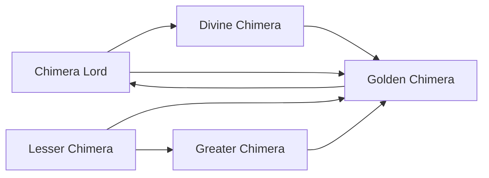

# Lesser Chimera

<small>[TR: Nightmares](../index.md) &rsaquo; [Races](index.md)</small>

| | |
|---|---|
| **ID** | `trnightmare:lesser_chimera` |
| **Stage** | Starting |
| **Difficulty** | Intermediate |
| **Alignment** | Default |
| **Aura** | 1,500 - 2,500 |
| **Magicule** | 3,000 - 4,500 |
| **Health bonus** | 18 |
| **Spiritual health bonus** | 80 |
| **Attack damage bonus** | 0.3 |
| **Movement speed bonus** | 0 |

> Insert Lesser Chimera description here

## Evolution

- **Evolves into:** [Greater Chimera](greater-chimera.md)
- **Default evolution:** [Greater Chimera](greater-chimera.md)
- **On awakening (True Demon Lord / True Hero):** [Golden Chimera](golden-chimera.md)
- **During the Harvest Festival:** [Greater Chimera](greater-chimera.md)

### Evolution tree

## Attribute modifiers

| Attribute | Amount | Operation |
|---|---|---|
| Scale | 0.4 | add |
| Max Health | 18 | add |
| Max Spiritual Health | 80 | add |
| Attack Damage | 0.3 | add |
| Attack Speed | -0.3 | add |
| Knockback Resistance | 0.05 | add |
| Movement Speed | 0 | add |
| Swim Speed Multiplier | 0 | add |

## Stats (config defaults)

Set in [`config/nightmare/race/chimera_config.toml`](../configs/config-nightmare-race-chimera-config.md).

| Option | Default | Description |
|---|---|---|
| `LesserChimera.minAura` | 1,500 | Minimal aura. |
| `LesserChimera.maxAura` | 2,500 | Maximum aura. |
| `LesserChimera.minMagicule` | 3,000 | Minimal magicule. |
| `LesserChimera.maxMagicule` | 4,500 | Maximum magicule. |
| `LesserChimera.size` | 0.4 | Bonus Size. |
| `LesserChimera.maxHealth` | 18 | Bonus Max Health. |
| `LesserChimera.maxSpiritualHealth` | 80 | Bonus Max Spiritual Health. |
| `LesserChimera.attack` | 0.3 | Bonus Attack Damage. |
| `LesserChimera.attackSpeed` | -0.3 | Bonus Attack Speed. |
| `LesserChimera.knockbackResistance` | 0.05 | Bonus Knockback Resistance. |
| `LesserChimera.movementSpeed` | 0 | Bonus Movement Speed. |
| `LesserChimera.swimSpeed` | 0 | Bonus Swimming Speed Multiplier. |
| `LesserChimera.intrinsicPool` | "tensura:absorb_and_dissolve", "tensura:beast_transformation", "tensura:dragon_ear", "tensura:dragon_eye", "tensura:dragon_mode", "tensura:dragon_skin", "tensura:giantification", "tensura:water_breathing" | List of intrinsic skills Lesser Chimera can randomly receive. |
| `LesserChimera.intrinsicCount` | 2 | How many intrinsic skills a Lesser Chimera receives from the pool. |
