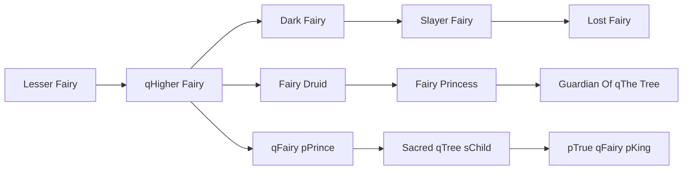

# Lesser Fairy

<small>[TR: Nightmares](../index.md) &rsaquo; [Races](index.md)</small>

| | |
|---|---|
| **ID** | `trnightmare:lesser_fairy` |
| **Difficulty** | Hard |
| **Alignment** | Default |
| **Aura** | 500 - 500 |
| **Magicule** | 1,500 - 5,500 |
| **Health bonus** | -10 |
| **Spiritual health bonus** | 90 |
| **Attack damage bonus** | 0 |
| **Movement speed bonus** | 0.02 |

> Fairies are naturally born within nature, specificly from the plants that grow around the Sacred Tree, or even the Sacred Tree itself.

## Evolution

- **Evolves into:** [qHigher Fairy](higher-fairy.md)
- **Default evolution:** [qHigher Fairy](higher-fairy.md)
- **On awakening (True Demon Lord / True Hero):** [qHigher Fairy](higher-fairy.md)
- **During the Harvest Festival:** [qHigher Fairy](higher-fairy.md)

### Evolution tree

## Intrinsic skills

Granted automatically when you become this race.

-  [Gravity Attack Resistance](../../tensura-reincarnated/abilities/resistance-skills/gravity-attack-resistance.md)

## Attribute modifiers

| Attribute | Amount | Operation |
|---|---|---|
| Scale | -1 | add |
| Max Health | -10 | add |
| Max Spiritual Health | 90 | add |
| Attack Damage | 0 | add |
| Attack Speed | -0.2 | add |
| Knockback Resistance | 0 | add |
| Movement Speed | 0.02 | add |
| Swim Speed Multiplier | 0.02 | add |

## Stats (config defaults)

Set in [`config/nightmare/race/fairy_clan_config.toml`](../configs/config-nightmare-race-fairy-clan-config.md).

| Option | Default | Description |
|---|---|---|
| `LesserFairy.minAura` | 500 | Minimal aura. |
| `LesserFairy.maxAura` | 500 | Maximum aura. |
| `LesserFairy.minMagicule` | 1,500 | Minimal magicule. |
| `LesserFairy.maxMagicule` | 5,500 | Maximum magicule. |
| `LesserFairy.size` | -1 | Bonus Size. |
| `LesserFairy.maxHealth` | -10 | Bonus Max Health. |
| `LesserFairy.maxSpiritualHealth` | 90 | Bonus Max Spiritual Health. |
| `LesserFairy.attack` | 0 | Bonus Attack Damage. |
| `LesserFairy.attackSpeed` | -0.2 | Bonus Attack Speed. |
| `LesserFairy.knockbackResistance` | 0 | Bonus Knockback Resistance. |
| `LesserFairy.movementSpeed` | 0.02 | Bonus Movement Speed. |
| `LesserFairy.swimSpeed` | 0.02 | Bonus Swimming Speed Multiplier. |
