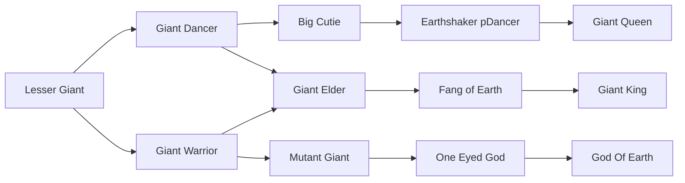
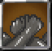

# Lesser Giant

<small>[TR: Nightmares](../index.md) &rsaquo; [Races](index.md)</small>

| | |
|---|---|
| **ID** | `trnightmare:lesser_giant` |
| **Stage** | Starting |
| **Difficulty** | Hard |
| **Alignment** | Default |
| **Aura** | 500 - 500 |
| **Magicule** | 1,500 - 5,500 |
| **Health bonus** | 80 |
| **Spiritual health bonus** | 240 |
| **Attack damage bonus** | 2 |
| **Movement speed bonus** | 0.04 |

> The Giants are identical to humans with the exception that they are much larger in size. Their way of dress is similar to that of a Savage Tribe.

## Evolution

- **Evolves into:** [Giant Dancer](giant-dancer.md), [Giant Warrior](giant-warrior.md)
- **Default evolution:** [Giant Warrior](giant-warrior.md)
- **On awakening (True Demon Lord / True Hero):** [Giant Warrior](giant-warrior.md)
- **During the Harvest Festival:** [Giant Warrior](giant-warrior.md)

### Evolution tree

## Intrinsic skills

Granted automatically when you become this race.

-  [Earth Attack Resistance](../../tensura-reincarnated/abilities/resistance-skills/earth-attack-resistance.md)
-  [Physical Attack Resistance](../../tensura-reincarnated/abilities/resistance-skills/physical-attack-resistance.md)
-  [Earth Manipulation](../../tensura-reincarnated/abilities/extra-skills/earth-manipulation.md)
-  [Heavy METAL!](../abilities/intrinsic-skills/heavy-metal.md)
-  [Size Condense](../abilities/intrinsic-skills/size-condense.md)

## Attribute modifiers

| Attribute | Amount | Operation |
|---|---|---|
| Scale | 0.5 | add |
| Max Health | 80 | add |
| Max Spiritual Health | 240 | add |
| Attack Damage | 2 | add |
| Attack Speed | 0 | add |
| Knockback Resistance | 0.5 | add |
| Movement Speed | 0.04 | add |
| Swim Speed Multiplier | 0.04 | add |

## Stats (config defaults)

Set in [`config/nightmare/race/giant_clan_config.toml`](../configs/config-nightmare-race-giant-clan-config.md).

| Option | Default | Description |
|---|---|---|
| `LesserGiant.minAura` | 500 | Minimal aura. |
| `LesserGiant.maxAura` | 500 | Maximum aura. |
| `LesserGiant.minMagicule` | 1,500 | Minimal magicule. |
| `LesserGiant.maxMagicule` | 5,500 | Maximum magicule. |
| `LesserGiant.size` | 0.5 | Bonus Size. |
| `LesserGiant.maxHealth` | 80 | Bonus Max Health. |
| `LesserGiant.maxSpiritualHealth` | 240 | Bonus Max Spiritual Health. |
| `LesserGiant.attack` | 2 | Bonus Attack Damage. |
| `LesserGiant.attackSpeed` | 0 | Bonus Attack Speed. |
| `LesserGiant.knockbackResistance` | 0.5 | Bonus Knockback Resistance. |
| `LesserGiant.movementSpeed` | 0.04 | Bonus Movement Speed. |
| `LesserGiant.swimSpeed` | 0.04 | Bonus Swimming Speed Multiplier. |
