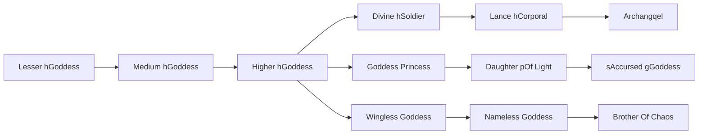

# Lesser hGoddess

<small>[TR: Nightmares](../index.md) &rsaquo; [Races](index.md)</small>

| | |
|---|---|
| **ID** | `trnightmare:lesser_goddess` |
| **Difficulty** | Easy |
| **Alignment** | Holy |
| **Aura** | 2,000 - 4,000 |
| **Magicule** | 500 - 1,000 |
| **Health bonus** | 25 |
| **Spiritual health bonus** | 90 |
| **Attack damage bonus** | 0.7 |
| **Movement speed bonus** | 0.02 |

> The Goddess Clan are the Children of the Supreme Being and are qworshipped and ipraised by the other races, or, feared and hated by them. The Goddess Clan are seen as the ultimate beings of spurity and creatures of virtue,

## Evolution

- **Evolves into:** [Medium hGoddess](medium-class-goddess.md)
- **Default evolution:** [Medium hGoddess](medium-class-goddess.md)
- **On awakening (True Demon Lord / True Hero):** [Medium hGoddess](medium-class-goddess.md)
- **During the Harvest Festival:** [Medium hGoddess](medium-class-goddess.md)

### Evolution tree

## Intrinsic skills

Granted automatically when you become this race.

-  [Holy Attack Resistance](../../tensura-reincarnated/abilities/resistance-skills/holy-attack-resistance.md)
-  [Light Attack Resistance](../../tensura-reincarnated/abilities/resistance-skills/light-attack-resistance.md)
-  [Magic Light Transform](../../tensura-reincarnated/abilities/extra-skills/magic-light-transform.md)
-  [Heavenly Eye](../../tensura-reincarnated/abilities/extra-skills/heavenly-eye.md)
-  [Goddess hIncarnation](../abilities/intrinsic-skills/goddess-incarnation.md)

## Attribute modifiers

| Attribute | Amount | Operation |
|---|---|---|
| Scale | 0 | add |
| Max Health | 25 | add |
| Max Spiritual Health | 90 | add |
| Attack Damage | 0.7 | add |
| Attack Speed | -0.2 | add |
| Knockback Resistance | 0.5 | add |
| Movement Speed | 0.02 | add |
| Swim Speed Multiplier | 0.02 | add |

## Stats (config defaults)

Set in [`config/nightmare/race/goddess_clan_config.toml`](../configs/config-nightmare-race-goddess-clan-config.md).

| Option | Default | Description |
|---|---|---|
| `LowerClassGoddess.minAura` | 2,000 | Minimal aura. |
| `LowerClassGoddess.maxAura` | 4,000 | Maximum aura. |
| `LowerClassGoddess.minMagicule` | 500 | Minimal magicule. |
| `LowerClassGoddess.maxMagicule` | 1,000 | Maximum magicule. |
| `LowerClassGoddess.size` | 0 | Bonus Size. |
| `LowerClassGoddess.maxHealth` | 25 | Bonus Max Health. |
| `LowerClassGoddess.maxSpiritualHealth` | 90 | Bonus Max Spiritual Health. |
| `LowerClassGoddess.attack` | 0.7 | Bonus Attack Damage. |
| `LowerClassGoddess.attackSpeed` | -0.2 | Bonus Attack Speed. |
| `LowerClassGoddess.knockbackResistance` | 0.5 | Bonus Knockback Resistance. |
| `LowerClassGoddess.movementSpeed` | 0.02 | Bonus Movement Speed. |
| `LowerClassGoddess.swimSpeed` | 0.02 | Bonus Swimming Speed Multiplier. |
