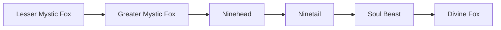

# Lesser Mystic Fox

<small>[TR: Nightmares](../index.md) &rsaquo; [Races](index.md)</small>

| | |
|---|---|
| **ID** | `trnightmare:lesser_mystic_fox` |
| **Difficulty** | Intermediate |
| **Alignment** | Default |
| **Aura** | 1,000 - 2,000 |
| **Magicule** | 2,000 - 4,000 |
| **Health bonus** | 15 |
| **Spiritual health bonus** | 60 |
| **Attack damage bonus** | 0 |
| **Movement speed bonus** | 0 |
| **EP to evolve into** | 0 |

> A young fox spirit with budding mystic instincts.

## Evolution

- **Evolves into:** [Greater Mystic Fox](greater-mystic-fox.md)
- **Default evolution:** [Greater Mystic Fox](greater-mystic-fox.md)

### Evolution tree

## Intrinsic skills

Granted automatically when you become this race.

-  [Abnormal Condition Nullification](../../tensura-reincarnated/abilities/resistance-skills/abnormal-condition-nullification.md)

## Attribute modifiers

| Attribute | Amount | Operation |
|---|---|---|
| Scale | size | add |
| Max Health | max HP | add |
| Max Spiritual Health | max spiritual HP | add |
| Attack Damage | attack | add |
| Attack Speed | attack speed | add |
| Knockback Resistance | knockback resistance | add |
| Movement Speed | movement speed | add |
| Swim Speed Multiplier | swim speed | add |

## Stats (config defaults)

Set in [`config/nightmare/race/mystic_fox_config.toml`](../configs/config-nightmare-race-mystic-fox-config.md).

| Option | Default | Description |
|---|---|---|
| `LesserMysticFox.epRequirement` | 0 | EP requirement to evolve into this tier. |
| `LesserMysticFox.minAura` | 1,000 | Minimal aura. |
| `LesserMysticFox.maxAura` | 2,000 | Maximum aura. |
| `LesserMysticFox.minMagicule` | 2,000 | Minimal magicule. |
| `LesserMysticFox.maxMagicule` | 4,000 | Maximum magicule. |
| `LesserMysticFox.size` | 0 | Bonus Size. |
| `LesserMysticFox.maxHealth` | 15 | Bonus Max Health. |
| `LesserMysticFox.maxSpiritualHealth` | 60 | Bonus Max Spiritual Health. |
| `LesserMysticFox.attack` | 0 | Bonus Attack Damage. |
| `LesserMysticFox.attackSpeed` | 0 | Bonus Attack Speed. |
| `LesserMysticFox.knockbackResistance` | 0 | Bonus Knockback Resistance. |
| `LesserMysticFox.movementSpeed` | 0 | Bonus Movement Speed. |
| `LesserMysticFox.swimSpeed` | 0 | Bonus Swimming Speed Multiplier. |
| `LesserMysticFox.minAura` | 4,000 |  |
| `LesserMysticFox.maxAura` | 9,000 |  |
| `LesserMysticFox.minMagicule` | 8,000 |  |
| `LesserMysticFox.maxMagicule` | 16,000 |  |
| `LesserMysticFox.size` | -0.5 |  |
| `LesserMysticFox.maxHealth` | 25 |  |
| `LesserMysticFox.maxSpiritualHealth` | 100 |  |
| `LesserMysticFox.attack` | 0.7 |  |
| `LesserMysticFox.attackSpeed` | 0.15 |  |
| `LesserMysticFox.knockbackResistance` | 0.1 |  |
| `LesserMysticFox.movementSpeed` | 0.03 |  |
| `LesserMysticFox.swimSpeed` | 0.02 |  |
