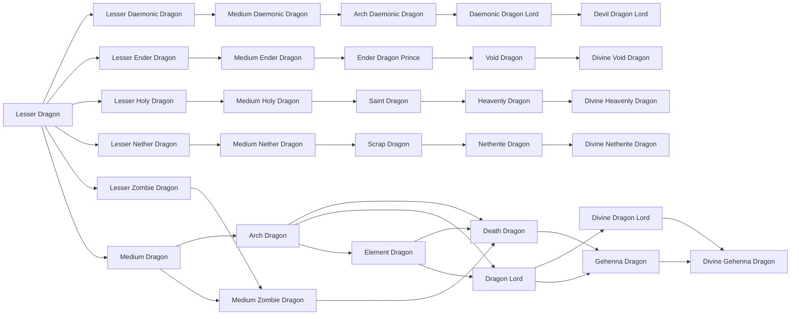

# Lesser Zombie Dragon

<small>[TR: Nightmares](../index.md) &rsaquo; [Races](index.md)</small>

| | |
|---|---|
| **ID** | `trnightmare:lesser_zombie_dragon` |
| **Difficulty** | Intermediate |
| **Alignment** | Default |
| **Aura** | 1,000 - 2,000 |
| **Magicule** | 3,000 - 6,000 |
| **Health bonus** | 20 |
| **Spiritual health bonus** | 80 |
| **Attack damage bonus** | 0 |
| **Movement speed bonus** | 0 |
| **EP to evolve into** | 0 |

> A cursed lesser dragon reanimated by deathly force.

## Evolution

- **Evolves from:** [Lesser Dragon](lesser-dragon.md)
- **Evolves into:** [Medium Zombie Dragon](medium-zombie-dragon.md)
- **Default evolution:** [Medium Zombie Dragon](medium-zombie-dragon.md)

### Requirements to evolve into Lesser Zombie Dragon

Each requirement adds its weight to the evolution progress bar; you can evolve at 100%.

| Requirement | Weight |
|---|---|
| Reach Existence Points of min base aura + min base magicule | 100% |

### Evolution tree

## Intrinsic skills

Granted automatically when you become this race.

-  [Dragon Ear](../../tensura-reincarnated/abilities/intrinsic-skills/dragon-ear.md)
-  [Dragon Eye](../../tensura-reincarnated/abilities/intrinsic-skills/dragon-eye.md)
-  [Dragon Skin](../../tensura-reincarnated/abilities/intrinsic-skills/dragon-skin.md)
-  [Size Condense](../abilities/intrinsic-skills/size-condense.md)

## Traits

- Has creative-style flight

## Attribute modifiers

| Attribute | Amount | Operation |
|---|---|---|
| Scale | size | add |
| Max Health | max HP | add |
| Max Spiritual Health | max spiritual HP | add |
| Attack Damage | attack | add |
| Attack Speed | attack speed | add |
| Knockback Resistance | knockback resistance | add |
| Movement Speed | movement speed | add |
| Swim Speed Multiplier | swim speed | add |

## Stats (config defaults)

Set in [`config/nightmare/race/dragon_config.toml`](../configs/config-nightmare-race-dragon-config.md).

| Option | Default | Description |
|---|---|---|
| `LesserZombieDragon.epRequirement` | 0 | EP requirement to evolve into this tier. |
| `LesserZombieDragon.minAura` | 1,000 | Minimal aura. |
| `LesserZombieDragon.maxAura` | 2,000 | Maximum aura. |
| `LesserZombieDragon.minMagicule` | 3,000 | Minimal magicule. |
| `LesserZombieDragon.maxMagicule` | 6,000 | Maximum magicule. |
| `LesserZombieDragon.size` | 0 | Bonus Size. |
| `LesserZombieDragon.maxHealth` | 20 | Bonus Max Health. |
| `LesserZombieDragon.maxSpiritualHealth` | 80 | Bonus Max Spiritual Health. |
| `LesserZombieDragon.attack` | 0 | Bonus Attack Damage. |
| `LesserZombieDragon.attackSpeed` | 0 | Bonus Attack Speed. |
| `LesserZombieDragon.knockbackResistance` | 0 | Bonus Knockback Resistance. |
| `LesserZombieDragon.movementSpeed` | 0 | Bonus Movement Speed. |
| `LesserZombieDragon.swimSpeed` | 0 | Bonus Swimming Speed Multiplier. |
| `LesserZombieDragon.minAura` | 6,000 |  |
| `LesserZombieDragon.maxAura` | 12,000 |  |
| `LesserZombieDragon.minMagicule` | 8,000 |  |
| `LesserZombieDragon.maxMagicule` | 16,000 |  |
| `LesserZombieDragon.size` | 0.2 |  |
| `LesserZombieDragon.maxHealth` | 45 |  |
| `LesserZombieDragon.maxSpiritualHealth` | 80 |  |
| `LesserZombieDragon.attack` | 1 |  |
| `LesserZombieDragon.attackSpeed` | -0.25 |  |
| `LesserZombieDragon.knockbackResistance` | 0.2 |  |
| `LesserZombieDragon.movementSpeed` | -0.005 |  |
| `LesserZombieDragon.swimSpeed` | -0.05 |  |

## Tags

`tensura:races/has_creative_flight`
