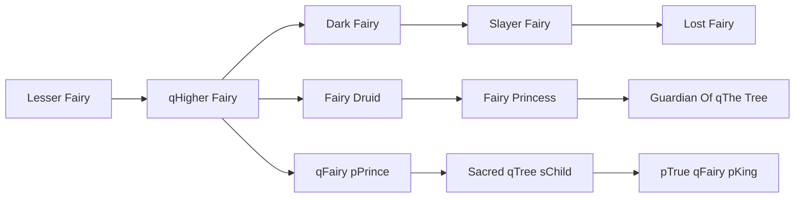

# Lost Fairy

<small>[TR: Nightmares](../index.md) &rsaquo; [Races](index.md)</small>

| | |
|---|---|
| **ID** | `trnightmare:lost_fairy` |
| **Difficulty** | Hard |
| **Alignment** | Majin |
| **Aura** | 50,000 - 100,000 |
| **Magicule** | 30,000 - 60,000 |
| **Health bonus** | 830 |
| **Spiritual health bonus** | 6,240 |
| **Attack damage bonus** | 9 |
| **Movement speed bonus** | 0.14 |
| **EP to evolve into** | 500,000 |

## Evolution

- **Evolves from:** [Slayer Fairy](slayer-fairy.md)

### Requirements to evolve into Lost Fairy

Each requirement adds its weight to the evolution progress bar; you can evolve at 100%.

| Requirement | Weight |
|---|---|
| Awaken [True Demon Lord./True Hero.] | 100% |

### Evolution tree

## Intrinsic skills

Granted automatically when you become this race.

-  [Gravity Attack Nullification](../../tensura-reincarnated/abilities/resistance-skills/gravity-attack-nullification.md)
-  [Magic Resistance](../../tensura-reincarnated/abilities/resistance-skills/magic-resistance.md)
-  [Thermal Fluctuation Nullification](../../tensura-reincarnated/abilities/resistance-skills/thermal-fluctuation-nullification.md)
-  [Ultra-Instinct](../../tensura-reincarnated/abilities/extra-skills/ultra-instinct.md)
-  [Dark Eight Palms](../../tensura-reincarnated/abilities/battlewill/dark-eight-palms.md)

## Traits

- Divine

## Attribute modifiers

| Attribute | Amount | Operation |
|---|---|---|
| Scale | size | add |
| Max Health | max HP | add |
| Max Spiritual Health | max spiritual HP | add |
| Attack Damage | attack | add |
| Attack Speed | attack speed | add |
| Knockback Resistance | knockback resistance | add |
| Movement Speed | movement speed | add |
| Swim Speed Multiplier | swim speed | add |

## Stats (config defaults)

Set in [`config/nightmare/race/fairy_clan_config.toml`](../configs/config-nightmare-race-fairy-clan-config.md).

| Option | Default | Description |
|---|---|---|
| `LostFairy.minAura` | 50,000 | Minimal aura. |
| `LostFairy.maxAura` | 100,000 | Maximum aura. |
| `LostFairy.minMagicule` | 30,000 | Minimal magicule. |
| `LostFairy.maxMagicule` | 60,000 | Maximum magicule. |
| `LostFairy.size` | -0.5 | Bonus Size. |
| `LostFairy.maxHealth` | 830 | Bonus Max Health. |
| `LostFairy.maxSpiritualHealth` | 6,240 | Bonus Max Spiritual Health. |
| `LostFairy.attack` | 9 | Bonus Attack Damage. |
| `LostFairy.attackSpeed` | 4 | Bonus Attack Speed. |
| `LostFairy.knockbackResistance` | 1 | Bonus Knockback Resistance. |
| `LostFairy.movementSpeed` | 0.14 | Bonus Movement Speed. |
| `LostFairy.swimSpeed` | 0.14 | Bonus Swimming Speed Multiplier. |
| `SlayerFairy.epRequirement` | 500,000 | Existence points required to evolve into Slayer Fairy. |
| `SlayerFairy.essenceRequirementLife` | 10 | Life Essence required to evolve into Slayer Fairy. |
| `SlayerFairy.essenceRequirementDaemon` | 10 | Daemon Essence required to evolve into Slayer Fairy. |
| `SlayerFairy.minAura` | 250,000 | Minimal aura. |
| `SlayerFairy.maxAura` | 500,000 | Maximum aura. |
| `SlayerFairy.minMagicule` | 150,000 | Minimal magicule. |
| `SlayerFairy.maxMagicule` | 390,000 | Maximum magicule. |
| `SlayerFairy.size` | 0 | Bonus Size. |
| `SlayerFairy.maxHealth` | 430 | Bonus Max Health. |
| `SlayerFairy.maxSpiritualHealth` | 3,140 | Bonus Max Spiritual Health. |
| `SlayerFairy.attack` | 7 | Bonus Attack Damage. |
| `SlayerFairy.attackSpeed` | 2 | Bonus Attack Speed. |
| `SlayerFairy.knockbackResistance` | 0.9 | Bonus Knockback Resistance. |
| `SlayerFairy.movementSpeed` | 0.12 | Bonus Movement Speed. |
| `SlayerFairy.swimSpeed` | 0.12 | Bonus Swimming Speed Multiplier. |
| `DarkFairy.epRequirement` | 80,000 | Existence points required to evolve into Dark Fairy. |
| `DarkFairy.essenceRequirementLife` | 10 | Life Essence required to evolve into Dark Fairy. |
| `DarkFairy.essenceRequirementDaemon` | 20 | Daemon Essence required to evolve into Dark Fairy. |
| `DarkFairy.minAura` | 24,000 | Minimal aura. |
| `DarkFairy.maxAura` | 48,000 | Maximum aura. |
| `DarkFairy.minMagicule` | 40,000 | Minimal magicule. |
| `DarkFairy.maxMagicule` | 80,000 | Maximum magicule. |
| `DarkFairy.size` | -0.5 | Bonus Size. |
| `DarkFairy.maxHealth` | 230 | Bonus Max Health. |
| `DarkFairy.maxSpiritualHealth` | 690 | Bonus Max Spiritual Health. |
| `DarkFairy.attack` | 5 | Bonus Attack Damage. |
| `DarkFairy.attackSpeed` | 3 | Bonus Attack Speed. |
| `DarkFairy.knockbackResistance` | 0.6 | Bonus Knockback Resistance. |
| `DarkFairy.movementSpeed` | 0.11 | Bonus Movement Speed. |
| `DarkFairy.swimSpeed` | 0.11 | Bonus Swimming Speed Multiplier. |
| `HigherFairy.epRequirement` | 40,000 | Existence points required to evolve into Higher Fairy. |
| `HigherFairy.essenceRequirementLife` | 10 | Number of life essence required to evolve into Higher Fairy. |
| `HigherFairy.minAura` | 25,000 | Minimal aura. |
| `HigherFairy.maxAura` | 50,000 | Maximum aura. |
| `HigherFairy.minMagicule` | 15,000 | Minimal magicule. |
| `HigherFairy.maxMagicule` | 30,000 | Maximum magicule. |
| `HigherFairy.size` | -0.5 | Bonus Size. |
| `HigherFairy.maxHealth` | 10 | Bonus Max Health. |
| `HigherFairy.maxSpiritualHealth` | 150 | Bonus Max Spiritual Health. |
| `HigherFairy.attack` | 0 | Bonus Attack Damage. |
| `HigherFairy.attackSpeed` | 1 | Bonus Attack Speed. |
| `HigherFairy.knockbackResistance` | 0 | Bonus Knockback Resistance. |
| `HigherFairy.movementSpeed` | 0.04 | Bonus Movement Speed. |
| `HigherFairy.swimSpeed` | 0.04 | Bonus Swimming Speed Multiplier. |
| `LesserFairy.minAura` | 500 | Minimal aura. |
| `LesserFairy.maxAura` | 500 | Maximum aura. |
| `LesserFairy.minMagicule` | 1,500 | Minimal magicule. |
| `LesserFairy.maxMagicule` | 5,500 | Maximum magicule. |
| `LesserFairy.size` | -1 | Bonus Size. |
| `LesserFairy.maxHealth` | -10 | Bonus Max Health. |
| `LesserFairy.maxSpiritualHealth` | 90 | Bonus Max Spiritual Health. |
| `LesserFairy.attack` | 0 | Bonus Attack Damage. |
| `LesserFairy.attackSpeed` | -0.2 | Bonus Attack Speed. |
| `LesserFairy.knockbackResistance` | 0 | Bonus Knockback Resistance. |
| `LesserFairy.movementSpeed` | 0.02 | Bonus Movement Speed. |
| `LesserFairy.swimSpeed` | 0.02 | Bonus Swimming Speed Multiplier. |

## Tags

`tensura:races/divine`
