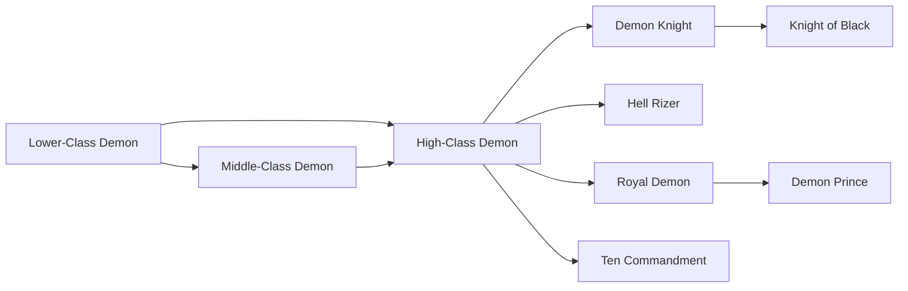
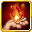

# Lower-Class Demon

<small>[TR: Nightmares](../index.md) &rsaquo; [Races](index.md)</small>

| | |
|---|---|
| **ID** | `trnightmare:lower_class_demon` |
| **Stage** | Starting |
| **Difficulty** | Intermediate |
| **Alignment** | Majin |
| **Aura** | 2,000 - 6,000 |
| **Magicule** | 4,000 - 9,000 |
| **Health bonus** | 12 |
| **Spiritual health bonus** | 70 |
| **Attack damage bonus** | 0.25 |
| **Movement speed bonus** | 0 |

> A member of the Demon Clan, a warring race that wants nothing but to purposefully serve the Demon King.

## Evolution

- **Evolves into:** [Middle-Class Demon](mid-class-demon.md)
- **Default evolution:** [Middle-Class Demon](mid-class-demon.md)
- **On awakening (True Demon Lord / True Hero):** [High-Class Demon](high-class-demon.md)
- **During the Harvest Festival:** [Middle-Class Demon](mid-class-demon.md)

### Evolution tree

## Intrinsic skills

Granted automatically when you become this race.

-  [Darkness Attack Resistance](../../tensura-reincarnated/abilities/resistance-skills/darkness-attack-resistance.md)
-  [Flame Attack Resistance](../../tensura-reincarnated/abilities/resistance-skills/flame-attack-resistance.md)
-  [Flame Manipulation](../../tensura-reincarnated/abilities/extra-skills/flame-manipulation.md)
-  [Magic Sense](../../tensura-reincarnated/abilities/extra-skills/magic-sense.md)

## Attribute modifiers

| Attribute | Amount | Operation |
|---|---|---|
| Scale | 0.1 | add |
| Max Health | 12 | add |
| Max Spiritual Health | 70 | add |
| Attack Damage | 0.25 | add |
| Attack Speed | -0.2 | add |
| Knockback Resistance | 0.05 | add |
| Movement Speed | 0 | add |
| Swim Speed Multiplier | 0 | add |

## Stats (config defaults)

Set in [`config/nightmare/race/demon_clan_config.toml`](../configs/config-nightmare-race-demon-clan-config.md).

| Option | Default | Description |
|---|---|---|
| `LowerClassDemon.minAura` | 2,000 | Minimal aura. |
| `LowerClassDemon.maxAura` | 6,000 | Maximum aura. |
| `LowerClassDemon.minMagicule` | 4,000 | Minimal magicule. |
| `LowerClassDemon.maxMagicule` | 9,000 | Maximum magicule. |
| `LowerClassDemon.size` | 0.1 | Bonus Size. |
| `LowerClassDemon.maxHealth` | 12 | Bonus Max Health. |
| `LowerClassDemon.maxSpiritualHealth` | 70 | Bonus Max Spiritual Health. |
| `LowerClassDemon.attack` | 0.25 | Bonus Attack Damage. |
| `LowerClassDemon.attackSpeed` | -0.2 | Bonus Attack Speed. |
| `LowerClassDemon.knockbackResistance` | 0.05 | Bonus Knockback Resistance. |
| `LowerClassDemon.movementSpeed` | 0 | Bonus Movement Speed. |
| `LowerClassDemon.swimSpeed` | 0 | Bonus Swimming Speed Multiplier. |
| `LowerClassDemon.intrinsicPool` | "tensura:self_regeneration", "tensura:magic_sense", "tensura:flame_manipulation" | List of intrinsic skills Lower Class Demon can randomly receive. |
| `LowerClassDemon.intrinsicCount` | 0 | How many intrinsic skills are rolled from the pool (if used). |
