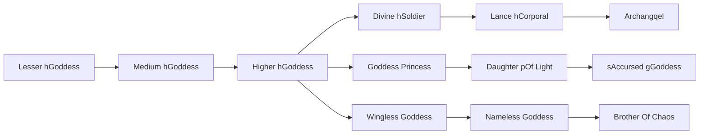

# Medium hGoddess

<small>[TR: Nightmares](../index.md) &rsaquo; [Races](index.md)</small>

| | |
|---|---|
| **ID** | `trnightmare:medium_class_goddess` |
| **Difficulty** | Easy |
| **Alignment** | Holy |
| **Aura** | 40,000 - 80,000 |
| **Magicule** | 24,000 - 48,000 |
| **Health bonus** | 100 |
| **Spiritual health bonus** | 200 |
| **Attack damage bonus** | 1.4 |
| **Movement speed bonus** | 0.04 |
| **EP to evolve into** | 80,000 |

## Evolution

- **Evolves from:** [Lesser hGoddess](lesser-goddess.md)
- **Evolves into:** [Higher hGoddess](higher-class-goddess.md)
- **Default evolution:** [Higher hGoddess](higher-class-goddess.md)
- **On awakening (True Demon Lord / True Hero):** [Higher hGoddess](higher-class-goddess.md)
- **During the Harvest Festival:** [Higher hGoddess](higher-class-goddess.md)

### Requirements to evolve into Medium hGoddess

Each requirement adds its weight to the evolution progress bar; you can evolve at 100%.

| Requirement | Weight |
|---|---|
| Reach Existence Points of 80,000 | 50% |
| Consume 10 of [Holy Essence](../items/materials/holy-essence.md) | 50% |

### Evolution tree

## Intrinsic skills

Granted automatically when you become this race.

-  [Physical Attack Resistance](../../tensura-reincarnated/abilities/resistance-skills/physical-attack-resistance.md)

## Attribute modifiers

| Attribute | Amount | Operation |
|---|---|---|
| Scale | 0 | add |
| Max Health | 100 | add |
| Max Spiritual Health | 200 | add |
| Attack Damage | 1.4 | add |
| Attack Speed | 0 | add |
| Knockback Resistance | 0.5 | add |
| Movement Speed | 0.04 | add |
| Swim Speed Multiplier | 0.04 | add |

## Stats (config defaults)

Set in [`config/nightmare/race/goddess_clan_config.toml`](../configs/config-nightmare-race-goddess-clan-config.md).

| Option | Default | Description |
|---|---|---|
| `MediumClassGoddess.epRequirement` | 80,000 | Existence points required to evolve into Medium Class Goddess. |
| `MediumClassGoddess.essenceRequirementHoly` | 10 | Holy essence required to evolve into Medium Class Goddess. |
| `MediumClassGoddess.minAura` | 40,000 | Minimal aura. |
| `MediumClassGoddess.maxAura` | 80,000 | Maximum aura. |
| `MediumClassGoddess.minMagicule` | 24,000 | Minimal magicule. |
| `MediumClassGoddess.maxMagicule` | 48,000 | Maximum magicule. |
| `MediumClassGoddess.size` | 0 | Bonus Size. |
| `MediumClassGoddess.maxHealth` | 100 | Bonus Max Health. |
| `MediumClassGoddess.maxSpiritualHealth` | 200 | Bonus Max Spiritual Health. |
| `MediumClassGoddess.attack` | 1.4 | Bonus Attack Damage. |
| `MediumClassGoddess.attackSpeed` | 0 | Bonus Attack Speed. |
| `MediumClassGoddess.knockbackResistance` | 0.5 | Bonus Knockback Resistance. |
| `MediumClassGoddess.movementSpeed` | 0.04 | Bonus Movement Speed. |
| `MediumClassGoddess.swimSpeed` | 0.04 | Bonus Swimming Speed Multiplier. |
| `LowerClassGoddess.minAura` | 2,000 | Minimal aura. |
| `LowerClassGoddess.maxAura` | 4,000 | Maximum aura. |
| `LowerClassGoddess.minMagicule` | 500 | Minimal magicule. |
| `LowerClassGoddess.maxMagicule` | 1,000 | Maximum magicule. |
| `LowerClassGoddess.size` | 0 | Bonus Size. |
| `LowerClassGoddess.maxHealth` | 25 | Bonus Max Health. |
| `LowerClassGoddess.maxSpiritualHealth` | 90 | Bonus Max Spiritual Health. |
| `LowerClassGoddess.attack` | 0.7 | Bonus Attack Damage. |
| `LowerClassGoddess.attackSpeed` | -0.2 | Bonus Attack Speed. |
| `LowerClassGoddess.knockbackResistance` | 0.5 | Bonus Knockback Resistance. |
| `LowerClassGoddess.movementSpeed` | 0.02 | Bonus Movement Speed. |
| `LowerClassGoddess.swimSpeed` | 0.02 | Bonus Swimming Speed Multiplier. |
