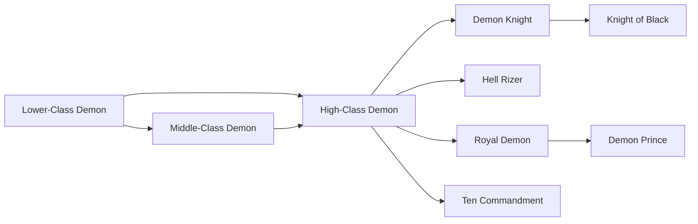

# Middle-Class Demon

<small>[TR: Nightmares](../index.md) &rsaquo; [Races](index.md)</small>

| | |
|---|---|
| **ID** | `trnightmare:mid_class_demon` |
| **Stage** | In-between |
| **Difficulty** | Intermediate |
| **Alignment** | Majin |
| **Aura** | 6,000 - 14,000 |
| **Magicule** | 10,000 - 22,000 |
| **Health bonus** | 28 |
| **Spiritual health bonus** | 130 |
| **Attack damage bonus** | 0.45 |
| **Movement speed bonus** | 0 |
| **EP to evolve into** | 45,000 |

## Evolution

- **Evolves from:** [Lower-Class Demon](lower-class-demon.md)
- **Evolves into:** [High-Class Demon](high-class-demon.md)
- **Default evolution:** [High-Class Demon](high-class-demon.md)
- **On awakening (True Demon Lord / True Hero):** [High-Class Demon](high-class-demon.md)
- **During the Harvest Festival:** [High-Class Demon](high-class-demon.md)

### Requirements to evolve into Middle-Class Demon

Each requirement adds its weight to the evolution progress bar; you can evolve at 100%.

| Requirement | Weight |
|---|---|
| Reach Existence Points of 45,000 | 50% |
| Consume 10 of [Soul Essence](../items/materials/soul-essence.md) | 50% |

### Evolution tree

## Intrinsic skills

Granted automatically when you become this race.

-  [Physical Attack Resistance](../../tensura-reincarnated/abilities/resistance-skills/physical-attack-resistance.md)
-  [Ultraspeed Regeneration](../../tensura-reincarnated/abilities/extra-skills/ultraspeed-regeneration.md)

## Attribute modifiers

| Attribute | Amount | Operation |
|---|---|---|
| Scale | 0.08 | add |
| Max Health | 28 | add |
| Max Spiritual Health | 130 | add |
| Attack Damage | 0.45 | add |
| Attack Speed | -0.1 | add |
| Knockback Resistance | 0.1 | add |
| Movement Speed | 0 | add |
| Swim Speed Multiplier | 0 | add |

## Stats (config defaults)

Set in [`config/nightmare/race/demon_clan_config.toml`](../configs/config-nightmare-race-demon-clan-config.md).

| Option | Default | Description |
|---|---|---|
| `MidClassDemon.epRequirement` | 45,000 | EP required to evolve from Lower Class Demon into Mid Class Demon (EvolutionRequirement.EPRequirement). |
| `MidClassDemon.essenceRequirement` | 10 | Soul Essence required to evolve from Lower Class Demon into Mid Class Demon (EvolutionRequirement.ItemConsumeRequirement). |
| `MidClassDemon.minAura` | 6,000 | Minimal aura. |
| `MidClassDemon.maxAura` | 14,000 | Maximum aura. |
| `MidClassDemon.minMagicule` | 10,000 | Minimal magicule. |
| `MidClassDemon.maxMagicule` | 22,000 | Maximum magicule. |
| `MidClassDemon.size` | 0.08 | Bonus Size. |
| `MidClassDemon.maxHealth` | 28 | Bonus Max Health. |
| `MidClassDemon.maxSpiritualHealth` | 130 | Bonus Max Spiritual Health. |
| `MidClassDemon.attack` | 0.45 | Bonus Attack Damage. |
| `MidClassDemon.attackSpeed` | -0.1 | Bonus Attack Speed. |
| `MidClassDemon.knockbackResistance` | 0.1 | Bonus Knockback Resistance. |
| `MidClassDemon.movementSpeed` | 0 | Bonus Movement Speed. |
| `MidClassDemon.swimSpeed` | 0 | Bonus Swimming Speed Multiplier. |
| `MidClassDemon.intrinsicPool` | "tensura:ultraspeed_regeneration" | Intrinsic pool (if used). |
| `MidClassDemon.intrinsicCount` | 0 | Intrinsic count (if used). |
| `LowerClassDemon.minAura` | 2,000 | Minimal aura. |
| `LowerClassDemon.maxAura` | 6,000 | Maximum aura. |
| `LowerClassDemon.minMagicule` | 4,000 | Minimal magicule. |
| `LowerClassDemon.maxMagicule` | 9,000 | Maximum magicule. |
| `LowerClassDemon.size` | 0.1 | Bonus Size. |
| `LowerClassDemon.maxHealth` | 12 | Bonus Max Health. |
| `LowerClassDemon.maxSpiritualHealth` | 70 | Bonus Max Spiritual Health. |
| `LowerClassDemon.attack` | 0.25 | Bonus Attack Damage. |
| `LowerClassDemon.attackSpeed` | -0.2 | Bonus Attack Speed. |
| `LowerClassDemon.knockbackResistance` | 0.05 | Bonus Knockback Resistance. |
| `LowerClassDemon.movementSpeed` | 0 | Bonus Movement Speed. |
| `LowerClassDemon.swimSpeed` | 0 | Bonus Swimming Speed Multiplier. |
| `LowerClassDemon.intrinsicPool` | "tensura:self_regeneration", "tensura:magic_sense", "tensura:flame_manipulation" | List of intrinsic skills Lower Class Demon can randomly receive. |
| `LowerClassDemon.intrinsicCount` | 0 | How many intrinsic skills are rolled from the pool (if used). |
