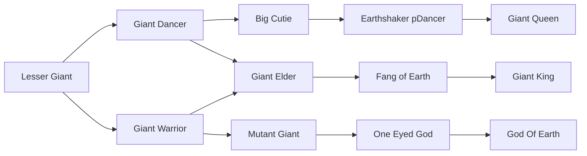

# One Eyed God

<small>[TR: Nightmares](../index.md) &rsaquo; [Races](index.md)</small>

| | |
|---|---|
| **ID** | `trnightmare:one_eyed_god` |
| **Difficulty** | Hard |
| **Alignment** | Majin |
| **Aura** | 135,000 - 270,000 |
| **Magicule** | 225,000 - 450,000 |
| **Health bonus** | 730 |
| **Spiritual health bonus** | 4,440 |
| **Attack damage bonus** | 7.5 |
| **Movement speed bonus** | 0.06 |
| **EP to evolve into** | 450,000 |

## Evolution

- **Evolves from:** [Mutant Giant](mutant-giant.md)
- **Evolves into:** [God Of Earth](god-of-earth.md)
- **Default evolution:** [God Of Earth](god-of-earth.md)
- **On awakening (True Demon Lord / True Hero):** [God Of Earth](god-of-earth.md)
- **During the Harvest Festival:** [God Of Earth](god-of-earth.md)

### Requirements to evolve into One Eyed God

Each requirement adds its weight to the evolution progress bar; you can evolve at 100%.

| Requirement | Weight |
|---|---|
| Reach Existence Points of 450,000 | 100% |

### Evolution tree

## Intrinsic skills

Granted automatically when you become this race.

-  [Earth Attack Nullification](../../tensura-reincarnated/abilities/resistance-skills/earth-attack-nullification.md)
-  [Pain Nullification](../../tensura-reincarnated/abilities/resistance-skills/pain-nullification.md)
-  [Abnormal Condition Nullification](../../tensura-reincarnated/abilities/resistance-skills/abnormal-condition-nullification.md)
-  [Ultraspeed Regeneration](../../tensura-reincarnated/abilities/extra-skills/ultraspeed-regeneration.md)
-  [Violent Break](../../tensura-reincarnated/abilities/battlewill/violent-break.md)
-  [Size Condense](../abilities/intrinsic-skills/size-condense.md)

## Attribute modifiers

| Attribute | Amount | Operation |
|---|---|---|
| Scale | 2 | add |
| Max Health | 730 | add |
| Max Spiritual Health | 4,440 | add |
| Attack Damage | 7.5 | add |
| Attack Speed | 0.2 | add |
| Knockback Resistance | 1.2 | add |
| Movement Speed | 0.06 | add |
| Swim Speed Multiplier | 0.06 | add |

## Stats (config defaults)

Set in [`config/nightmare/race/giant_clan_config.toml`](../configs/config-nightmare-race-giant-clan-config.md).

| Option | Default | Description |
|---|---|---|
| `OneEyedGod.epRequirement` | 450,000 | Existence points required to evolve into One Eyed God. |
| `OneEyedGod.minAura` | 135,000 | Minimal aura. |
| `OneEyedGod.maxAura` | 270,000 | Maximum aura. |
| `OneEyedGod.minMagicule` | 225,000 | Minimal magicule. |
| `OneEyedGod.maxMagicule` | 450,000 | Maximum magicule. |
| `OneEyedGod.size` | 2 | Bonus Size. |
| `OneEyedGod.maxHealth` | 730 | Bonus Max Health. |
| `OneEyedGod.maxSpiritualHealth` | 4,440 | Bonus Max Spiritual Health. |
| `OneEyedGod.attack` | 7.5 | Bonus Attack Damage. |
| `OneEyedGod.attackSpeed` | 0.2 | Bonus Attack Speed. |
| `OneEyedGod.knockbackResistance` | 1.2 | Bonus Knockback Resistance. |
| `OneEyedGod.movementSpeed` | 0.06 | Bonus Movement Speed. |
| `OneEyedGod.swimSpeed` | 0.06 | Bonus Swimming Speed Multiplier. |
| `MutantGiant.epRequirement` | 100,000 | Existence points required to evolve into Mutant Giant. |
| `MutantGiant.minAura` | 30,000 | Minimal aura. |
| `MutantGiant.maxAura` | 60,000 | Maximum aura. |
| `MutantGiant.minMagicule` | 50,000 | Minimal magicule. |
| `MutantGiant.maxMagicule` | 100,000 | Maximum magicule. |
| `MutantGiant.size` | 1.5 | Bonus Size. |
| `MutantGiant.maxHealth` | 400 | Bonus Max Health. |
| `MutantGiant.maxSpiritualHealth` | 940 | Bonus Max Spiritual Health. |
| `MutantGiant.attack` | 4.5 | Bonus Attack Damage. |
| `MutantGiant.attackSpeed` | 0.1 | Bonus Attack Speed. |
| `MutantGiant.knockbackResistance` | 1 | Bonus Knockback Resistance. |
| `MutantGiant.movementSpeed` | 0.05 | Bonus Movement Speed. |
| `MutantGiant.swimSpeed` | 0.05 | Bonus Swimming Speed Multiplier. |
| `GiantWarrior.epRequirement` | 40,000 | Existence points required to evolve into Giant Warrior. |
| `GiantWarrior.minAura` | 25,000 | Minimal aura. |
| `GiantWarrior.maxAura` | 50,000 | Maximum aura. |
| `GiantWarrior.minMagicule` | 15,000 | Minimal magicule. |
| `GiantWarrior.maxMagicule` | 30,000 | Maximum magicule. |
| `GiantWarrior.size` | 0.5 | Bonus Size. |
| `GiantWarrior.maxHealth` | 330 | Bonus Max Health. |
| `GiantWarrior.maxSpiritualHealth` | 940 | Bonus Max Spiritual Health. |
| `GiantWarrior.attack` | 3.5 | Bonus Attack Damage. |
| `GiantWarrior.attackSpeed` | 0 | Bonus Attack Speed. |
| `GiantWarrior.knockbackResistance` | 0.8 | Bonus Knockback Resistance. |
| `GiantWarrior.movementSpeed` | 0.04 | Bonus Movement Speed. |
| `GiantWarrior.swimSpeed` | 0.04 | Bonus Swimming Speed Multiplier. |
| `LesserGiant.minAura` | 500 | Minimal aura. |
| `LesserGiant.maxAura` | 500 | Maximum aura. |
| `LesserGiant.minMagicule` | 1,500 | Minimal magicule. |
| `LesserGiant.maxMagicule` | 5,500 | Maximum magicule. |
| `LesserGiant.size` | 0.5 | Bonus Size. |
| `LesserGiant.maxHealth` | 80 | Bonus Max Health. |
| `LesserGiant.maxSpiritualHealth` | 240 | Bonus Max Spiritual Health. |
| `LesserGiant.attack` | 2 | Bonus Attack Damage. |
| `LesserGiant.attackSpeed` | 0 | Bonus Attack Speed. |
| `LesserGiant.knockbackResistance` | 0.5 | Bonus Knockback Resistance. |
| `LesserGiant.movementSpeed` | 0.04 | Bonus Movement Speed. |
| `LesserGiant.swimSpeed` | 0.04 | Bonus Swimming Speed Multiplier. |
