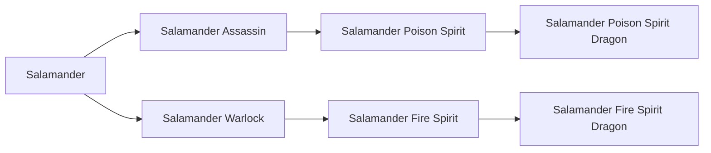

# Salamander Assassin

<small>[TR: Nightmares](../index.md) &rsaquo; [Races](index.md)</small>

| | |
|---|---|
| **ID** | `trnightmare:salamander_assassin` |
| **Difficulty** | Hard |
| **Alignment** | Default |
| **Aura** | 500 - 500 |
| **Magicule** | 1,500 - 5,500 |
| **Health bonus** | 10 |
| **Spiritual health bonus** | 15 |
| **Attack damage bonus** | 2 |
| **Movement speed bonus** | 0.04 |
| **EP to evolve into** | 50,000 |

## Evolution

- **Evolves from:** [Salamander](salamander.md)
- **Evolves into:** [Salamander Poison Spirit](salamander-poison-spirit.md)
- **Default evolution:** [Salamander Poison Spirit](salamander-poison-spirit.md)
- **On awakening (True Demon Lord / True Hero):** [Salamander Poison Spirit](salamander-poison-spirit.md)
- **During the Harvest Festival:** [Salamander Poison Spirit](salamander-poison-spirit.md)

### Requirements to evolve into Salamander Assassin

Each requirement adds its weight to the evolution progress bar; you can evolve at 100%.

| Requirement | Weight |
|---|---|
| Reach Existence Points of 50,000 | 100% |

### Evolution tree

## Attribute modifiers

| Attribute | Amount | Operation |
|---|---|---|
| Scale | -1.1 | add |
| Max Health | 10 | add |
| Max Spiritual Health | 15 | add |
| Attack Damage | 2 | add |
| Attack Speed | -1 | add |
| Knockback Resistance | 0 | add |
| Movement Speed | 0.04 | add |
| Swim Speed Multiplier | 0.6 | add |

## Stats (config defaults)

Set in [`config/nightmare/race/axolotl/salamander_config.toml`](../configs/config-nightmare-race-axolotl-salamander-config.md).

| Option | Default | Description |
|---|---|---|
| `SalamanderAssassin.epRequirement` | 50,000 | EP requirement to evolve. |
| `SalamanderAssassin.minAura` | 500 | Minimal aura. |
| `SalamanderAssassin.maxAura` | 500 | Maximum aura. |
| `SalamanderAssassin.minMagicule` | 1,500 | Minimal magicule. |
| `SalamanderAssassin.maxMagicule` | 5,500 | Maximum magicule. |
| `SalamanderAssassin.size` | -1.1 | Bonus Size. |
| `SalamanderAssassin.maxHealth` | 10 | Bonus Max Health. |
| `SalamanderAssassin.maxSpiritualHealth` | 15 | Bonus Max Spiritual Health. |
| `SalamanderAssassin.attack` | 2 | Bonus Attack Damage. |
| `SalamanderAssassin.attackSpeed` | -1 | Bonus Attack Speed. |
| `SalamanderAssassin.knockbackResistance` | 0 | Bonus Knockback Resistance. |
| `SalamanderAssassin.movementSpeed` | 0.04 | Bonus Movement Speed. |
| `SalamanderAssassin.swimSpeed` | 0.6 | Bonus Swimming Speed Multiplier. |
| `SalamanderAssassin.intrinsicSkills` | "tensura:dragon_eye", "tensura:poisonous_breath" | List of skills obtained by this race. |
| `Salamander.minAura` | 500 | Minimal aura. |
| `Salamander.maxAura` | 1,500 | Maximum aura. |
| `Salamander.minMagicule` | 1,500 | Minimal magicule. |
| `Salamander.maxMagicule` | 5,500 | Maximum magicule. |
| `Salamander.size` | -1.1 | Bonus Size. |
| `Salamander.maxHealth` | -15 | Bonus Max Health. |
| `Salamander.maxSpiritualHealth` | -10 | Bonus Max Spiritual Health. |
| `Salamander.attack` | 0 | Bonus Attack Damage. |
| `Salamander.attackSpeed` | 0 | Bonus Attack Speed. |
| `Salamander.knockbackResistance` | 0.5 | Bonus Knockback Resistance. |
| `Salamander.movementSpeed` | 0.02 | Bonus Movement Speed. |
| `Salamander.swimSpeed` | 0.3 | Bonus Swimming Speed Multiplier. |
| `Salamander.intrinsicSkills` | "tensura:self_regeneration", "tensura:absorb_and_dissolve", "tensura:fire_breath", "tensura:poison", "tensura:poison_resistance" | List of skills obtained by this race. |
