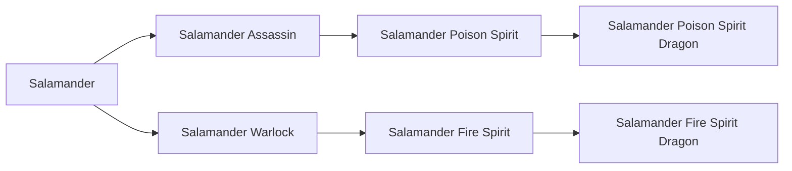

# Salamander Fire Spirit Dragon

<small>[TR: Nightmares](../index.md) &rsaquo; [Races](index.md)</small>

| | |
|---|---|
| **ID** | `trnightmare:salamander_fire_dragon` |
| **Difficulty** | Hard |
| **Alignment** | Majin |
| **Aura** | 500 - 500 |
| **Magicule** | 1,500 - 5,500 |
| **Health bonus** | 1,004 |
| **Spiritual health bonus** | 6,240 |
| **Attack damage bonus** | 2 |
| **Movement speed bonus** | 0.09 |
| **EP to evolve into** | 1,750,000 |

## Evolution

- **Evolves from:** [Salamander Fire Spirit](salamander-fire-spirit.md)

### Requirements to evolve into Salamander Fire Spirit Dragon

Each requirement adds its weight to the evolution progress bar; you can evolve at 100%.

| Requirement | Weight |
|---|---|
| Reach Existence Points of 1,750,000 | 50% |
| Kill 4 bosses | 50% |

### Evolution tree

## Traits

- Divine

## Attribute modifiers

| Attribute | Amount | Operation |
|---|---|---|
| Scale | -1.1 | add |
| Max Health | 1,004 | add |
| Max Spiritual Health | 6,240 | add |
| Attack Damage | 2 | add |
| Attack Speed | 1 | add |
| Knockback Resistance | 5 | add |
| Movement Speed | 0.09 | add |
| Swim Speed Multiplier | 0.1 | add |

## Stats (config defaults)

Set in [`config/nightmare/race/axolotl/salamander_config.toml`](../configs/config-nightmare-race-axolotl-salamander-config.md).

| Option | Default | Description |
|---|---|---|
| `FireDragon.epRequirement` | 1,750,000 | EP requirement to evolve. |
| `FireDragon.bossRequirement` | 4 | Bosses required to evolve. |
| `FireDragon.minAura` | 500 | Minimal aura. |
| `FireDragon.maxAura` | 500 | Maximum aura. |
| `FireDragon.minMagicule` | 1,500 | Minimal magicule. |
| `FireDragon.maxMagicule` | 5,500 | Maximum magicule. |
| `FireDragon.size` | -1.1 | Bonus Size. |
| `FireDragon.maxHealth` | 1,004 | Bonus Max Health. |
| `FireDragon.maxSpiritualHealth` | 6,240 | Bonus Max Spiritual Health. |
| `FireDragon.attack` | 2 | Bonus Attack Damage. |
| `FireDragon.attackSpeed` | 1 | Bonus Attack Speed. |
| `FireDragon.knockbackResistance` | 5 | Bonus Knockback Resistance. |
| `FireDragon.movementSpeed` | 0.09 | Bonus Movement Speed. |
| `FireDragon.swimSpeed` | 0.1 | Bonus Swimming Speed Multiplier. |
| `FireDragon.intrinsicSkills` | "trnightmare:fire_ki_release", "trnightmare:fire_dragon_armor", "tensura:thermal_fluctuation_nullification", "trnightmare:axolotl_haki" | List of skills obtained by this race. |
| `FireSpirit.epRequirement` | 380,000 | EP requirement to evolve. |
| `FireSpirit.coreRequirement` | 6 | Flame Elemental cores required to evolve |
| `FireSpirit.minAura` | 500 | Minimal aura. |
| `FireSpirit.maxAura` | 500 | Maximum aura. |
| `FireSpirit.minMagicule` | 1,500 | Minimal magicule. |
| `FireSpirit.maxMagicule` | 5,500 | Maximum magicule. |
| `FireSpirit.size` | -1.1 | Bonus Size. |
| `FireSpirit.maxHealth` | 430 | Bonus Max Health. |
| `FireSpirit.maxSpiritualHealth` | 2,740 | Bonus Max Spiritual Health. |
| `FireSpirit.attack` | 2 | Bonus Attack Damage. |
| `FireSpirit.attackSpeed` | 0 | Bonus Attack Speed. |
| `FireSpirit.knockbackResistance` | 5 | Bonus Knockback Resistance. |
| `FireSpirit.movementSpeed` | 0.07 | Bonus Movement Speed. |
| `FireSpirit.swimSpeed` | 0.5 | Bonus Swimming Speed Multiplier. |
| `FireSpirit.intrinsicSkills` | "trnightmare:fire_ki_release", "trnightmare:flame_attack_nullification" | List of skills obtained by this race. |
| `SalamanderWarlock.epRequirement` | 50,000 | EP requirement to evolve. |
| `SalamanderWarlock.minAura` | 500 | Minimal aura. |
| `SalamanderWarlock.maxAura` | 1,500 | Maximum aura. |
| `SalamanderWarlock.minMagicule` | 1,500 | Minimal magicule. |
| `SalamanderWarlock.maxMagicule` | 5,500 | Maximum magicule. |
| `SalamanderWarlock.size` | -1.1 | Bonus Size. |
| `SalamanderWarlock.maxHealth` | 90 | Bonus Max Health. |
| `SalamanderWarlock.maxSpiritualHealth` | 640 | Bonus Max Spiritual Health. |
| `SalamanderWarlock.attack` | 0 | Bonus Attack Damage. |
| `SalamanderWarlock.attackSpeed` | 0 | Bonus Attack Speed. |
| `SalamanderWarlock.knockbackResistance` | 0.5 | Bonus Knockback Resistance. |
| `SalamanderWarlock.movementSpeed` | 0.02 | Bonus Movement Speed. |
| `SalamanderWarlock.swimSpeed` | 0.5 | Bonus Swimming Speed Multiplier. |
| `SalamanderWarlock.intrinsicSkills` | "tensura:thermal_fluctuation_resistance", "tensura:dragon_ear" | List of skills obtained by this race. |
| `Salamander.minAura` | 500 | Minimal aura. |
| `Salamander.maxAura` | 1,500 | Maximum aura. |
| `Salamander.minMagicule` | 1,500 | Minimal magicule. |
| `Salamander.maxMagicule` | 5,500 | Maximum magicule. |
| `Salamander.size` | -1.1 | Bonus Size. |
| `Salamander.maxHealth` | -15 | Bonus Max Health. |
| `Salamander.maxSpiritualHealth` | -10 | Bonus Max Spiritual Health. |
| `Salamander.attack` | 0 | Bonus Attack Damage. |
| `Salamander.attackSpeed` | 0 | Bonus Attack Speed. |
| `Salamander.knockbackResistance` | 0.5 | Bonus Knockback Resistance. |
| `Salamander.movementSpeed` | 0.02 | Bonus Movement Speed. |
| `Salamander.swimSpeed` | 0.3 | Bonus Swimming Speed Multiplier. |
| `Salamander.intrinsicSkills` | "tensura:self_regeneration", "tensura:absorb_and_dissolve", "tensura:fire_breath", "tensura:poison", "tensura:poison_resistance" | List of skills obtained by this race. |

## Tags

`tensura:races/divine`
