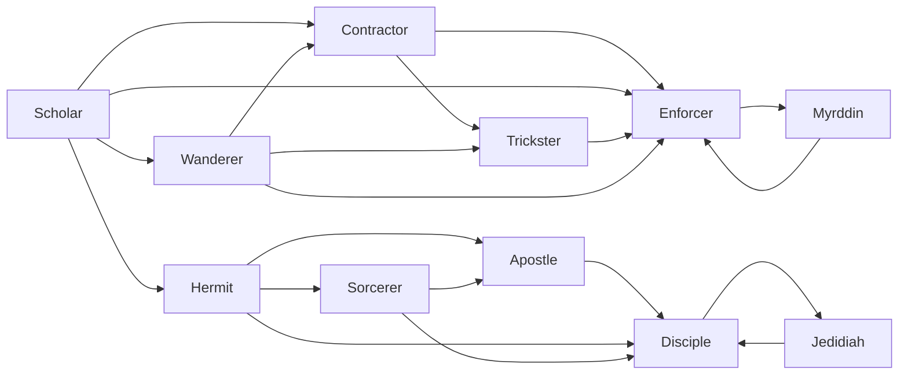

# Scholar

<small>[TR: Nightmares](../index.md) &rsaquo; [Races](index.md)</small>

| | |
|---|---|
| **ID** | `trnightmare:scholar` |
| **Stage** | Starting |
| **Difficulty** | Easy |
| **Alignment** | Default |
| **Aura** | 500 - 2,000 |
| **Magicule** | 5,500 - 8,000 |
| **Health bonus** | 20 |
| **Spiritual health bonus** | 340 |
| **Attack damage bonus** | 0 |
| **Movement speed bonus** | 0 |

## Evolution

- **Evolves into:** [Hermit](hermit.md), [Wanderer](wanderer.md)
- **Default evolution:** [Hermit](hermit.md)
- **On awakening (True Demon Lord / True Hero):** [Enforcer](enforcer.md)
- **During the Harvest Festival:** [Contractor](contractor.md)

### Evolution tree

## Attribute modifiers

| Attribute | Amount | Operation |
|---|---|---|
| Scale | 0 | add |
| Max Health | 20 | add |
| Max Spiritual Health | 340 | add |
| Attack Damage | 0 | add |
| Attack Speed | -0.5 | add |
| Knockback Resistance | 0.1 | add |
| Movement Speed | 0 | add |
| Swim Speed Multiplier | 0 | add |

## Stats (config defaults)

Set in [`config/nightmare/race/scholar_config.toml`](../configs/config-nightmare-race-scholar-config.md).

| Option | Default | Description |
|---|---|---|
| `Scholar.minAura` | 500 | Minimal aura. |
| `Scholar.maxAura` | 2,000 | Maximum aura. |
| `Scholar.minMagicule` | 5,500 | Minimal magicule. |
| `Scholar.maxMagicule` | 8,000 | Maximum magicule. |
| `Scholar.size` | 0 | Bonus Size. |
| `Scholar.maxHealth` | 20 | Bonus Max Health. |
| `Scholar.maxSpiritualHealth` | 340 | Bonus Max Spiritual Health. |
| `Scholar.attack` | 0 | Bonus Attack Damage. |
| `Scholar.attackSpeed` | -0.5 | Bonus Attack Speed. |
| `Scholar.knockbackResistance` | 0.1 | Bonus Knockback Resistance. |
| `Scholar.movementSpeed` | 0 | Bonus Movement Speed. |
| `Scholar.swimSpeed` | 0 | Bonus Swimming Speed Multiplier. |
| `Scholar.intrinsicSkills` | "tensura:chant_annulment", "tensura:sage" | List of skills obtained by this race. |
