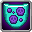

# Shadow Mimic

<small>[TR: Nightmares](../index.md) &rsaquo; [Races](index.md)</small>

| | |
|---|---|
| **ID** | `trnightmare:shadow_mimic` |
| **Stage** | In-between |
| **Alignment** | Default |

## Evolution

- **Evolves from:** [Lesser Mimic](lesser-mimic.md)
- **Evolves into:** [Thought Leech](thought-leech.md)
- **Default evolution:** [Thought Leech](thought-leech.md)
- **On awakening (True Demon Lord / True Hero):** [Thought Leech](thought-leech.md)
- **During the Harvest Festival:** [Thought Leech](thought-leech.md)

### Evolution tree

## Intrinsic skills

Granted automatically when you become this race.

-  [Magic Sense](../../tensura-reincarnated/abilities/extra-skills/magic-sense.md)
-  [Possession](../../tensura-reincarnated/abilities/intrinsic-skills/possession.md)
-  [Darkness Attack Resistance](../../tensura-reincarnated/abilities/resistance-skills/darkness-attack-resistance.md)
-  [Poison Nullification](../../tensura-reincarnated/abilities/resistance-skills/poison-nullification.md)

## Attribute modifiers

| Attribute | Amount | Operation |
|---|---|---|
| Scale | scale bonus | add |
| Max Health | max HP | add |
| Max Spiritual Health | max spiritual HP | add |
| Attack Damage | attack | add |
| Attack Speed | attack speed | add |
| Knockback Resistance | knockback resistance | add |
| Movement Speed | movement speed | add |
| Swim Speed Multiplier | swim speed | add |
| Scale | size | add |
