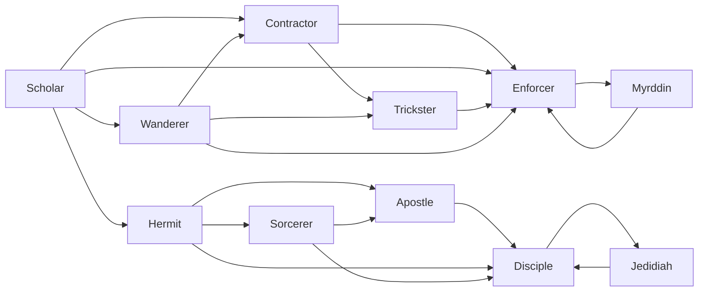

# Sorcerer

<small>[TR: Nightmares](../index.md) &rsaquo; [Races](index.md)</small>

| | |
|---|---|
| **ID** | `trnightmare:sorcerer` |
| **Difficulty** | Intermediate |
| **Alignment** | Holy |
| **Aura** | 20,000 - 100,000 |
| **Magicule** | 20,000 - 200,000 |
| **Health bonus** | 180 |
| **Spiritual health bonus** | 1,540 |
| **Attack damage bonus** | 3 |
| **Movement speed bonus** | 0.06 |
| **EP to evolve into** | 100,000 |

## Evolution

- **Evolves from:** [Hermit](hermit.md)
- **Evolves into:** [Apostle](apostle.md)
- **Default evolution:** [Apostle](apostle.md)
- **On awakening (True Demon Lord / True Hero):** [Disciple](disciple.md)
- **During the Harvest Festival:** [Apostle](apostle.md)

### Requirements to evolve into Sorcerer

Each requirement adds its weight to the evolution progress bar; you can evolve at 100%.

| Requirement | Weight |
|---|---|
| Reach Existence Points of 100,000 | 100% |

### Evolution tree

## Attribute modifiers

| Attribute | Amount | Operation |
|---|---|---|
| Scale | 0 | add |
| Max Health | 180 | add |
| Max Spiritual Health | 1,540 | add |
| Attack Damage | 3 | add |
| Attack Speed | -1.5 | add |
| Knockback Resistance | 0.3 | add |
| Movement Speed | 0.06 | add |
| Swim Speed Multiplier | 0.06 | add |

## Stats (config defaults)

Set in [`config/nightmare/race/scholar_config.toml`](../configs/config-nightmare-race-scholar-config.md).

| Option | Default | Description |
|---|---|---|
| `Sorcerer.epRequirement` | 100,000 | EP requirement to evolve into Sorcerer. |
| `Sorcerer.minAura` | 20,000 | Minimal aura. |
| `Sorcerer.maxAura` | 100,000 | Maximum aura. |
| `Sorcerer.minMagicule` | 20,000 | Minimal magicule. |
| `Sorcerer.maxMagicule` | 200,000 | Maximum magicule. |
| `Sorcerer.size` | 0 | Bonus Size. |
| `Sorcerer.maxHealth` | 180 | Bonus Max Health. |
| `Sorcerer.maxSpiritualHealth` | 1,540 | Bonus Max Spiritual Health. |
| `Sorcerer.attack` | 3 | Bonus Attack Damage. |
| `Sorcerer.attackSpeed` | -1.5 | Bonus Attack Speed. |
| `Sorcerer.knockbackResistance` | 0.3 | Bonus Knockback Resistance. |
| `Sorcerer.movementSpeed` | 0.06 | Bonus Movement Speed. |
| `Sorcerer.swimSpeed` | 0.06 | Bonus Swimming Speed Multiplier. |
| `Sorcerer.intrinsicSkills` | "trnightmare:ideal" | List of skills obtained by this race. |
| `Hermit.epRequirement` | 50,000 | EP requirement to evolve into Hermit. |
| `Hermit.minAura` | 20,000 | Minimal aura. |
| `Hermit.maxAura` | 100,000 | Maximum aura. |
| `Hermit.minMagicule` | 20,000 | Minimal magicule. |
| `Hermit.maxMagicule` | 50,000 | Maximum magicule. |
| `Hermit.size` | 0 | Bonus Size. |
| `Hermit.maxHealth` | 80 | Bonus Max Health. |
| `Hermit.maxSpiritualHealth` | 740 | Bonus Max Spiritual Health. |
| `Hermit.attack` | 2 | Bonus Attack Damage. |
| `Hermit.attackSpeed` | -1 | Bonus Attack Speed. |
| `Hermit.knockbackResistance` | 0.2 | Bonus Knockback Resistance. |
| `Hermit.movementSpeed` | 0.05 | Bonus Movement Speed. |
| `Hermit.swimSpeed` | 0.05 | Bonus Swimming Speed Multiplier. |
| `Hermit.intrinsicSkills` | "tensura:shadow_motion" | List of skills obtained by this race. |
| `Scholar.minAura` | 500 | Minimal aura. |
| `Scholar.maxAura` | 2,000 | Maximum aura. |
| `Scholar.minMagicule` | 5,500 | Minimal magicule. |
| `Scholar.maxMagicule` | 8,000 | Maximum magicule. |
| `Scholar.size` | 0 | Bonus Size. |
| `Scholar.maxHealth` | 20 | Bonus Max Health. |
| `Scholar.maxSpiritualHealth` | 340 | Bonus Max Spiritual Health. |
| `Scholar.attack` | 0 | Bonus Attack Damage. |
| `Scholar.attackSpeed` | -0.5 | Bonus Attack Speed. |
| `Scholar.knockbackResistance` | 0.1 | Bonus Knockback Resistance. |
| `Scholar.movementSpeed` | 0 | Bonus Movement Speed. |
| `Scholar.swimSpeed` | 0 | Bonus Swimming Speed Multiplier. |
| `Scholar.intrinsicSkills` | "tensura:chant_annulment", "tensura:sage" | List of skills obtained by this race. |
