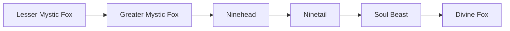

# Soul Beast

<small>[TR: Nightmares](../index.md) &rsaquo; [Races](index.md)</small>

| | |
|---|---|
| **ID** | `trnightmare:soul_beast` |
| **Difficulty** | Hard |
| **Alignment** | Default |
| **Aura** | 1,000 - 2,000 |
| **Magicule** | 2,000 - 4,000 |
| **Health bonus** | 15 |
| **Spiritual health bonus** | 60 |
| **Attack damage bonus** | 0 |
| **Movement speed bonus** | 0 |
| **EP to evolve into** | 0 |

> A transcendent fox spirit fused with vast spiritual essence.

## Evolution

- **Evolves from:** [Ninetail](ninetail.md)
- **Evolves into:** [Divine Fox](divine-fox.md)
- **Default evolution:** [Divine Fox](divine-fox.md)

### Requirements to evolve into Soul Beast

Each requirement adds its weight to the evolution progress bar; you can evolve at 100%.

| Requirement | Weight |
|---|---|
| Reach Existence Points of ep requirement | 100% |

### Evolution tree

## Intrinsic skills

Granted automatically when you become this race.

-  [Abnormal Condition Nullification](../../tensura-reincarnated/abilities/resistance-skills/abnormal-condition-nullification.md)
-  [Beast Unification](../abilities/intrinsic-skills/beast-unification.md)

## Attribute modifiers

| Attribute | Amount | Operation |
|---|---|---|
| Scale | size | add |
| Max Health | max HP | add |
| Max Spiritual Health | max spiritual HP | add |
| Attack Damage | attack | add |
| Attack Speed | attack speed | add |
| Knockback Resistance | knockback resistance | add |
| Movement Speed | movement speed | add |
| Swim Speed Multiplier | swim speed | add |

## Stats (config defaults)

Set in [`config/nightmare/race/mystic_fox_config.toml`](../configs/config-nightmare-race-mystic-fox-config.md).

| Option | Default | Description |
|---|---|---|
| `SoulBeast.epRequirement` | 0 | EP requirement to evolve into this tier. |
| `SoulBeast.minAura` | 1,000 | Minimal aura. |
| `SoulBeast.maxAura` | 2,000 | Maximum aura. |
| `SoulBeast.minMagicule` | 2,000 | Minimal magicule. |
| `SoulBeast.maxMagicule` | 4,000 | Maximum magicule. |
| `SoulBeast.size` | 0 | Bonus Size. |
| `SoulBeast.maxHealth` | 15 | Bonus Max Health. |
| `SoulBeast.maxSpiritualHealth` | 60 | Bonus Max Spiritual Health. |
| `SoulBeast.attack` | 0 | Bonus Attack Damage. |
| `SoulBeast.attackSpeed` | 0 | Bonus Attack Speed. |
| `SoulBeast.knockbackResistance` | 0 | Bonus Knockback Resistance. |
| `SoulBeast.movementSpeed` | 0 | Bonus Movement Speed. |
| `SoulBeast.swimSpeed` | 0 | Bonus Swimming Speed Multiplier. |
| `SoulBeast.epRequirement` | 900,000 |  |
| `SoulBeast.minAura` | 360,000 |  |
| `SoulBeast.maxAura` | 650,000 |  |
| `SoulBeast.minMagicule` | 700,000 |  |
| `SoulBeast.maxMagicule` | 1,250,000 |  |
| `SoulBeast.size` | 0 |  |
| `SoulBeast.maxHealth` | 600 |  |
| `SoulBeast.maxSpiritualHealth` | 4,200 |  |
| `SoulBeast.attack` | 2.9 |  |
| `SoulBeast.attackSpeed` | 0.35 |  |
| `SoulBeast.knockbackResistance` | 0.7 |  |
| `SoulBeast.movementSpeed` | 0.055 |  |
| `SoulBeast.swimSpeed` | 0.12 |  |
