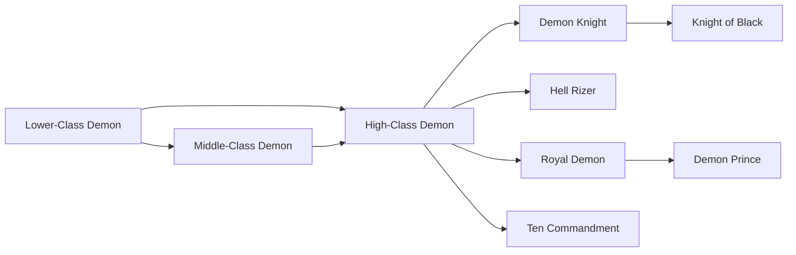

# Ten Commandment

<small>[TR: Nightmares](../index.md) &rsaquo; [Races](index.md)</small>

| | |
|---|---|
| **ID** | `trnightmare:ten_commandments` |
| **Difficulty** | Intermediate |
| **Alignment** | Majin |
| **Aura** | 150,000 - 320,000 |
| **Magicule** | 200,000 - 400,000 |
| **Health bonus** | 1,100 |
| **Spiritual health bonus** | 4,500 |
| **Attack damage bonus** | 8.25 |
| **Movement speed bonus** | 0.02 |
| **EP to evolve into** | 350,000 |

## Evolution

- **Evolves from:** [High-Class Demon](high-class-demon.md)

### Requirements to evolve into Ten Commandment

Each requirement adds its weight to the evolution progress bar; you can evolve at 100%.

| Requirement | Weight |
|---|---|
| Reach Existence Points of 350,000 | 50% |
| Consume 75 of [Soul Essence](../items/materials/soul-essence.md) | 50% |

### Evolution tree

## Intrinsic skills

Granted automatically when you become this race.

-  [Abnormal Condition Nullification](../../tensura-reincarnated/abilities/resistance-skills/abnormal-condition-nullification.md)
-  [Flame Attack Nullification](../../tensura-reincarnated/abilities/resistance-skills/flame-attack-nullification.md)
-  [Gravity Attack Resistance](../../tensura-reincarnated/abilities/resistance-skills/gravity-attack-resistance.md)
-  [Spatial Attack Nullification](../../tensura-reincarnated/abilities/resistance-skills/spatial-attack-nullification.md)
-  [Magic Darkness Transform](../../tensura-reincarnated/abilities/extra-skills/magic-darkness-transform.md)

## Traits

- Divine

## Attribute modifiers

| Attribute | Amount | Operation |
|---|---|---|
| Scale | 0.02 | add |
| Max Health | 1,100 | add |
| Max Spiritual Health | 4,500 | add |
| Attack Damage | 8.25 | add |
| Attack Speed | 0.12 | add |
| Knockback Resistance | 0.28 | add |
| Movement Speed | 0.02 | add |
| Swim Speed Multiplier | 0.05 | add |

## Stats (config defaults)

Set in [`config/nightmare/race/demon_clan_config.toml`](../configs/config-nightmare-race-demon-clan-config.md).

| Option | Default | Description |
|---|---|---|
| `TenCommandment.epRequirement` | 350,000 | EP required to evolve from Knight Black into Ten Commandment (EvolutionRequirement.EPRequirement). |
| `TenCommandment.essenceRequirement` | 75 | Soul Essence required to evolve from Knight Black into Ten Commandment (EvolutionRequirement.ItemConsumeRequirement). |
| `TenCommandment.minAura` | 150,000 | Minimal aura. |
| `TenCommandment.maxAura` | 320,000 | Maximum aura. |
| `TenCommandment.minMagicule` | 200,000 | Minimal magicule. |
| `TenCommandment.maxMagicule` | 400,000 | Maximum magicule. |
| `TenCommandment.size` | 0.02 | Bonus Size. |
| `TenCommandment.maxHealth` | 1,100 | Bonus Max Health. |
| `TenCommandment.maxSpiritualHealth` | 4,500 | Bonus Max Spiritual Health. |
| `TenCommandment.attack` | 8.25 | Bonus Attack Damage. |
| `TenCommandment.attackSpeed` | 0.12 | Bonus Attack Speed. |
| `TenCommandment.knockbackResistance` | 0.28 | Bonus Knockback Resistance. |
| `TenCommandment.movementSpeed` | 0.02 | Bonus Movement Speed. |
| `TenCommandment.swimSpeed` | 0.05 | Bonus Swimming Speed Multiplier. |
| `TenCommandment.intrinsicPool` | [] (empty) | Intrinsic pool (if used). |
| `TenCommandment.intrinsicCount` | 0 | Intrinsic count (if used). |
| `HighClassDemon.epRequirement` | 80,000 | EP required to evolve from Mid Class Demon into High Class Demon (EvolutionRequirement.EPRequirement). |
| `HighClassDemon.essenceRequirement` | 15 | Soul Essence required to evolve from Mid Class Demon into High Class Demon (EvolutionRequirement.ItemConsumeRequirement). |
| `HighClassDemon.minAura` | 18,000 | Minimal aura. |
| `HighClassDemon.maxAura` | 40,000 | Maximum aura. |
| `HighClassDemon.minMagicule` | 28,000 | Minimal magicule. |
| `HighClassDemon.maxMagicule` | 55,000 | Maximum magicule. |
| `HighClassDemon.size` | 0.05 | Bonus Size. |
| `HighClassDemon.maxHealth` | 45 | Bonus Max Health. |
| `HighClassDemon.maxSpiritualHealth` | 200 | Bonus Max Spiritual Health. |
| `HighClassDemon.attack` | 0.65 | Bonus Attack Damage. |
| `HighClassDemon.attackSpeed` | 0 | Bonus Attack Speed. |
| `HighClassDemon.knockbackResistance` | 0.15 | Bonus Knockback Resistance. |
| `HighClassDemon.movementSpeed` | 0.01 | Bonus Movement Speed. |
| `HighClassDemon.swimSpeed` | 0.02 | Bonus Swimming Speed Multiplier. |
| `HighClassDemon.intrinsicPool` | "tensura:infinite_regeneration", "tensura:black_flame", "tensura:universal_perception" | Intrinsic pool (if used). |
| `HighClassDemon.intrinsicCount` | 0 | Intrinsic count (if used). |
| `MidClassDemon.epRequirement` | 45,000 | EP required to evolve from Lower Class Demon into Mid Class Demon (EvolutionRequirement.EPRequirement). |
| `MidClassDemon.essenceRequirement` | 10 | Soul Essence required to evolve from Lower Class Demon into Mid Class Demon (EvolutionRequirement.ItemConsumeRequirement). |
| `MidClassDemon.minAura` | 6,000 | Minimal aura. |
| `MidClassDemon.maxAura` | 14,000 | Maximum aura. |
| `MidClassDemon.minMagicule` | 10,000 | Minimal magicule. |
| `MidClassDemon.maxMagicule` | 22,000 | Maximum magicule. |
| `MidClassDemon.size` | 0.08 | Bonus Size. |
| `MidClassDemon.maxHealth` | 28 | Bonus Max Health. |
| `MidClassDemon.maxSpiritualHealth` | 130 | Bonus Max Spiritual Health. |
| `MidClassDemon.attack` | 0.45 | Bonus Attack Damage. |
| `MidClassDemon.attackSpeed` | -0.1 | Bonus Attack Speed. |
| `MidClassDemon.knockbackResistance` | 0.1 | Bonus Knockback Resistance. |
| `MidClassDemon.movementSpeed` | 0 | Bonus Movement Speed. |
| `MidClassDemon.swimSpeed` | 0 | Bonus Swimming Speed Multiplier. |
| `MidClassDemon.intrinsicPool` | "tensura:ultraspeed_regeneration" | Intrinsic pool (if used). |
| `MidClassDemon.intrinsicCount` | 0 | Intrinsic count (if used). |
| `LowerClassDemon.minAura` | 2,000 | Minimal aura. |
| `LowerClassDemon.maxAura` | 6,000 | Maximum aura. |
| `LowerClassDemon.minMagicule` | 4,000 | Minimal magicule. |
| `LowerClassDemon.maxMagicule` | 9,000 | Maximum magicule. |
| `LowerClassDemon.size` | 0.1 | Bonus Size. |
| `LowerClassDemon.maxHealth` | 12 | Bonus Max Health. |
| `LowerClassDemon.maxSpiritualHealth` | 70 | Bonus Max Spiritual Health. |
| `LowerClassDemon.attack` | 0.25 | Bonus Attack Damage. |
| `LowerClassDemon.attackSpeed` | -0.2 | Bonus Attack Speed. |
| `LowerClassDemon.knockbackResistance` | 0.05 | Bonus Knockback Resistance. |
| `LowerClassDemon.movementSpeed` | 0 | Bonus Movement Speed. |
| `LowerClassDemon.swimSpeed` | 0 | Bonus Swimming Speed Multiplier. |
| `LowerClassDemon.intrinsicPool` | "tensura:self_regeneration", "tensura:magic_sense", "tensura:flame_manipulation" | List of intrinsic skills Lower Class Demon can randomly receive. |
| `LowerClassDemon.intrinsicCount` | 0 | How many intrinsic skills are rolled from the pool (if used). |

## Tags

`tensura:races/divine`
