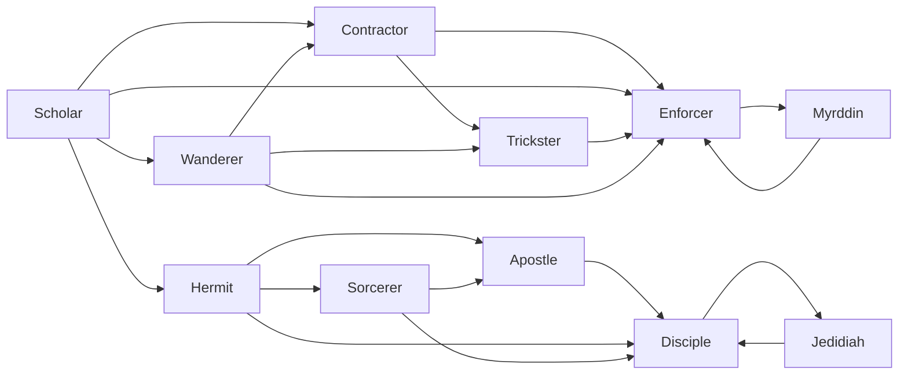

# Trickster

<small>[TR: Nightmares](../index.md) &rsaquo; [Races](index.md)</small>

| | |
|---|---|
| **ID** | `trnightmare:trickster` |
| **Difficulty** | Intermediate |
| **Alignment** | Majin |
| **Aura** | 100,000 - 1,000,000 |
| **Magicule** | 100,000 - 2,000,000 |
| **Health bonus** | 580 |
| **Spiritual health bonus** | 2,340 |
| **Attack damage bonus** | 4 |
| **Movement speed bonus** | 0.07 |
| **EP to evolve into** | 500,000 |

## Evolution

- **Evolves from:** [Contractor](contractor.md), [Wanderer](wanderer.md)
- **Evolves into:** [Enforcer](enforcer.md)
- **Default evolution:** [Enforcer](enforcer.md)
- **On awakening (True Demon Lord / True Hero):** [Enforcer](enforcer.md)
- **During the Harvest Festival:** [Enforcer](enforcer.md)

### Requirements to evolve into Trickster

Each requirement adds its weight to the evolution progress bar; you can evolve at 100%.

| Requirement | Weight |
|---|---|
| Reach Existence Points of ep requirement | 50% |
| Master name | 50% |

### Evolution tree

## Attribute modifiers

| Attribute | Amount | Operation |
|---|---|---|
| Scale | size | add |
| Max Health | max HP | add |
| Max Spiritual Health | max spiritual HP | add |
| Attack Damage | attack | add |
| Attack Speed | attack speed | add |
| Knockback Resistance | knockback resistance | add |
| Movement Speed | movement speed | add |
| Swim Speed Multiplier | swim speed | add |

## Stats (config defaults)

Set in [`config/nightmare/race/scholar_config.toml`](../configs/config-nightmare-race-scholar-config.md).

| Option | Default | Description |
|---|---|---|
| `Trickster.epRequirement` | 500,000 | EP requirement to evolve into Trickster. |
| `Trickster.minAura` | 100,000 | Minimal aura. |
| `Trickster.maxAura` | 1,000,000 | Maximum aura. |
| `Trickster.minMagicule` | 100,000 | Minimal magicule. |
| `Trickster.maxMagicule` | 2,000,000 | Maximum magicule. |
| `Trickster.size` | 0 | Bonus Size. |
| `Trickster.maxHealth` | 580 | Bonus Max Health. |
| `Trickster.maxSpiritualHealth` | 2,340 | Bonus Max Spiritual Health. |
| `Trickster.attack` | 4 | Bonus Attack Damage. |
| `Trickster.attackSpeed` | -2 | Bonus Attack Speed. |
| `Trickster.knockbackResistance` | 0.5 | Bonus Knockback Resistance. |
| `Trickster.movementSpeed` | 0.07 | Bonus Movement Speed. |
| `Trickster.swimSpeed` | 0.07 | Bonus Swimming Speed Multiplier. |
| `Trickster.intrinsicSkills` | "trnightmare:avalon", "tensura:magic_jamming" | List of skills obtained by this race. |
| `Contractor.epRequirement` | 100,000 | EP requirement to evolve into Contractor. |
| `Contractor.minAura` | 20,000 | Minimal aura. |
| `Contractor.maxAura` | 100,000 | Maximum aura. |
| `Contractor.minMagicule` | 20,000 | Minimal magicule. |
| `Contractor.maxMagicule` | 200,000 | Maximum magicule. |
| `Contractor.size` | 0 | Bonus Size. |
| `Contractor.maxHealth` | 180 | Bonus Max Health. |
| `Contractor.maxSpiritualHealth` | 1,540 | Bonus Max Spiritual Health. |
| `Contractor.attack` | 3 | Bonus Attack Damage. |
| `Contractor.attackSpeed` | -1.5 | Bonus Attack Speed. |
| `Contractor.knockbackResistance` | 0.3 | Bonus Knockback Resistance. |
| `Contractor.movementSpeed` | 0.06 | Bonus Movement Speed. |
| `Contractor.swimSpeed` | 0.06 | Bonus Swimming Speed Multiplier. |
| `Contractor.intrinsicSkills` | "trnightmare:avalon" | List of skills obtained by this race. |
| `Wanderer.epRequirement` | 50,000 | EP requirement to evolve into Wanderer. |
| `Wanderer.minAura` | 20,000 | Minimal aura. |
| `Wanderer.maxAura` | 50,000 | Maximum aura. |
| `Wanderer.minMagicule` | 20,000 | Minimal magicule. |
| `Wanderer.maxMagicule` | 100,000 | Maximum magicule. |
| `Wanderer.size` | 0 | Bonus Size. |
| `Wanderer.maxHealth` | 80 | Bonus Max Health. |
| `Wanderer.maxSpiritualHealth` | 740 | Bonus Max Spiritual Health. |
| `Wanderer.attack` | 2 | Bonus Attack Damage. |
| `Wanderer.attackSpeed` | -1 | Bonus Attack Speed. |
| `Wanderer.knockbackResistance` | 0.2 | Bonus Knockback Resistance. |
| `Wanderer.movementSpeed` | 0.05 | Bonus Movement Speed. |
| `Wanderer.swimSpeed` | 0.05 | Bonus Swimming Speed Multiplier. |
| `Wanderer.intrinsicSkills` | "tensura:magic_aura" | List of skills obtained by this race. |
| `Scholar.minAura` | 500 | Minimal aura. |
| `Scholar.maxAura` | 2,000 | Maximum aura. |
| `Scholar.minMagicule` | 5,500 | Minimal magicule. |
| `Scholar.maxMagicule` | 8,000 | Maximum magicule. |
| `Scholar.size` | 0 | Bonus Size. |
| `Scholar.maxHealth` | 20 | Bonus Max Health. |
| `Scholar.maxSpiritualHealth` | 340 | Bonus Max Spiritual Health. |
| `Scholar.attack` | 0 | Bonus Attack Damage. |
| `Scholar.attackSpeed` | -0.5 | Bonus Attack Speed. |
| `Scholar.knockbackResistance` | 0.1 | Bonus Knockback Resistance. |
| `Scholar.movementSpeed` | 0 | Bonus Movement Speed. |
| `Scholar.swimSpeed` | 0 | Bonus Swimming Speed Multiplier. |
| `Scholar.intrinsicSkills` | "tensura:chant_annulment", "tensura:sage" | List of skills obtained by this race. |
