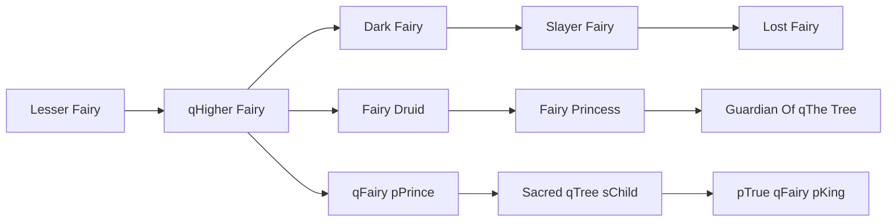

# pTrue qFairy pKing

<small>[TR: Nightmares](../index.md) &rsaquo; [Races](index.md)</small>

| | |
|---|---|
| **ID** | `trnightmare:true_fairy_king` |
| **Difficulty** | Hard |
| **Alignment** | Default |
| **Aura** | 1,250,000 - 2,500,000 |
| **Magicule** | 750,000 - 1,500,000 |
| **Health bonus** | 1,180 |
| **Spiritual health bonus** | 6,340 |
| **Attack damage bonus** | 10 |
| **Movement speed bonus** | 0.09 |
| **EP to evolve into** | 2,500,000 |

## Evolution

- **Evolves from:** [Sacred qTree sChild](sacred-tree-child.md)

### Requirements to evolve into pTrue qFairy pKing

Each requirement adds its weight to the evolution progress bar; you can evolve at 100%.

| Requirement | Weight |
|---|---|
| Reach Existence Points of ep requirement | 50% |
| Consume essence requirement life of [Life Essence](../items/materials/life-essence.md) | 50% |

### Evolution tree

## Intrinsic skills

Granted automatically when you become this race.

-  [Divine Ki Release](../../tensura-reincarnated/abilities/intrinsic-skills/divine-ki-release.md)
-  [Spiritual Attack Nullification](../../tensura-reincarnated/abilities/resistance-skills/spiritual-attack-nullification.md)
-  [Gravity Attack Nullification](../../tensura-reincarnated/abilities/resistance-skills/gravity-attack-nullification.md)
-  [Earth Attack Nullification](../../tensura-reincarnated/abilities/resistance-skills/earth-attack-nullification.md)
-  [Thermal Fluctuation Nullification](../../tensura-reincarnated/abilities/resistance-skills/thermal-fluctuation-nullification.md)
-  [Light Attack Resistance](../../tensura-reincarnated/abilities/resistance-skills/light-attack-resistance.md)

## Traits

- Divine

## Attribute modifiers

| Attribute | Amount | Operation |
|---|---|---|
| Scale | size | add |
| Max Health | max HP | add |
| Max Spiritual Health | max spiritual HP | add |
| Attack Damage | attack | add |
| Attack Speed | attack speed | add |
| Knockback Resistance | knockback resistance | add |
| Movement Speed | movement speed | add |
| Swim Speed Multiplier | swim speed | add |

## Stats (config defaults)

Set in [`config/nightmare/race/fairy_clan_config.toml`](../configs/config-nightmare-race-fairy-clan-config.md).

| Option | Default | Description |
|---|---|---|
| `TrueFairyKing.epRequirement` | 2,500,000 | Existence points required to evolve into True Fairy King. |
| `TrueFairyKing.essenceRequirementLife` | 50 | Life Essence required to evolve into Sacred Tree Child. |
| `TrueFairyKing.minAura` | 1,250,000 | Minimal aura. |
| `TrueFairyKing.maxAura` | 2,500,000 | Maximum aura. |
| `TrueFairyKing.minMagicule` | 750,000 | Minimal magicule. |
| `TrueFairyKing.maxMagicule` | 1,500,000 | Maximum magicule. |
| `TrueFairyKing.size` | 0.5 | Bonus Size. |
| `TrueFairyKing.maxHealth` | 1,180 | Bonus Max Health. |
| `TrueFairyKing.maxSpiritualHealth` | 6,340 | Bonus Max Spiritual Health. |
| `TrueFairyKing.attack` | 10 | Bonus Attack Damage. |
| `TrueFairyKing.attackSpeed` | 2 | Bonus Attack Speed. |
| `TrueFairyKing.knockbackResistance` | 0.9 | Bonus Knockback Resistance. |
| `TrueFairyKing.movementSpeed` | 0.09 | Bonus Movement Speed. |
| `TrueFairyKing.swimSpeed` | 0.09 | Bonus Swimming Speed Multiplier. |
| `SacredTreeChild.epRequirement` | 420,000 | Existence points required to evolve into Sacred Tree Child. |
| `SacredTreeChild.essenceRequirementLife` | 20 | Life Essence required to evolve into Sacred Tree Child. |
| `SacredTreeChild.minAura` | 210,000 | Minimal aura. |
| `SacredTreeChild.maxAura` | 420,000 | Maximum aura. |
| `SacredTreeChild.minMagicule` | 126,000 | Minimal magicule. |
| `SacredTreeChild.maxMagicule` | 252,000 | Maximum magicule. |
| `SacredTreeChild.size` | -1 | Bonus Size. |
| `SacredTreeChild.maxHealth` | 680 | Bonus Max Health. |
| `SacredTreeChild.maxSpiritualHealth` | 2,740 | Bonus Max Spiritual Health. |
| `SacredTreeChild.attack` | 1 | Bonus Attack Damage. |
| `SacredTreeChild.attackSpeed` | 2 | Bonus Attack Speed. |
| `SacredTreeChild.knockbackResistance` | 0.5 | Bonus Knockback Resistance. |
| `SacredTreeChild.movementSpeed` | 0.08 | Bonus Movement Speed. |
| `SacredTreeChild.swimSpeed` | 0.08 | Bonus Swimming Speed Multiplier. |
| `FairyPrince.epRequirement` | 120,000 | Existence points required to evolve into Fairy Prince. |
| `FairyPrince.essenceRequirementLife` | 20 | Life Essence required to evolve into Fairy Prince. |
| `FairyPrince.minAura` | 60,000 | Minimal aura. |
| `FairyPrince.maxAura` | 120,000 | Maximum aura. |
| `FairyPrince.minMagicule` | 40,000 | Minimal magicule. |
| `FairyPrince.maxMagicule` | 80,000 | Maximum magicule. |
| `FairyPrince.size` | -1 | Bonus Size. |
| `FairyPrince.maxHealth` | 330 | Bonus Max Health. |
| `FairyPrince.maxSpiritualHealth` | 940 | Bonus Max Spiritual Health. |
| `FairyPrince.attack` | 0 | Bonus Attack Damage. |
| `FairyPrince.attackSpeed` | 0 | Bonus Attack Speed. |
| `FairyPrince.knockbackResistance` | 0.5 | Bonus Knockback Resistance. |
| `FairyPrince.movementSpeed` | 0.07 | Bonus Movement Speed. |
| `FairyPrince.swimSpeed` | 0.07 | Bonus Swimming Speed Multiplier. |
| `HigherFairy.epRequirement` | 40,000 | Existence points required to evolve into Higher Fairy. |
| `HigherFairy.essenceRequirementLife` | 10 | Number of life essence required to evolve into Higher Fairy. |
| `HigherFairy.minAura` | 25,000 | Minimal aura. |
| `HigherFairy.maxAura` | 50,000 | Maximum aura. |
| `HigherFairy.minMagicule` | 15,000 | Minimal magicule. |
| `HigherFairy.maxMagicule` | 30,000 | Maximum magicule. |
| `HigherFairy.size` | -0.5 | Bonus Size. |
| `HigherFairy.maxHealth` | 10 | Bonus Max Health. |
| `HigherFairy.maxSpiritualHealth` | 150 | Bonus Max Spiritual Health. |
| `HigherFairy.attack` | 0 | Bonus Attack Damage. |
| `HigherFairy.attackSpeed` | 1 | Bonus Attack Speed. |
| `HigherFairy.knockbackResistance` | 0 | Bonus Knockback Resistance. |
| `HigherFairy.movementSpeed` | 0.04 | Bonus Movement Speed. |
| `HigherFairy.swimSpeed` | 0.04 | Bonus Swimming Speed Multiplier. |
| `LesserFairy.minAura` | 500 | Minimal aura. |
| `LesserFairy.maxAura` | 500 | Maximum aura. |
| `LesserFairy.minMagicule` | 1,500 | Minimal magicule. |
| `LesserFairy.maxMagicule` | 5,500 | Maximum magicule. |
| `LesserFairy.size` | -1 | Bonus Size. |
| `LesserFairy.maxHealth` | -10 | Bonus Max Health. |
| `LesserFairy.maxSpiritualHealth` | 90 | Bonus Max Spiritual Health. |
| `LesserFairy.attack` | 0 | Bonus Attack Damage. |
| `LesserFairy.attackSpeed` | -0.2 | Bonus Attack Speed. |
| `LesserFairy.knockbackResistance` | 0 | Bonus Knockback Resistance. |
| `LesserFairy.movementSpeed` | 0.02 | Bonus Movement Speed. |
| `LesserFairy.swimSpeed` | 0.02 | Bonus Swimming Speed Multiplier. |

## Tags

`tensura:races/divine`
